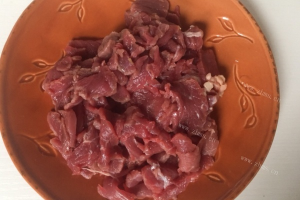
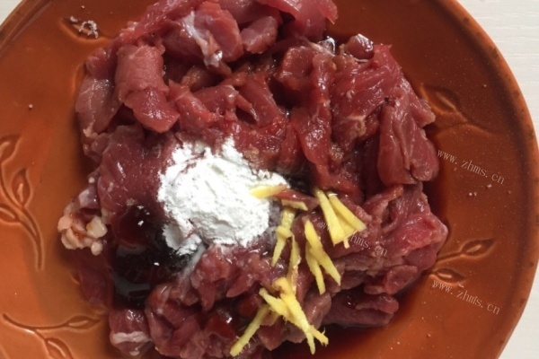
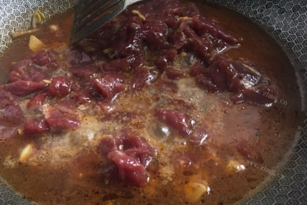

# 水煮牛肉的做法

麻辣鲜香

## 必备原料和工具

- 牛肉
- 豆芽
- 鸡蛋
- 香菜
- 豆瓣酱
- 料酒
- 淀粉
- 干辣椒粉
- 姜
- 蒜
- 红辣椒
- 蚝油

## 计算

每次制作前需要确定计划做几份。一份正好够 2 个人吃。

这是一份的量：

- 牛肉 300g
- 豆芽 100g
- 鸡蛋 1 个
- 香菜 5 根
- 豆瓣酱 10g
- 料酒 10ml
- 淀粉 15g
- 干辣椒粉 5g
- 姜 20g
- 蒜 3 瓣
- 红辣椒 1 根
- 蚝油 8g

## 操作

- 牛肉洗干净切片。

- 加入 15g 姜丝，1 个鸡蛋，15g 淀粉，8g 蚝油，10ml 料酒搅拌均匀，腌制 15 分钟。

- 香菜洗干净切好。

- 锅里倒油，加入豆瓣酱，5g 姜丝，蒜片。

- 倒入开水，煮成红汤。

- 豆芽洗干净去掉尾须，放进开水里焯熟。

- 将豆芽铺入碗底。

- 将牛肉片一片一片的放进红汤中，煮熟以后捞出。

- 将牛肉铺在豆芽上，撒上香菜梗。

- 撒上香菜叶，辣椒粉，辣椒圈。

- 另起锅烧热油，将热油淋在菜上面，就完成了。

## 附加内容

- 参考: [水煮牛肉的详细步骤](https://www.zhms.cn/recipe/blrqm.html?source=2)

如果您遵循本指南的制作流程而发现有问题或可以改进的流程，请提出 Issue 或 Pull request 。
