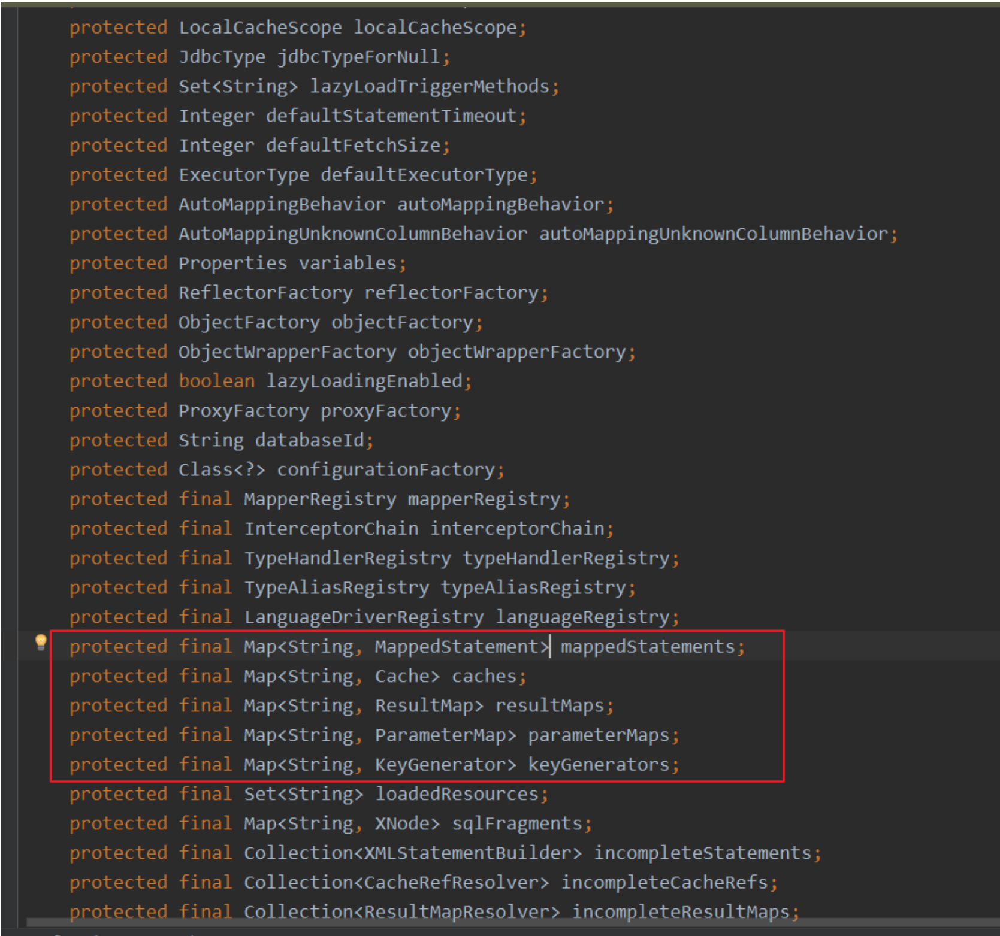

# Mybatis源码

## 1. 回顾

### 1.1 JDBC(Java DataBase Connectivity)

::: tip
JDBC就是使用Java语言操作关系型数据库的一套API, 全称(Java DataBase Connectivity)Java数据库连接

JDBC本质:
- 官方(sun公司)定义的一套操作所有关系型数据库的规则, 即 接口
- 各个数据库厂商去实现这套接口, 提供数据库驱动jar包
- 我们可以使用这套接口(JDBC)编程, 真正执行的代码是驱动jar包中的实现类

:::

#### 1.1.1 使用的步骤

>* 1.**加载数据库驱动**
>* 2.**获取数据库连接**
>* 3.**定义SQL语句**
>* 4.**获取执行SQL对象**
>* 5.**执行SQL**
>* 6.**处理返回的结果集**
>* 7.**释放资源**

#### 1.1.2 使用示例

`entity`
```java
package love.lingdu.entity;

import lombok.Data;

@Data
public class TbUser {
    private Integer id;
    private String userName;
    private String gender;
    private String hobby;
}
```

使用JDBC访问数据库

```java
package love.lingdu.jdbcDemo;

import love.lingdu.entity.TbUser;

import java.sql.*;

public class Demo01 {
    //JDBC使用流程
    public static void main(String[] args) {
        Connection connection = null;
        PreparedStatement preparedStatement = null;
        ResultSet resultSet = null;
        try {
            //1.加载数据库驱动
            Class.forName("com.mysql.jdbc.Driver");
            //2.获取数据库连接
            //通过驱动管理类获取数据库连接
            connection = DriverManager.getConnection("jdbc:mysql://localhost:3306/mybatis_source?characterEncoding = utf - 8", " root", " root");
            //3.定义SQL语句
            //定义sql语句, ? 表示占位符
            String sql = "select * from tb_user where id = ?";
            //4. 获取执行sql的对象 statement
            preparedStatement = connection.prepareStatement(sql);
            //设置参数, 第一个参数为sql语句中参数的序号(从1开始), 第二个参数为设置的参数值
            preparedStatement.setInt(1, 1);
            //5.执行sql
            //向数据库发出sql执行查询, 查询出结果集
            resultSet = preparedStatement.executeQuery();
            //6. 处理返回的结果集
            while (resultSet.next()) {
                int id = resultSet.getInt("id");
                String userName = resultSet.getString("user_name");
                String gender = resultSet.getString("gender");
                String hobby = resultSet.getString("hobby");
                //封装User对象
                TbUser tbUser = new TbUser();
                tbUser.setId(id);
                tbUser.setUserName(userName);
                tbUser.setGender(gender);
                tbUser.setHobby(hobby);
                System.out.println(tbUser);
            }
        } catch (Exception e) {
            e.printStackTrace();
        } finally {
            //7.释放连接
            if (connection != null) {
                try {
                    connection.close();
                } catch (SQLException e) {
                    e.printStackTrace();
                }
            }
            if (preparedStatement != null) {
                try {
                    preparedStatement.close();
                } catch (SQLException e) {
                    e.printStackTrace();
                }
            }
        }
    }
}

```
#### 1.1.3 总结

通过以上的代码, 我们可以知道JDBC的四个核心对象
1. **DriverManager(驱动管理类)** : 注册驱动和获取数据库连接
2. **Connection(数据库连接对象)** : 获取指定SQL对象和管理事务
3. **Statement(执行SQL语句)** : 执行DML、DDL、DQL语句
4. **ResultSet(结果集对象)** : 封装DQL语句的查询结果

#### 1.1.4 存在的问题

使用JBDC存在的问题
1. 数据库连接, 使用时候就创建, 不使用时候立即释放, 对数据库进行频繁连接开启和关闭, 造成数据库资源浪费,
   硬性数据库性能
   设想: 使用数据库连接池管理数据库连接
2. 将sql语句硬编码到Java代码中, 如果sql语句修改了, 需要重新编译Java代码, 不利于系统维护
   设想: 将sql语句配置在xml配置文件中, 即使sql变化了, 不需要对Java代码惊醒冲洗编译
3. 向 preparedStatement 中设置参数, 对占位符位置和设置参数值, 硬编码在Java代码中, 不利于系统维护
   设想: 将sql语句及占位符号和参数全部配置在xml中
4. 从resultSet中遍历结果集数据时, 存在硬编码, 将获取表的字段进行硬编码, 不利于系统维护
   设想: 将查询的结果集, 自动映射成Java对象

### 1.2 Mybatis开发简单回顾

#### 1.2.1 Mybatis是什么

Mybatis是一个 ORM (Object RelationShip Mapper 对象关系映射)类型框架, 解决了数据库访问和操作问题, 对现有的JDBC
技术的封装

#### 1.2.2 Mybatis开发环境搭建

1. 准备依赖

```xml
<!-- mybatis-->
<dependency>
    <groupId>org.mybatis</groupId>
    <artifactId>mybatis</artifactId>
    <version>3.4.6</version>
</dependency>
<!-- 数据库驱动-->
<dependency>
    <groupId>mysql</groupId>
    <artifactId>mysql-connector-java</artifactId>
    <version>5.1.48</version>
</dependency>
```

2. 准备配置文件
   - 基本配置文件 mybatis-config.xml
     - 数据源的设置 environment
     - 类型别名
     - mapper文件的注册
   - Mapper文件
     - DAO规定方法的实现 ------> SQL语句


3. 初始化配置  
   mybatis-config.xml  
   配置environment  
   示例:  

```xml
<?xml version="1.0" encoding="UTF-8" ?>
<!DOCTYPE configuration PUBLIC "-//mybatis.org//DTD Config 3.0//EN"
        "http://mybatis.org/dtd/mybatis-3-config.dtd">
<configuration>
    <typeAliases>
        <typeAlias type="love.lingdu.entity.User" alias="User"/>
        <typeAlias type="love.lingdu.entity.Account" alias="Account"/>
    </typeAliases>
    <environments default="default">
        <!--environment是可以配置多个-->
        <environment id="default">
            <transactionManager type="JDBC"></transactionManager>
            <dataSource type="POOLED">
                <property name="driver" value="com.mysql.jdbc.Driver"></property>
                <property name="url"
                          value="jdbc:mysql://localhost:3306/mybatis_source?useSSL=false"></property>
                <property name="username" value="root"></property>
                <property name="password" value="root"></property>
            </dataSource>
        </environment>
        <!-- <environment id="oracle">
        <transactionManager type="JDBC"></transactionManager>
        <dataSource type="POOLED">
        <property name="driver" value="oracle.jdbc.OracleDriver">
        </property>
        <property name="url"
        value="jdbc:oracle:thin:@localhost:1521:xe"></property>
        <property name="username" value="hr"/>
        <property name="password" value="hr"/>
        </dataSource>
        </environment>-->
    </environments>
    <mappers>
        <!--<package name=""-->
        <mapper resource="UserDAOMapper.xml"/>
        <mapper resource="AccountDAOMapper.xml"/>
    </mappers>
</configuration>

```

4. 开发步骤
   - entity
   - 类型别名
   - table
   - DAO接口
   - Mapper文件
   - Mapper文件的注册
   - API编程

#### 1.2.3 细节说明
1. 如何访问指定数据库  


   我们不指定的话, 访问的就是默认数据库, 指定database就会访问指定数据源  
   我们调用 DAO层 中的方法执行对应的SQL语句的时候, 到底会访问哪个数据库呢? 这个是由 databaseId 决定的,
   我们把 databaseId 设置成 default , 他就访问的是哪一个数据库


   如果在MyBatis当中涉及到多数据源  
   事务不好控制了  
   XXXService当中涉及到了ADAO.m1()使用default数据源, BDAO.m2中使用的是Oracle数据源, 怎么办
2. 配置别名的作用

```xml
<typeAliases>
    <typeAlias type="love.lingdu.entity.User" alias="User"/>
    <typeAlias type="love.lingdu.entity.Account" alias="Account"/>
</typeAliases>
```
配置别名的作用就是在Mapper文件当中无需再写全限定名

3. Mapper.xml注册

```xml

<mappers>
    <!--<package name=""-->
    <mapper resource="UserDAOMapper.xml"/>
    <mapper resource="AccountDAOMapper.xml"/>
</mappers>

```

4. API编写

```java
@Test
public void test1()throws IOException{
    // 获取文件的输入流
    InputStream inputStream = Resources.getResourceAsStream("mybatis-config.xml");
    SqlSessionFactory sessionFactory = new SqlSessionFactoryBuilder().build(inputStream);
    SqlSession sqlSession = sessionFactory.openSession();
    UserDAO userDAO = sqlSession.getMapper(UserDAO.class);
    List<User> users = userDAO.queryAllUsersByPage();
    for(User user : users){
        System.out.println("user = "+user);
    }
}

```
或者可以这样写
```java
@Test
public void test2()throws IOException{
    InputStream inputStream = Resources.getResourceAsStream("mybatis-config.xml");
    SqlSessionFactory sqlSessionFactory = new SqlSessionFactoryBuilder().build(inputStream);
    SqlSession sqlSession = sqlSessionFactory.openSession();
    List<User> users = sqlSession.selectList("love.lingdu.dao.UserDAO.queryAllUsersByPage");
    System.out.println("users = "+users);
}

```

#### 1.2.4 核心代码分析

核心代码实例
```java
// 第一种写法
InputStream inputStream = Resources.getResourceAsStream("mybatis-config.xml");
SqlSessionFactory sessionFactory = new SqlSessionFactoryBuilder().build(inputStream);
SqlSession sqlSession = sessionFactory.openSession();
UserDAO userDAO = sqlSession.getMapper(UserDAO.class);
List<User> users = userDAO.queryAllUsersByPage();
// 第二种写法
InputStream inputStream = Resources.getResourceAsStream("mybatis-config.xml");
SqlSessionFactory sqlSessionFactory = new SqlSessionFactoryBuilder().build(inputStream);
SqlSession sqlSession = sqlSessionFactory.openSession();
List<User> users = sqlSession.selectList("love.lingdu.dao.UserDAO.queryAllUsersByPage");

```

两种方式功能等价, 实现效果有什么区别? 哪种方式好?
```java
# 第一种方式好, 表达概念更清晰, 可读性更好
- 我们在表达一个含义的时候,绝不是用字符串来表达的, 是用类型来表达的
比如说:
String name = 'huxz';
用字符串来表示一个名字的概念, huxz到底是什么名字, 是人名还是狗名, 你说不清楚, 所以用字符串表达不清
楚
所以java为什么要强调封装, 定义类型
public class User{  
    private String name = 'huxz';
}
# 第一种开发, 本质上就是对第二种开发的封装(代理设计模式)
- Mybatis刚刚诞生的时候, 对于数据库的操作都是第二种, 没有第一种, 在后续版本迭代的时候, 才
- 有了第一种. 第二种, 本质上就是将第二种的实现方式进行了封装, 通过代理设计模式进行了封装

```

## 2. MyBatis的核心对象

我们常说 Mybatis 是对 JDB C的封装, 那么他是通过什么来封装的呢? 封装的是什么呢?  
JDBC设计的内容无非是以下的几个内容:
* Connection
* Statement
* ResultSet

而Mybatis通过 SqlSession 封装了JDBC的使用

**结论:**  
Mybatis通过SqlSession封装了JDBC  
封装了JDBC的 ResultSet , Statement . 通过这些Statement与数据库进行交互, 最终的结果由ResultSet进行封装, 进
而返回给我们

`Statement` 主要包括
* 普通的Statement
* PreparedStatement(预编译Statement, 可以防止SQL注入)
* CallableStatement(主要应用在存储过程层面上)


但是对于Mybatis来讲, 他不仅仅包含 `SqlSession` , 还包括 `SqlSessionFactory` , `mybatis-config.xml` ,
`Mapper.xml`

SqlSessionFactory -------------创建---------------> SqlSession


```java
# Mybatis
- SqlSession封装了JDBC的使用, 而且他还提供了SqlSessionFactory来创建SqlSession, 但是还需要
- 我们在配置文件中书写相关配置, 进而最终由SqlSession帮助我们基于Mapper文件生成DAO, 这一套东西构
- 了Mybatis

```

### 2.1 Mybatis的核心对象及作用


Mybatis是有两大类核心对象

#### 2.1.1 数据存储对象

概念: 在Java中(JVM)对Mybatis相关的 `配置信息` 进行 `封装`

我们知道文件他存了很多东西, 存了很多配置的内容, 我们不可能用点就读一次文件, 因为他频繁会产生IO, 作为IO来将
他是操作系统层面上的资源, 他的创建绝不是虚拟机单独完成的, 他一定是虚拟机与操作系统进行交互和交流来完成
的, 所以注定IO在我们开发过程中一定是越少越好, 能复用最好, 所以说这些Mybatis文件不可能是随用随读的, 他一定是
一次性读取, 进而封装在Java对象当中

问题: 配置信息要封装成对象, 那么他有几种配置信息??

Mybatis有两种配置文件: `mybatis-config.xml` 和 `XXXDAOMapper.xml`

##### 2.1.1.1 Configuration

mbatis-config.xml -------------- 封装成了 --------------> Configuration

Configuration的作用:

* 封装mybatis-config.xml相关的内容
   - setting标签对应的内容
   - environment标签对应的内容
   - typeAlias标签对应的内容
   - loadedResource


cacheEnabled从这个属性我们可以看到，这个我们可以写也可以不写，因为我们不写的话我们默认走的就是默认
值

* 封装了Mapper文件
  MappedStatements(Mapper文件相关的内容, 在Configuration对象中进行了汇总, 为什么要汇总, 为了以后用起来方
  便)

Configuration -----> MappedStatements ----> MappedStatement ----> 封装 xxxDAOMapper.xml -----> caches ----->
  resultMaps -----> parameterMaps -----> keyGenerators



caches, parameterMaps, resultMaps, MapperdStatement, keyGenerators这些是把Mapper.xml文件中的内容进行了封
装

resultMaps: 所有的Mapper.xml文件中resultMap标签

parameterMaps: 是对sql标签上的parameterMap属性做了封装

上面这些属性都加了s, 表示的是复数, 也就是他的数量不止一个, 是所有的Mapper.xml文件中的这些属性都封装到
这里面了, 这些不仅仅要存还要用, 所以是将他们存到一个Map中, 他是有key的, 他的key就是namespace.id


* 创建Mybatis其他核心对象  
  可以理解为Configuration对象是其他对象的工厂  
  Executor  
  ParameterHandler  
  ResultSetHandler  
  StatementHandler


##### 2.1.1.2 MappedStatement

MappedStatement对象, 也是一个存储对象, 存储的是Mapper文件中我们定义的SQL标签, 其中封装的是我们Mapper文件
中的一个个标签, 举例来讲, 其中一个标签就会被封装成MappedStatement对象

XXXDAOMapper.xml ------- 封装成了 -------> MappedStatement(形象的认知, 不准确)

MappedStatement 封装的是XXXDAOMapper.xml里面的一个个的标签, 标签里面的属性会被封装成MappedStatement里
面的一个一个属性

我们的标签当中肯定会有id的属性，在我们的MappedStatement当中也会有id的属性。id属性完全唯一，他存储的是
namespace.id所以，也是唯一，注定了在一个Mabatis当中会有N个MapperStatement对象

这里面的statementType是什么意思，指的就是普通，预编译，存储过程。默认使用的就是preparedStatement，所以在
我们的SQL标签上也肯定有这个属性，这个属性默认prepared, 因为普通得Statement不具有预编译的功能, 效率太低,
CallableStatement 存储过程, 基本上不用

MappedStatement中封装SQL语句 -----> BoundSql
一条完整的SQL = sql语句本身 + 参数 -----封装成了----> BoundSql -----从属于-----> MappedStatement

]

##### 2.1.1.3 MappedStatement和Configuration对象关系

Configuration 中有 MappedStatement , MappedStatement中也有Configuration

##### 2.1.1.4 思考

什么时候创建Configuration, 什么时候创建MapperdStatement, 以及他与我们的SqlSession(Mybatis核心功能) 是怎么交互
的?

操作类对象大致有一下几种：

* Excutor
* StatementHandler
* ParameterHandler
* ResultSetHandler
* TypeHandler

这些对象是Configuration对象进行创建的。有了操作类对象之后，我们基于上述存储类对象，我们就可以对数据库进
行相应的操作了。

#### 2.1.2 操作类型对象

:::tip
我们说作为Configuration或者是MappedStatement也好, 他存储的都是我们在配置文件中或者在注解当中 所配置
的相关信息, 类似于我们数据库中表中存储的数据是一样的, 光有这些存储数据的对象是不够的 除了这些存储数
据的对象外, 我们还应该有操作这些数据完成功能的对象

Mapper.xml当中的SQL标签都被解析成了一个一个的MappedStament对象, 那么我们当中的SQL是基于什么形式
进行封装的呢?

我们要知道, Java当中一切皆对象, MappedStatement当中的SQL被封装成了MappedStateMent当中的SqlSource对
象

我们通过sqlSource.getBoundSql()来获取一个BoundSql对象, BoundSQL当中的对象就是对于SQL语句的真实封装

Configuration也好, MappedStatement也好, 存储的是我们配置文件或者是在注解当中书写的配置信息. 它们是一
个存储对象

:::

##### 2.1.2.1 Executor

`Executor` 是执行器的意思, 什么是执行器, 执行器就是完成各种操作的对象. 他是Mybatis当中处理功能的核心. 增删改
和查都在Executor当中都提供了相应的方法. 我们在不了解Mybatis的时候, 我们认为Mybatis当中我们使用的是
SqlSession, 但是实际上, 真正执行各种操作的是 `Executor`

我们说Executor是完成Mybatis中操作对象的核心. 他是一个接口, 我们从接口实现当中可以看到具体的功能点


`Executor` 中提供了

    * 增删改查(update(增删改)、query(查))
    * 事务操作
      提交、回滚
    * 缓存相关的操作


之前我们总以为是由 `SqlSession` 来完成一系列的操作, 其实是交由 `Executor` 来落实操作的

问题: `Executor` 是接口, 为啥是接口?

设计原则: 操作相关的类型, 设计成接口

xxxService xxxxDAO Executor SqlSession

未来开发设计之后, 我们拿到一个全新的功能之后, 我们不知道怎么设计. 我们这里有一个规范, 但凡是操作相关的类
型, 我们都需要设计成接口. 就比如我们的SqlSession也是一个接口

设计成接口也是为了提供一种规范, 我们在这种规范下可以有不同的实现, 也就是不同的实现类适配不同的业务场景

我们说任何对数据库的操作底层都得用JDBC, 而JDBC中三大件: `Connection` 是连接数据库, `ResultSet` 是获得查询
结果集的, 而真正与数据库传输sql进行交互的是 `Statement` , 通过
看代码我们会发现Statement是和Sql语句相关(Connection创建的), 换句话说, 如果日后我的SQL
语句不变, 完全可以用一个Statement, 这样就有了复用 `Statement` 的需求了, 同时因为我少创建
了 `Statement` 对象, 他的效率会得到一个很好的保障


`BaseExcutor` 仅仅是一个适配器, 仅仅提供了了一些基本的功能. 真正的核心的实现类最为核心的三个实现类是:
`Executor` 实现类

* BatchExcutor 在Mybatis当中,如果你还想进行相应的批处理的操作, 也就是一个连接执行一坨sql语句, 这个时候你
  就可以考 虑用BatchExcutor

      BatchExecutor是一个批处理的执行器, 我们知道在JDBC当中就有批处理的操作, 如果我们想在JDBC
      当中仍然有批处理的操作. 使用这个BatchExecutor即可. 也就是一个Connection处理一坨SQL语句,
      我们就可以考虑用这个执行器

* ReuseExcutor(是为了复用statement设计的)  
  目的: 复用Statement 在什么情况下会复用Statement的呢? Statement的创建与什么相关

      ReuseExecutor这是一个复用Executor, 他复用的是Statement. 我们说任何对数据库的操作底层都得用JDBC.
      JDBC中的三大件东西: Connection是连接数据库的, ResultSet是获取查询结果集的, 真正和数据库交互的是
      Statement. 复用Statement在什么条件下会发生呢? Statement与什么相关呢?
      Statement是SQL语句相关的. 如果我们的SQL在任何条件下都不会改变的话. 我们就可以一直使用这个Statement
      对象, 减少了对象的创建, 保证了性能, 这个SQL语句的可以是增删改查任何的语句, 但是不能有任何的改变,
      任何的改变的话, 就不适用了

      JDBC当中批处理是啥意思?
      我们最简单的JDBC是获取一个Connection之后, 我们直接获取一个Statement对象, 然后拿着这个对象
      和数据库沟通, 然后取到结果集, 释放连接, 但是这样会有一个问题, 需要频繁的有连接的创建和关闭. 或
      者是连接池的获取和归还
      我们想到了批处理, 也就是在一个连接之上, 与数据库进行多次SQL交互, 这样的话我们就省略了大量的
      Connection的创建和销毁, 这就是批处理, 大大提高了性能, 站在Mybatis当中我们想要使用批处理的
      话, 我们就使用BatchExecutor

* SimpleExcutor(常用Excutor Mybatis推荐 默认)  
  值得注意的是常用的执行器往往是最简单的这个: SimpleExecutor, 完成常规的操作, 这个是最核心的Executor, 这
  要是Mybatis当中内置推荐的执行器. 如果我们不更改配置的话, 默认使用的就是Configuration当中的简单的  
  **Executor**


  Configuration三个功能: 封装Mybatis-config.xml, 存储MappedStatement, 创建其他的核心执行的对象包括Executor,
  所以配置肯定在这个类里边

**为什么说IO，连接都是非常真贵的资源？** 我们知道，我们搞Java开发我们底层面临的是OS操作系统的资源，在它之
上我们构建了一个Java虚拟机的东西。我们写Java程序是运行在虚拟机层面上的东西，然后我们想要在虚拟机当中去
建立网络连接、或者是io、或者是线程的时候，这个时候虚拟机就办不到了，需要去沟通操作系统，因为只有操作系
统可以进行读取文件，可以去访问互联网，只有操作系统可以操作CPU操作线程、进程。所以，我们知道这些操作背
后都有操作系统，都会有这些native的方法的操作，而这些东西都是耗时和占用资源的，所以我们认为这些东西，必
须要关，必须要复用，必须要池化。


Excutor来处理和数据库的操作，那么这个是怎么和JDBC建立连接的呢，这就和后面的对象有关系了。

Executor才是真正完成数据库交互, 增删改查的核心, 但是和我们前面所讲的: 一切操作的底层, 对于数据库这个层面上
来讲, 都应该是JDBC, 现在Mybatis做了这项工作之后, 他怎么和JDBC建立联系呢? 那就由后面的对象配合他来完成

##### 2.1.2.2 StatementHandler(主要的功能: 增删改查)

StatementHandler是Mybatis真正和JDBC建立联系的核心, 那又是怎么建立联系的呢?

他直接与JDBC中的Statement建立联系(也可以理解为StatementHandler是对JDBC的Statement的封装)也就是说Executor
要完成操作(他也得用JDBC), 进而就会调用StatementHandler, 而StatementHandler里面封装了Statement, 进而就可以真
正的与数据库进行相关的联络和联系, 进而完成他的增删改查了

StatementHandler是MyBatista封装了JDBC Statement, 真正Mybatis进行数据库访问数据的核心

问题: 为啥要用Executor, 不能直接StatementHandler这里为什么又包了一层, 不能删掉Executor?

Executor当中有三件事: 增删改查、事务、缓存. 把其中的第一部分操作交给了StatementHandler. 这里为什么要使用包
装, 一个类型包装另外一个类型, 是为了符合功能单一原则


完成对数据库的操作, 包括了增删改查, 还有批处理, 还有获取SQL, 还有对于SQL参数的处理, 所以他的主要工作就是对
于数据库的操作

StatementHandler实现类(采用了适配器的设计模式)

* BaseStatementHandler
    - PreparedStatementHandler
    - SimpleStatementHandler
    - CallableStatementHandler
* RoutingStatementHandler

这里有很浓重的适配器设计模式的痕迹, 会有一个BaseStatementHandler草草的实现一些基础功能

```java
public class SimpleStatementHandler extends BaseStatementHandler {
    public SimpleStatementHandler(Executor executor, MappedStatement mappedStatement,
                                  Object parameter, RowBounds rowBounds, ResultHandler resultHandler, BoundSql boundSql)
    {
        super(executor, mappedStatement, parameter, rowBounds, resultHandler, boundSql);
    }
    @Override
    public int update(Statement statement) throws SQLException {
        String sql = boundSql.getSql();
        Object parameterObject = boundSql.getParameterObject();
        KeyGenerator keyGenerator = mappedStatement.getKeyGenerator();
        int rows;
        if (keyGenerator instanceof Jdbc3KeyGenerator) {
            statement.execute(sql, Statement.RETURN_GENERATED_KEYS);
            rows = statement.getUpdateCount();
            keyGenerator.processAfter(executor, mappedStatement, statement, parameterObject);
        } else if (keyGenerator instanceof SelectKeyGenerator) {
            statement.execute(sql);
            rows = statement.getUpdateCount();
            keyGenerator.processAfter(executor, mappedStatement, statement, parameterObject);
        } else {
            statement.execute(sql);
            rows = statement.getUpdateCount();
        }
        return rows;
    }
    @Override
    public void batch(Statement statement) throws SQLException {
        String sql = boundSql.getSql();
        statement.addBatch(sql);
    }
    @Override
    public <E> List<E> query(Statement statement, ResultHandler resultHandler) throws
            SQLException {
        String sql = boundSql.getSql();
        statement.execute(sql);
        return resultSetHandler.<E>handleResultSets(statement);
    }
    @Override
    public <E> Cursor<E> queryCursor(Statement statement) throws SQLException {
        String sql = boundSql.getSql();
        statement.execute(sql);
        return resultSetHandler.<E>handleCursorResultSets(statement);
    }
    @Override
    protected Statement instantiateStatement(Connection connection) throws SQLException {
        if (mappedStatement.getResultSetType() != null) {
            return connection.createStatement(mappedStatement.getResultSetType().getValue(),
                    ResultSet.CONCUR_READ_ONLY);
        } else {
            return connection.createStatement();
        }
    }
    @Override
    public void parameterize(Statement statement) throws SQLException {
        // N/A
    }
}
```

##### 2.1.2.3 ParameterHandler

功能: 解决的是参数问题, 怎么把Mybatis当中的参数, 最后替换成JDBC当中的参数  
目的: Mybatis参数 ------替换成-------> JDBC相关的参数  
@Param -------换成------------> #{} -----------换成--------> ?  
以上的这些功能都是ParameterHandler来做

##### 2.1.2.4 ResultSetHandler

ResultSetHandler 封装的是JDBC当中的 ResultSet

目的: 对JDBC中查询结果集ResultSet进行封装

```java
public interface ResultSetHandler {
    // 这个参数 为什么是Statement
    //在JDBC的操作中,我们必须得有Statement,才能获取ResultSet
    // 所有的查询结果, 都要和执行的Sql语句息息相关, Statement代表的是Sql语句
    <E> List<E> handleResultSets(Statement var1) throws SQLException;
    <E> Cursor<E> handleCursorResultSets(Statement var1) throws SQLException;
    void handleOutputParameters(CallableStatement var1) throws SQLException;
}
public List<Object> handleResultSets(Statement stmt) throws SQLException {
    
}

```

:::tip
在Idea当中如何快速看他的实现类：鼠标放到类名上：Ctrl+Alt+B即可，鼠标翻到方法上，直接Ctrl+Alt+B也可直接到方
法
:::

##### 2.1.2.5 TypeHandler(类型处理)

他的作用就是类型的梳理, 当前我们使用Java程序操作数据库, 这里面管的就是数据库类型和Java类型转换的过程

类型一定是和参数和返回值息息相关的, 所以, 这个类在两个Handler的下边  

Java程序操作 数据库

Java类型 数据库类型 String varchar int number .......

他会和谁发生连带性关系, 一定会和参数和返回值有关系 参数类型 ------------转换为-------------> 数据库类型 返回值 ------
------转换为-------------> java类型


