# 工作流

##  工作流中的概念

- ==流程定义==(ProcessDefinition): 定义某些流程的顺序结构; 定义一个流程就是画流程图  (相当于定义一个java中的类: Person)

- ==流程实例==(ProcessInstance): 启动了某个流程(实例化一个流程)        (相当于java中对象 : new Person)

- ==流程变量==(Process variable): 流程运行期间的一些数据(请假流程中的: 请假人, 请假天数,请假原因)

- ==任务==(Task): 流程执行到的需要具体的执行一个任务(某个任务)

- ==起始、结束==(Start、End)

- ==网关(Gateway)==: 控制流程的流转方向

  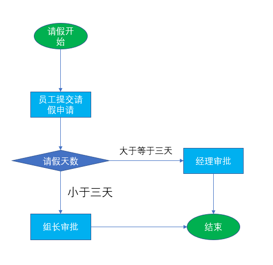

## 工作流产品

- JBPM(Java Business Process Management  业务流程管理)
- OSWorkFlow
- Activiti5(上来就是5没有4,activiti的前身就是JBPM)
- Shark
- 信雅达
- 普元工作流


##  一个核心七个服务组件

**==ProcessEngine==**这个类是Activiti5的核心, 所有的服务都需要通过ProcessEngine来创建,该类是线程安全的

==Activiti5的持久化层采用的是**MyBatis**, 这样移植性好==

==Activiti5主要包括**7个Service(7个服务组件)**, 这些Service都是通过**ProcessEngine**创建==

- **==repositoryService==**(持久化服务) : 操作数据库,完成流程部署,流程定义保存等工作
- **==runtimeService==**(运行时服务): 在流程运行期间获取到流程的所有信息,控制流程启动停止等
- formService(表单服务): 是一个可选的, 实际开发也是不用的(增加开发的复杂度了);就是流程运行时需要的数据利用表单提交过来; 用自己的业务控制表单: Html
- identityService(身份信息): 来管理流程框架中的用户, 分组信息等
- **==taskService(任务服务)==**: 负责流程期间任务的签收处理,以及完成任务等工作
- ==historyService(历史信息)==: 流程运行的历史信息
- managementService(管理定时服务): 


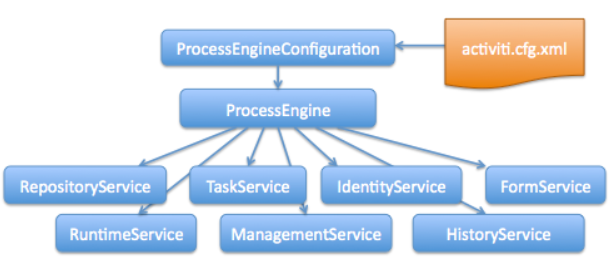


##  Activiti框架表结构

act_ge_bytear				    二进制表

act_ge_property			  属性数据表存储整个流程引擎级别的数据,初始化表结构时,会默认插入三条记录

act_hi_actins			 	   历史节点表

act_hi_attachment		 历史附件表

acti_hi_comment			历史意见表

act_hi_identitylink		 历史流程人员表

act_hi_detail					 历史详情表,提供历史变量的查询

act_hi_procinst	         历史流程实例表

act_hi_taskinst	          历史任务实例表

act_hi_varinst		        历史变量表

act_id_group		         用户组信息表

act_id_info 		            用户扩展信息表

act_id_membership	 用户与用户组对应信息表

act_id_user   				  用户信息表

act_re_deployment  	部署信息表

act_re_model				  流程设计模型部署表

act_re_procdef				流程定义数据表

act_ru_event_subscr   throwEvent、catchEvent   时间监听信息表

act_ru_execution    	  运行时流程执行实例表

act_ru_ identitylink  	运行时流程人员表,主要存储任务节点与参与者的相关信息

act_ru_ job						运行时定时任务数据表

act_ru_ task  					运行时任务节点表

act_ru_ variable		     运行时流程变量数据表

------


activiti将运行时表和流程结束的表进行分开处理, 运行期间经常进行一些CRUR;  运行期间这些表中的数据总是很少,所以CRUD非常快(将运行时表和历史表分开)

- 流程运行期间数据以及信息储存的表:

  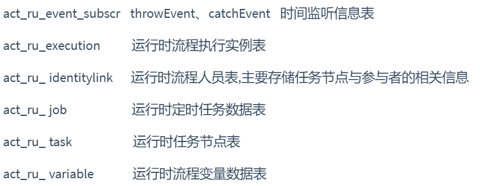

- 流程运行完成后的一些表

  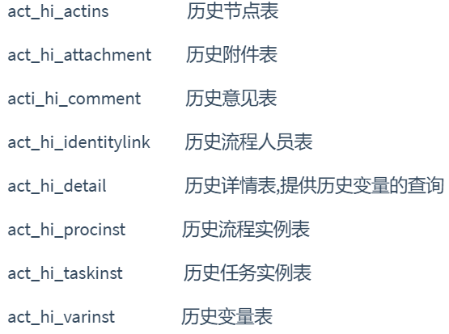
  
  

------

activiti5如何和我们业务逻辑配合使用

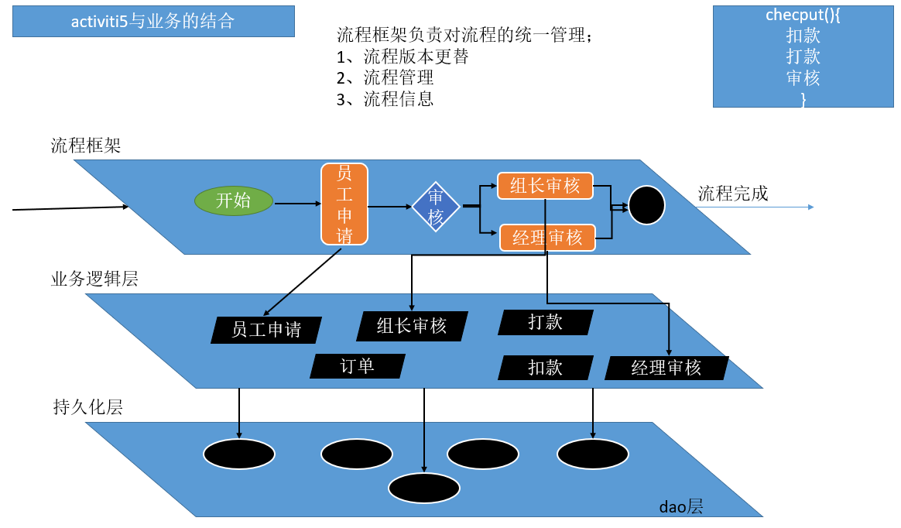

流程的控制框架来做, 流程做到的具体任务是我们的业务逻辑


## HelloWorld

### IDEA中安装activiti并使用

​		可以参考这篇微博里面介绍的很详细, [点我](https://www.cnblogs.com/jpfss/p/11078285.html)


### 实验步骤

#### 导包

```xml
<?xml version="1.0" encoding="UTF-8"?>
<project xmlns="http://maven.apache.org/POM/4.0.0"
         xmlns:xsi="http://www.w3.org/2001/XMLSchema-instance"
         xsi:schemaLocation="http://maven.apache.org/POM/4.0.0 http://maven.apache.org/xsd/maven-4.0.0.xsd">
    <modelVersion>4.0.0</modelVersion>

    <groupId>com.zhfxx</groupId>
    <artifactId>activiti_01</artifactId>
    <version>1.0-SNAPSHOT</version>


    <dependencies>
        <!-- activiti的依赖 -->
        <dependency>
            <groupId>org.activiti</groupId>
            <artifactId>activiti-engine</artifactId>
            <version>5.22.0</version>
        </dependency>

        <!-- mysql驱动 -->
        <dependency>
            <groupId>mysql</groupId>
            <artifactId>mysql-connector-java</artifactId>
            <version>5.1.39</version>
        </dependency>

        <!--junit-->
        <dependency>
            <groupId>junit</groupId>
            <artifactId>junit</artifactId>
            <version>RELEASE</version>
        </dependency>

    </dependencies>

    <build>
        <plugins>
            <!-- 配置编译的jdk版本 -->
            <plugin>
                <groupId>org.apache.maven.plugins</groupId>
                <artifactId>maven-compiler-plugin</artifactId>
                <version>3.7.0</version>
                <configuration>
                    <!-- 指定source和target的版本 -->
                    <source>1.8</source>
                    <target>1.8</target>
                </configuration>
            </plugin>
        </plugins>
    </build>


    
</project>
```


#### 写配置

activiti.cfg.xml 

```xml
<?xml version="1.0" encoding="UTF-8"?>
<beans xmlns="http://www.springframework.org/schema/beans"
	xmlns:xsi="http://www.w3.org/2001/XMLSchema-instance"
	xsi:schemaLocation="http://www.springframework.org/schema/beans http://www.springframework.org/schema/beans/spring-beans.xsd">

	<!--  注意点：
		id="processEngineConfiguration"；id必须叫这个名字
	-->
	<!-- 流程引擎的配置信息:
		ProcessEngine：
			流程引擎可以得到7个service组件
	 -->
	<bean id="processEngineConfiguration"
		class="org.activiti.engine.impl.cfg.StandaloneProcessEngineConfiguration">

		<property name="jdbcUrl" value="jdbc:mysql://localhost:3306/activiti" />
		<property name="jdbcDriver" value="com.mysql.jdbc.Driver" />
		<property name="jdbcUsername" value="root" />
		<property name="jdbcPassword" value="root" />

		<!-- 数据库模式：更新；
				第一次运行：创建各个表
				以后运行：修改表；
		 -->
		<property name="databaseSchemaUpdate" value="true" />

		<property name="jobExecutorActivate" value="false" />
		<property name="asyncExecutorEnabled" value="true" />
		<property name="asyncExecutorActivate" value="false" />
        
		<!--  默认用 英文字体生成图之类的数据-->
		<property name="activityFontName" value="宋体"></property>
		<property name="annotationFontName" value="宋体"></property>
		<property name="labelFontName" value="宋体"></property>
	</bean>

</beans>

```


#### 测试

测试代码:

```java
package com.zhfxx;

import org.activiti.engine.*;
import org.junit.Before;
import org.junit.Test;

/**
 * @Author: gcl
 * @Date: 2020/2/12 10:25
 */
public class ActivitiTest {

    ProcessEngine processEngine = ProcessEngines.getDefaultProcessEngine();
    RepositoryService repositoryService;
    RuntimeService runtimeService;
    TaskService taskService;
    FormService formService;
    HistoryService historyService;
    IdentityService identityService;
    ManagementService managementService;

    @Before
    public void serviceInit() {

        //持久化服务组件: 负责保存流程定义信息等
        repositoryService = processEngine.getRepositoryService();

        //运行时服务组件: 查询流程运行期间一些信息, 控制流程等
        runtimeService = processEngine.getRuntimeService();

        //任务服务组件: 完成任务, 签收任务等
        taskService = processEngine.getTaskService();

        //表单组件: 没用
        formService = processEngine.getFormService();

        //查询流程历史记录等信息: 历史组件
        historyService = processEngine.getHistoryService();

        //用户模块组件, CRUD一些用户以及用户分组等信息
        identityService = processEngine.getIdentityService();

        //管理组件: 监听流程、定时任务等
        managementService = processEngine.getManagementService();
    }

    @Test
    public void test01() {
        System.out.println("流程引擎：" + processEngine);
        System.out.println("持久化服务组件：repositoryService: "+repositoryService);
        System.out.println("运行时服务组件：runtimeService: "+runtimeService);
        System.out.println("任务服务组件：taskService: "+taskService);
        System.out.println("表单组件：formService: "+formService);
        System.out.println("查询流程历史记录等信息：historyService: "+historyService);
        System.out.println("用户模块组件：identityService: "+identityService);
        System.out.println("管理组件：managementService: "+managementService);


    }
}

```

测试结果:

```java
流程引擎：org.activiti.engine.impl.ProcessEngineImpl@12d2ce03
持久化服务组件：repositoryService: org.activiti.engine.impl.RepositoryServiceImpl@7e5c856f
运行时服务组件：runtimeService: org.activiti.engine.impl.RuntimeServiceImpl@413f69cc
任务服务组件：taskService: org.activiti.engine.impl.TaskServiceImpl@1f53a5dc
表单组件：formService: org.activiti.engine.impl.FormServiceImpl@1b75c2e3
查询流程历史记录等信息：historyService: org.activiti.engine.impl.HistoryServiceImpl@1984b1f
用户模块组件：identityService: org.activiti.engine.impl.IdentityServiceImpl@3bd323e9
管理组件：managementService: org.activiti.engine.impl.ManagementServiceImpl@39ac0c0a
```

同时数据库中创建了25张表

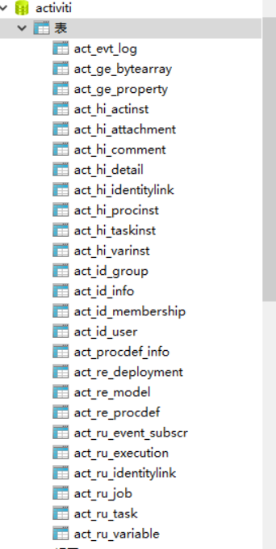


只有act_ge_property中有记录

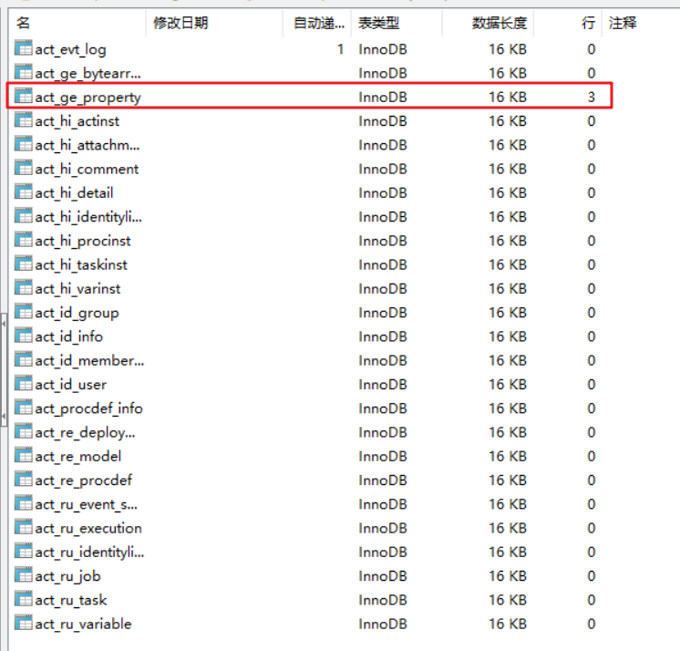

流程框架第一次给数据库中建表，这个表就会有数据（存储当前activiti版本信息等）

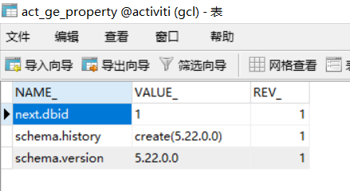


### 部署流程

#### 画流程图

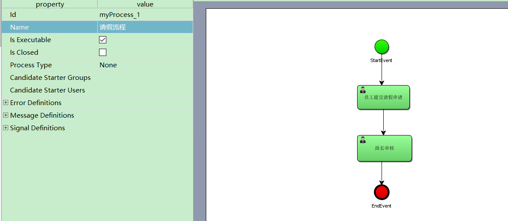


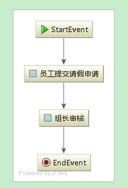

#### 部署

```java
 /**
   * 测试定义一个流程, 并把流程定义信息保存在数据库中
   */
    @Test
    public void testProcessDefinitionDeploy() {
        Deployment deploy = repositoryService.createDeployment()
                                .addClasspathResource("process/leave.bpmn")
                                .deploy();
        System.out.println("部署的流程deploy对象的id: "+deploy.getId() +"  名字为: "+ deploy.getName());
    }
```

测试结果:

```java
部署的流程deploy对象 id:1  名字:null
```


同时数据库中这些表中有数据

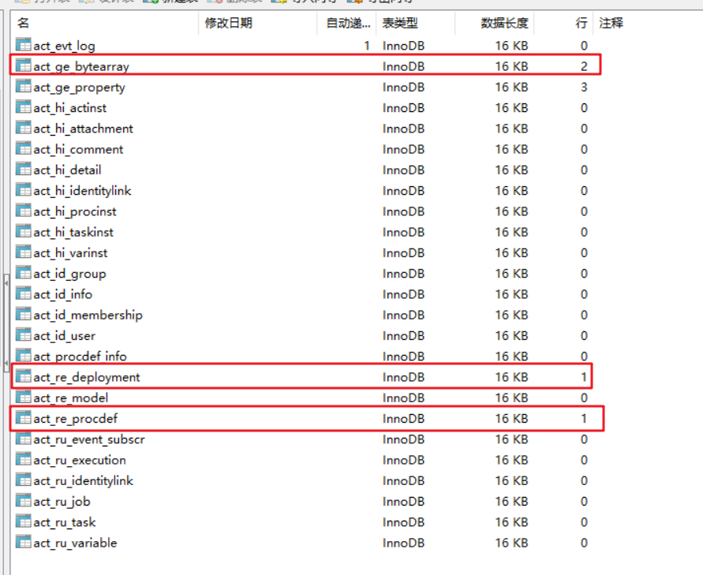

部署（流程部署信息的保存) ; 部署的信息：某一天部署了什么东西

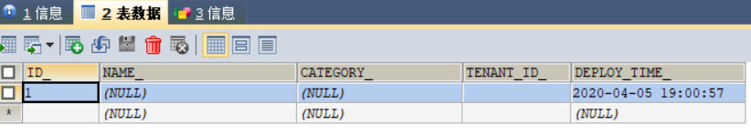

procdef：Procecss Definetion：流程定义；

真正的id: myProcess_1:1:4; 流程key   版本号   部署id

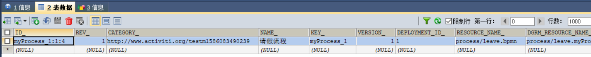

保存了流程图和流程定义文件

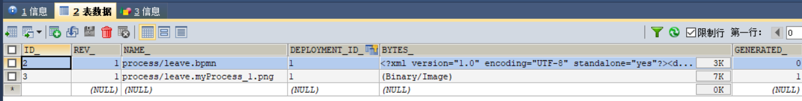


总结:

- 每次流程图有修改以后, 我们都需要重新部署,  流程引擎才能用到新的流程
-  以前旧的流程都是存储在数据库中, 新的流程也要存在数据库中
- 每次部署都会保存一个新的流程定义  act_re_procdef
- 流程定义的key是用来识别版本是否叠加的
- 部署会产生流程定义

------

**查询所有的流程信息: repositoryService**

```java
 /**
     * 查询所有的流程信息: repositoryService
     */
    @Test
    public void queryProcessDefinitionInfo(){

        //查询部署信息
        DeploymentQuery query = repositoryService.createDeploymentQuery();
        List<Deployment> list = query.list();
        for (Deployment deployment : list) {
            System.out.println("部署的id: "+deployment.getId());
            System.out.println("部署的name: "+deployment.getName());
        }

        System.out.println("========================================");

        //查询流程定义信息
        ProcessDefinitionQuery definitionQuery = repositoryService.createProcessDefinitionQuery();
        //查询流程的数量
        System.out.println("流程的数量: "+ definitionQuery.count());
       //可以按照id来查, 也可以按照版本来查,也可以按照key来查
        List<ProcessDefinition> list2 = definitionQuery.list();
        for (ProcessDefinition processDefinition : list2) {
            System.out.println("流程的id: "+ processDefinition.getId());
            System.out.println("流程的name: "+ processDefinition.getName());
            System.out.println("流程的key: "+ processDefinition.getKey());
            System.out.println("流程的资源信息: "+ processDefinition.getResourceName() + "===="+ processDefinition.getDiagramResourceName());
            System.out.println("流程的版本信息: "+ processDefinition.getVersion());
            System.out.println("流程的部署id: "+ processDefinition.getDeploymentId());

        }

    }
```

查询结果: 

```java
部署的id: 1
部署的name: null
========================================
流程的数量: 1
流程的id: myProcess_1:1:4
流程的name: 请假流程
流程的key: myProcess_1
流程的资源信息: process/leave.bpmn====process/leave.myProcess_1.png
流程的版本信息: 1
流程的额部署id: 1
```


#### 创建流程实例并启动

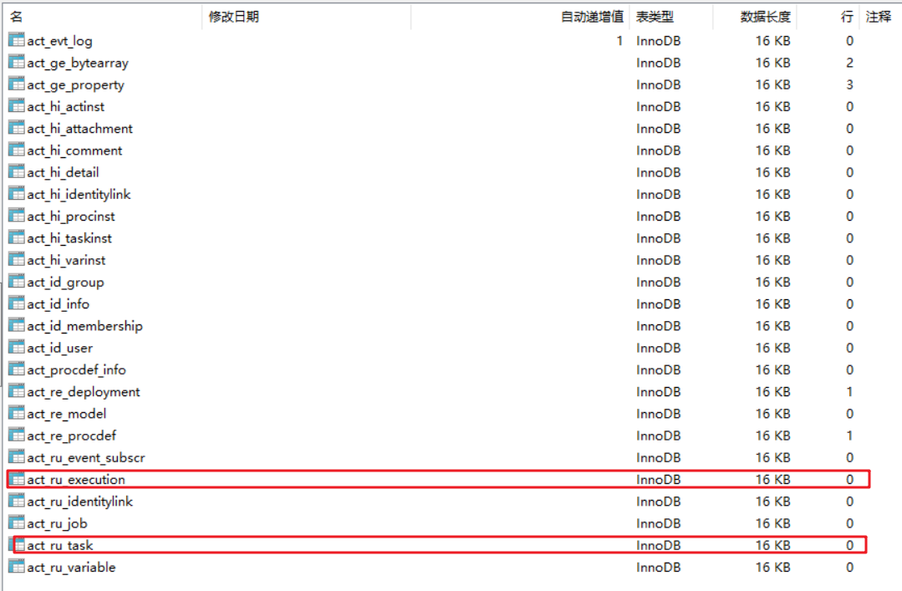

测试代码

```java
/**
     * 创建流程实例并启动 : runtimeService
     */
    @Test
    public void createProcessInstance(){

        //根据查询流程定义
        ProcessDefinition processDefinition = repositoryService.createProcessDefinitionQuery()
                .processDefinitionKey("myProcess_1")
                .latestVersion()
                .singleResult();
        //获取流程id
        String processDefinitionId = processDefinition.getId();
        //创建流程实例并启动流程实例
        ProcessInstance processInstance = runtimeService.startProcessInstanceById(processDefinitionId);
        System.out.println("获取到达的任务的id: "+ processInstance.getActivityId());
        System.out.println("流程定义的id: "+ processInstance.getProcessDefinitionId());

    }

```

输出结果:

```java
获取到达的任务的id: _3
流程定义的id: myProcess_1:1:4
```


以下五张表中产生了数据

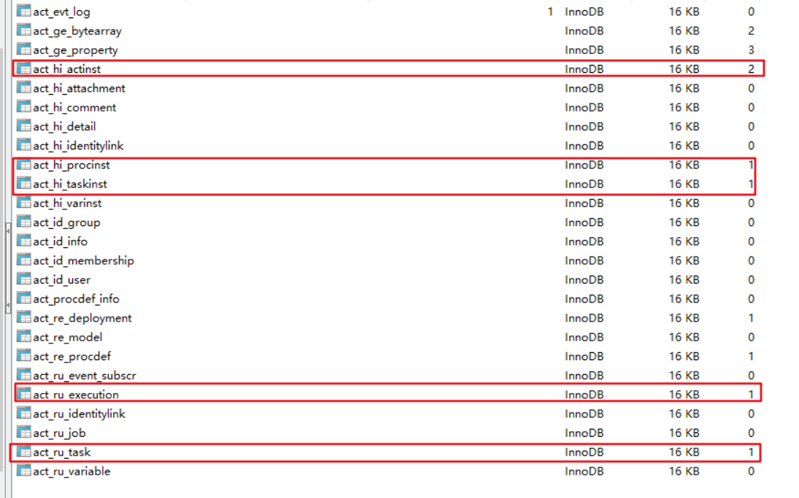

act_hi_actinst

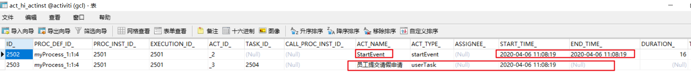

act_hi_procinst

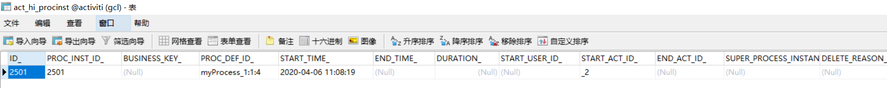

act_hi_taskinst

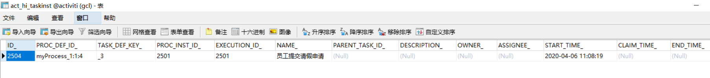

act_ru_execution

此id为流程实例的id

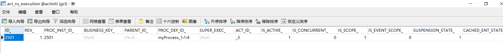

act_ru_task

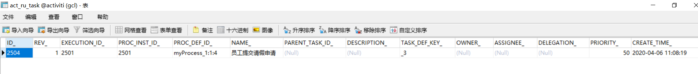

ru_task：用户要完成的任务；

execution_：流程的运行信息

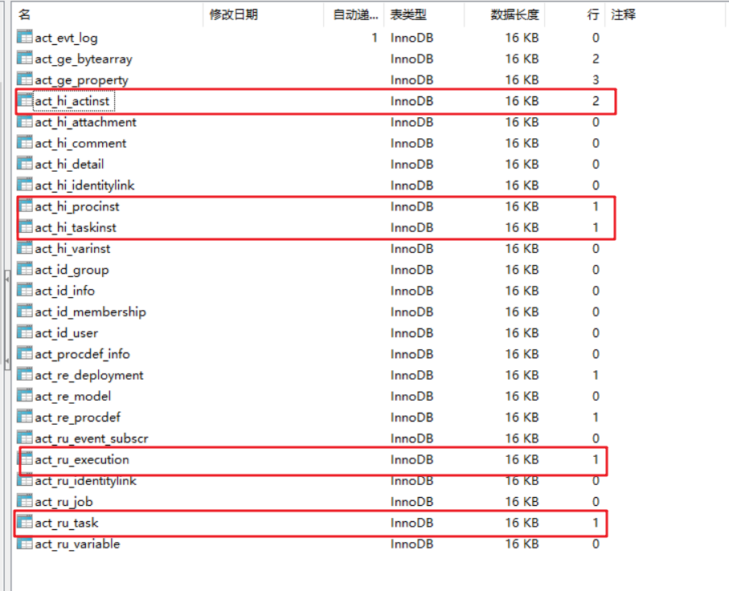

总结: 一个流程定义可以启动多个流程实例


### 查询指定人所拥有的任务及签收任务和完成任务

```java
/**
     * 测试任务: taskService
     *
     *  1. 查询所有任务
     *  2. 将任务签收   (领完任务)
     *  3. 完成任务
     */
    @Test
    public void testTask(){

        //1.查询当前系统中有哪些任务
        List<Task> list = taskService.createTaskQuery().list();
        for (Task task : list){
            System.out.println("任务的id: "+task.getId());
            System.out.println("任务的name: "+task.getName());

        }

        System.out.println("=====================");

        //2.可以查某个流程当前走到了哪个任务
        List<Task> tasks = taskService.createTaskQuery().processInstanceId("2501").list();
        for (Task task : tasks){
            System.out.println("任务的id: "+task.getId());
            System.out.println("任务的name: "+task.getName());

        }
        System.out.println("=====================================");

        //可以查某个人现在需要做哪些任务；任务分配给了哪些人；

        List<Task> taskList = taskService.createTaskQuery().list();
        for (Task task : taskList) {
            System.out.println("当前任务分配给了哪些人: "+ task.getAssignee());
            System.out.println("任务的名称" +task.getName());
        }


        //签收任务
        List<Task> taskList2 = taskService.createTaskQuery().list();
        String assignee = "zhangsan";
        for (Task task : taskList) {
            /**
             * 参数一: 任务的id
             * 参数二: 签署人的名字
             */
            taskService.claim(task.getId(),assignee);
            System.out.println(assignee+"签了"+task.getName()+"任务");
        }
        System.out.println("================================");

        //查询zhangsan有哪些任务,当前系统中有哪些任务
        List<Task> taskList3 = taskService.createTaskQuery().list();
        for (Task task : taskList3){
            System.out.println("任务的id: "+ task.getId()+"------>任务的名称: "+ task.getName()+"----->任务的签署人: "+task.getAssignee());
        }


        //完成任务
        List<Task> taskList4 = taskService.createTaskQuery().list();
        for (Task task : taskList3){
            taskService.complete(task.getId());
        }

        //查询张三有哪些任务
        long count = taskService.createTaskQuery().taskAssignee("zhangsan").count();
        System.out.println("zhangsan所拥有的任务数量: "+ count);


    }
```

测试结果:

```java
任务的id: 2504
任务的name: 员工提交请假申请
=====================
任务的id: 2504
任务的name: 员工提交请假申请
=====================================
当前任务分配给了哪些人: null
任务的名称员工提交请假申请
zhangsan签了员工提交请假申请任务
================================
任务的id: 2504------>任务的名称: 员工提交请假申请----->任务的签署人: zhangsan
zhangsan所拥有的任务数量: 0
```


指定人来签收任务

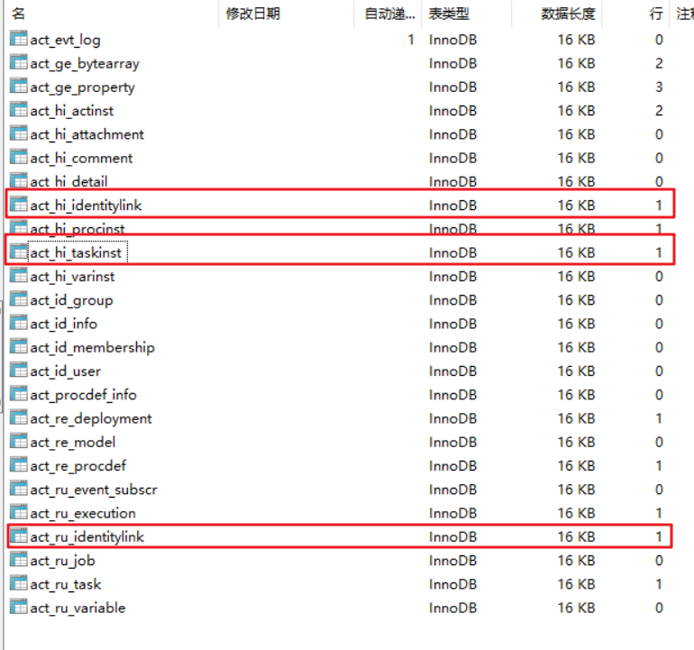


### 网关

#### 排他网关

ru_variable：流程变量；流程运行期间要用的数据, 使用`${}`取出某些变量的值, 用来做判断, 做任务派发等

排他网关相当于: if() else if() ; 只会有一个分支到达


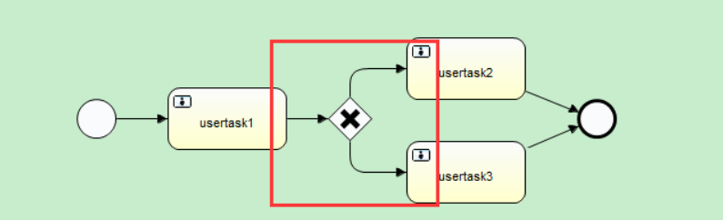

例如上图，两条“出线”没有设置条件的话，就是默认满足任何条件。此时网关会选择第一条符合的路由。至于哪条是第一条呢？不是由流程图的上下左右方位控制，而是与bpmn文档的顺序有关。因此为了同时符合多个条件时，不知道会走哪条路由的情况，最好还是让路由的条件形成互斥关系。另外，如果流程不满足任意一条“出线”的条件，那么流程就会抛出异常


#### 并行网关

当出现这样的场景：请假申请开始，需要项目经理和部门经理都审批，两者没有前后需要两个人全部审批才能进入下个节点。这个时候就需要并行网关


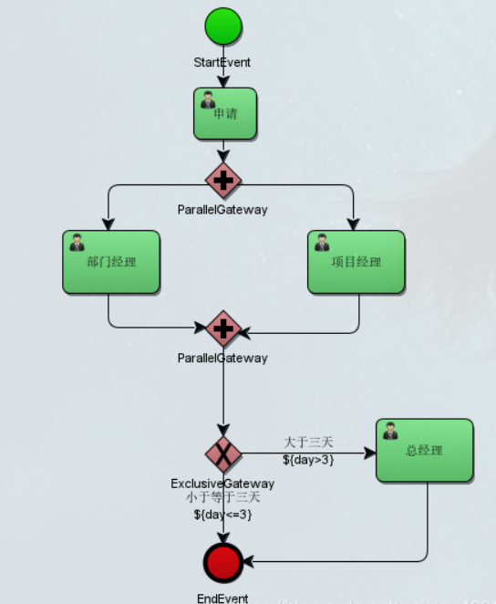

- **分支**： 并行后的所有外出顺序流，为每个顺序流都创建一个并发分支。

- **汇聚**： 所有到达并行网关，在此等待的进入分支， 直到所有进入顺序流的分支都到达以后， 流程就会通过汇聚网关

  

  <font color='red'>注意:</font> 与其他网关的主要区别是，并行网关不会解析条件。 即使顺序流中定义了条件，也会被忽略


#### 包含网关


#### 基于事件网关
