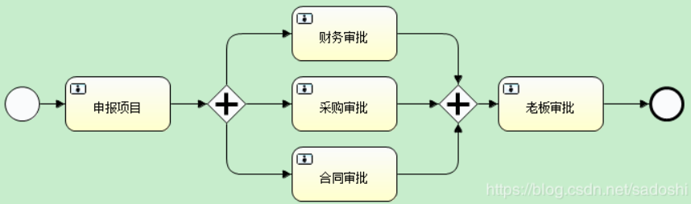
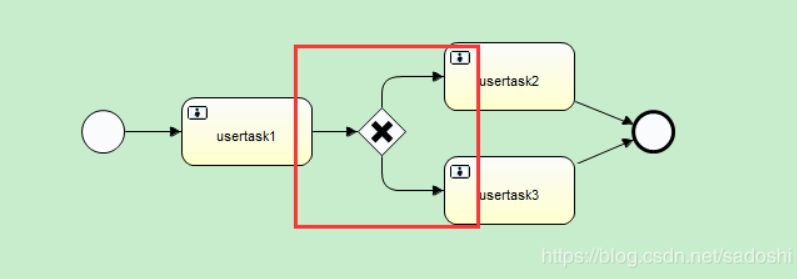
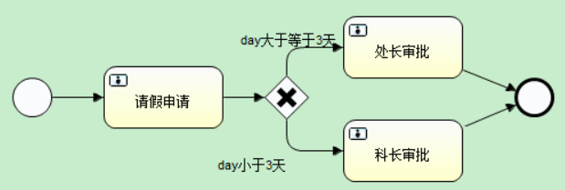
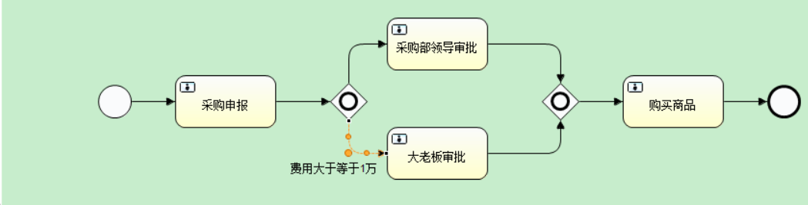

# Activiti(二)——网关

>网关和分支是流程图中相当重要的一环。毕竟不可能所有流程都是一条直线走到底的，可能需要并行处理，也可能需要根据条件的不同选择对应的路由，网关的作用正是在此

## 1. 并行网关

并行网关就是当流程到达该网关时，会分成多个分支，对应业务中的并发情况。

假设现在有这么一个场景，公司进行进行项目申报，需要走申报项目流程，待财务部门、采购部门、法律部门审批之后，再到老板审批，最后结束。这过程中财务、采购、合同审批是可以并行处理的。对应的流程图如下：

当聚合网关的所有“进线”的execution都执行完，就会合并到并行前的execution上，到下一个节点。

并行网关的特点是会使流程从一个execution变成并行的多个execution。通常需要在后面添加聚合网关把并行的execution聚合。如果不加聚合网关，那么流程就会一直维持多个并行execution的状态。

## 2. 排他网关

当流程执行到排他网关时，排他网关会选择一条符合条件路由走出

例如上图，两条“出线”没有设置条件的话，就是默认满足任何条件。此时网关会选择第一条符合的路由。至于哪条是第一条呢？不是由流程图的上下左右方位控制，而是与bpmn文档的顺序有关。因此为了同时符合多个条件时，不知道会走哪条路由的情况，最好还是让路由的条件形成互斥关系。另外，如果流程不满足任意一条“出线”的条件，那么流程就会抛出异常。

现在我们假设一个场景。员工需要走请假申请流程，如果请假小于3天，那么科长审批即可，如果请假大于等于3天，那么需要处长审批。流程图和对应的流程文档大致如下：

## 3. 包含网关

包含网关融合了并行网关和排他网关的特点，并行网关的“出线”属于无条件，而排他网关只能选择符合条件的第一条“出线”。那如果我们需要一个路由选择，只要满足条件的“出线”，都可以路由走出去，这时候需要选择包含网关。

例如上图，我们设定一个采购申报流程，无论什么情况，都需要采购部领导审批，而如果费用大于等于1万元，则同时需要通过大老板审批。包含网关上面的“出线”没设任何条件，下面的“出线”设置了cost大于等于10000。

我们可以分别设置条件。当流程变量中的cost变量设置小于1万时，流程表现与排他网关类似；当流程变量中的cost变量设置大于等于1万时，流程表现与并行网关类似。
