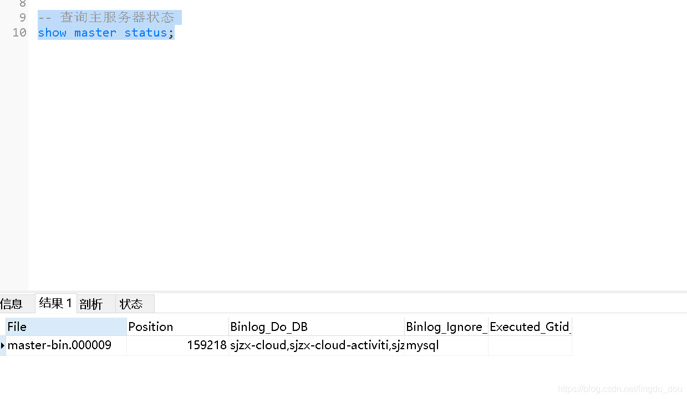
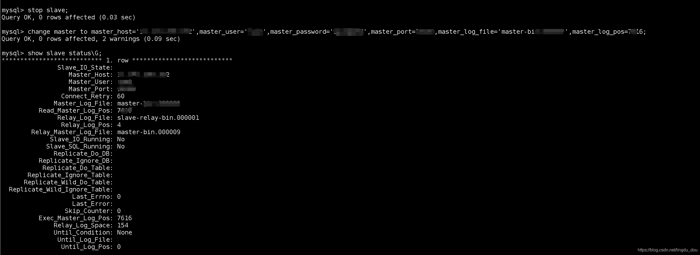
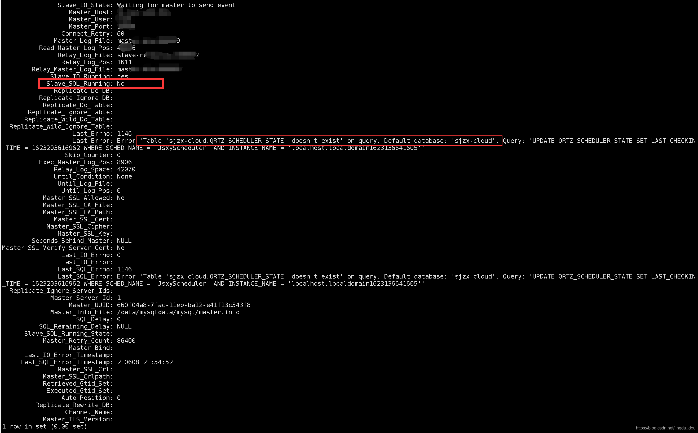

# MySQL主从同步

## 主
```mysqld
[mysqld]

# 主从同步主配置开始 #
server-id=1             # 节点ID，确保唯一
log-bin=master-bin      # 开启mysql的binlog日志功能
sync_binlog = 1         # 控制数据库的binlog刷到磁盘上去 , 0 不控制，性能最好，1每次事物提交都会刷到日志文件中，性能最差，最安全
binlog_format = mixed   # binlog日志格式，mysql默认采用statement，建议使用mixed
expire_logs_days = 7    # binlog过期清理时间
max_binlog_size = 100m  # binlog每个日志文件大小
binlog_cache_size = 4m  # binlog缓存大小
max_binlog_cache_size= 512m     # 最大binlog缓存大

auto-increment-offset = 1       # 自增值的偏移量
auto-increment-increment = 1    # 自增值的自增量
slave-skip-errors = all         # 跳过从库错误
log_bin_index=master-bin.index

binlog_do_db=table2           ##table2是要同步的数据库的名称
binlog_do_db=table3  		  ##table3是要同步的数据库的名称

binlog-ignore-db=mysql  #不生成日志文件的数据库，多个忽略数据库可以用逗号拼接，或者 复制这句话，写多行

user=mysql
# 主从同步主配置结束 #


# 设置端口
port=3306
#
# Remove leading # and set to the amount of RAM for the most important data
# cache in MySQL. Start at 70% of total RAM for dedicated server, else 10%.
# innodb_buffer_pool_size = 128M
#
# Remove leading # to turn on a very important data integrity option: logging
# changes to the binary log between backups.
# log_bin
#
# Remove leading # to set options mainly useful for reporting servers.
# The server defaults are faster for transactions and fast SELECTs.
# Adjust sizes as needed, experiment to find the optimal values.
# join_buffer_size = 128M
# sort_buffer_size = 2M
# read_rnd_buffer_size = 2M

# datadir=/var/lib/mysql
datadir=/data/mysql/data/mysql
# socket=/var/lib/mysql/mysql.sock
socket=/data/mysql/data/mysql/mysql.sock

# Disabling symbolic-links is recommended to prevent assorted security risks
symbolic-links=0

log-error=/var/log/mysqld.log
pid-file=/var/run/mysqld/mysqld.pid

character_set_server=utf8

init_connect='SET NAMES utf8'

# 大小写
lower_case_table_names=1

# innodb_force_recovery=0

#最大连接数
max_connections=1000

```

## 从

```mysqld
[mysqld]

# 主从同步从配置开始 #
server-id=2					# 节点ID，确保唯一
log-bin=slave-bin
relay-log=slave-relay-bin
relay-log-index=slave-relay-bin.index
# 主从同步从配置结束 #

# 设置端口
port=3307
#
# Remove leading # and set to the amount of RAM for the most important data
# cache in MySQL. Start at 70% of total RAM for dedicated server, else 10%.
# innodb_buffer_pool_size = 128M
#
# Remove leading # to turn on a very important data integrity option: logging
# changes to the binary log between backups.
# log_bin
#
# Remove leading # to set options mainly useful for reporting servers.
# The server defaults are faster for transactions and fast SELECTs.
# Adjust sizes as needed, experiment to find the optimal values.
# join_buffer_size = 128M
# sort_buffer_size = 2M
# read_rnd_buffer_size = 2M
# datadir=/var/lib/mysql
datadir=/data/mysqldata/mysql
# # socket=/var/lib/mysql/mysql.sock
socket=/data/mysqldata/mysql/mysql.sock

# Disabling symbolic-links is recommended to prevent assorted security risks
symbolic-links=0

log-error=/var/log/mysqld.log
pid-file=/var/run/mysqld/mysqld.pid

character_set_server=utf8

init_connect='SET NAMES utf8'


# 大小写
lower_case_table_names=1


[mysqld_safe]
log-error=/var/log/mysqld.log
pid-file=/var/run/mysqld/mysqld.pid

[client]
port=3307
socket=/data/mysqldata/mysql/mysql.sock

```

改好配置后分别重启数据库

主库执行

```sql
-- 查询主服务器状态
show master status;

```


## 从库：

```shell
mysql> stop slave; 
Query OK, 0 rows affected (0.03 sec)

mysql> change master to master_host='192.168.0.152',master_user='root',master_password='12345',master_port=3306,master_log_file='master-bin.000009',master_log_pos=7616;
Query OK, 0 rows affected, 2 warnings (0.09 sec)

mysql> show slave status\G;
*************************** 1. row ***************************
               Slave_IO_State: 
                  Master_Host: 192.168.0.152
                  Master_User: root
                  Master_Port: 3306
                Connect_Retry: 60
              Master_Log_File: master-bin.000009
          Read_Master_Log_Pos: 7616
               Relay_Log_File: slave-relay-bin.000001
                Relay_Log_Pos: 4
        Relay_Master_Log_File: master-bin.000009
             Slave_IO_Running: No
            Slave_SQL_Running: No
              Replicate_Do_DB: 
          Replicate_Ignore_DB: 
           Replicate_Do_Table: 
       Replicate_Ignore_Table: 
      Replicate_Wild_Do_Table: 
  Replicate_Wild_Ignore_Table: 
                   Last_Errno: 0
                   Last_Error: 
                 Skip_Counter: 0
          Exec_Master_Log_Pos: 7616
              Relay_Log_Space: 154
              Until_Condition: None
               Until_Log_File: 
                Until_Log_Pos: 0

```


说明：192.168.0.152是主服务器的id，master_log_file='master-bin.000009’是主服务器的File（你主服务器查出来的是什么就写什么），master_log_pos=7616是主服务器的Position（你主服务器查出来的是什么就写什么）；
每次重新启动主服务器，master_log_file和master_log_pos都会变。

## 遇到的坑：


主从数据库大小写不统一造成的错误

只同步某一个库，或者是某一张表，或者是不同步某一个库，不同步某一张表，改怎么设置呢？ 以上说的都能实现，参考MySQL官网：http://dev.mysql.com/doc/refman/5.7/en/change-replication-filter.html
举例忽略不同步某一张表(db1.mytable)：

```shell
mysql> stop slave;
mysql> CHANGE REPLICATION FILTER REPLICATE_IGNORE_TABLE = (db1.mytable);
mysql> start slave;

```


