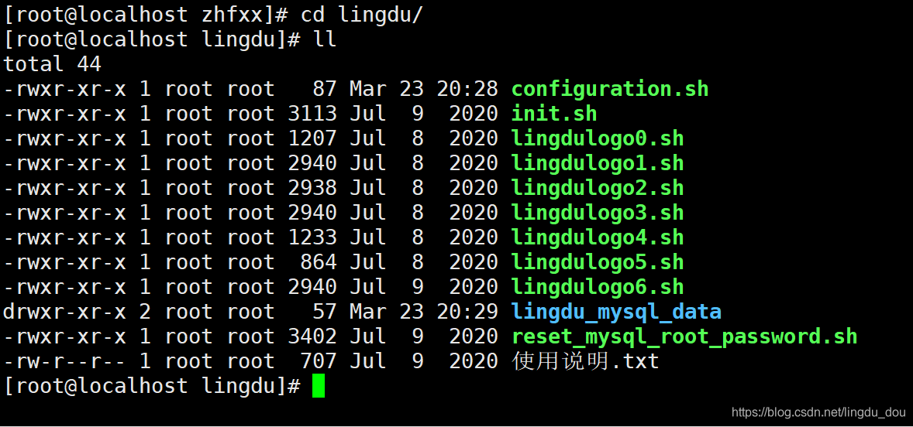
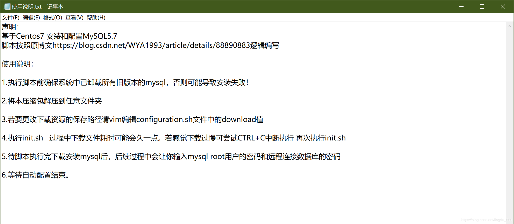
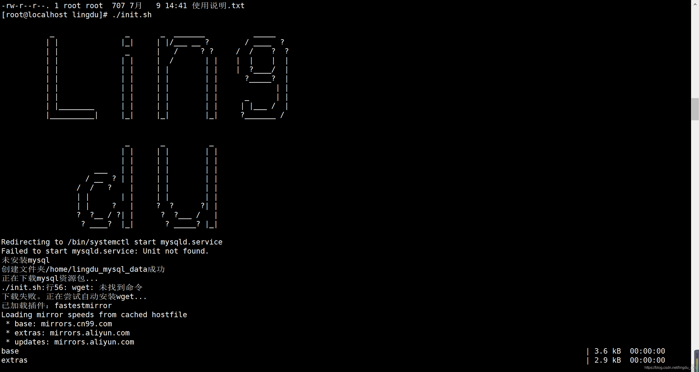
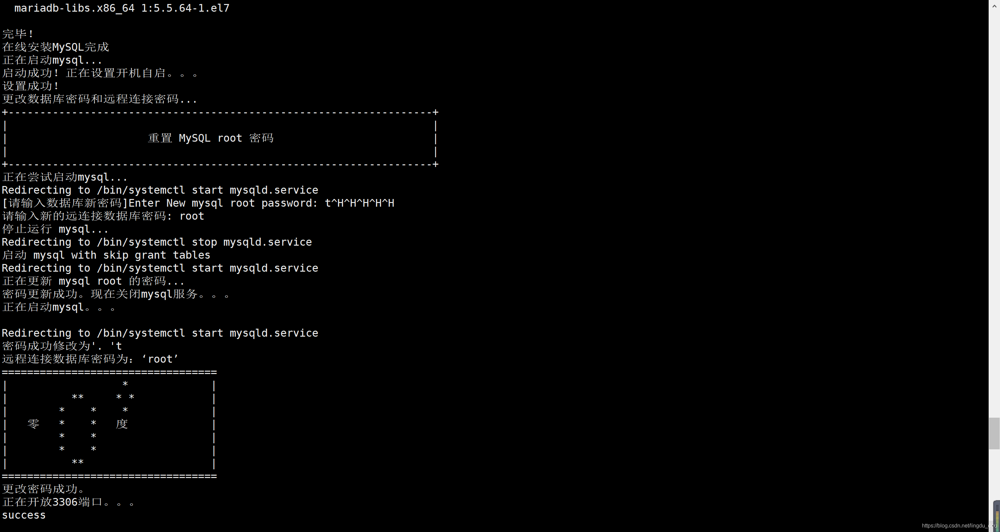
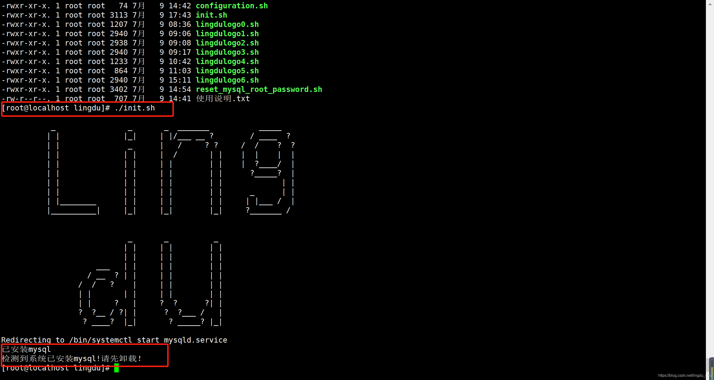
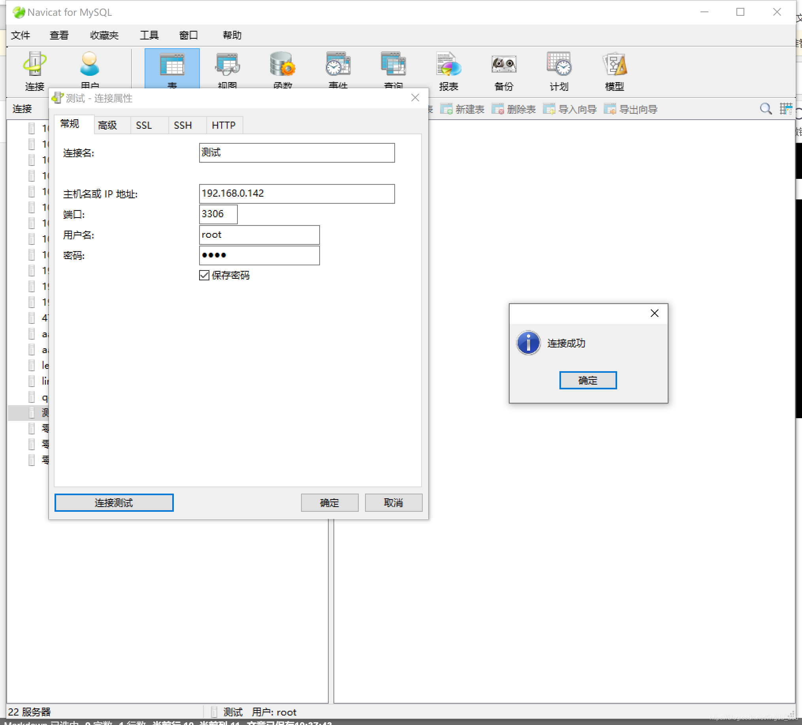

# MySQL安装脚本

## 说明

参照原博文[Centos7 安装和配置MySQL5.7](https://blog.csdn.net/WYA1993/article/details/88890883)

结合自己在网上搜索的一些资料整合的一套安装mysql并设置root密码和数据库远程连接密码的脚本

:::tip 由于时间久远，最近安装会出现异常可执行
```shell
rpm --import https://repo.mysql.com/RPM-GPG-KEY-mysql-2022
```
:::





部分脚本代码展示

```shell
#!/bin/bash

#测试脚本
#输出logo
./lingdulogo0.sh;
#检测是否已安装mysql
service mysqld start
if [ $? -eq 0 ]; then
        echo "已安装mysql";
	echo "检测到系统已安装mysql!请先卸载！";
	exit 1;
else
        echo "未安装mysql";
fi
#./lingdulogo1.sh;
#./lingdulogo2.sh;
#./lingdulogo3.sh;
#./lingdulogo4.sh;
#./lingdulogo5.sh;
#./lingdulogo6.sh;

#安装wget
#引入配置
source ./configuration.sh;
#获取文件下载路径
DownLoad=$download;

#创建下载路径文件夹
if [ -d "${DownLoad}" ]; then
 while :;do
    delete=""
    read -p "检测到文件夹${DownLoad}已存在！是否重新创建文件夹：[y/n]" delete
    if [ "${delete}" = "y" ]; then
        lingdu=`rm -rf ${DownLoad}`;
	break;
    else
	if [ "${delete}" = "n" ];then
	    echo "将使用已有的文件夹${DownLoad}存放下载文件";
	    break;
	else
	    echo "指令错误！";
	fi
    fi
 done
fi
mkdir -p ${DownLoad};
if [ $? -ne 0 ]; then
 echo "创建文件夹${DownLoad}失败";
 exit 1;
else
 echo "创建文件夹${DownLoad}成功";
fi

#下载mysql资源包
echo "正在下载mysql资源包...";
wget -P ${DownLoad} https://dev.mysql.com/get/mysql57-community-release-el7-11.noarch.rpm;
if [ $? -ne 0 ]; then
    echo "下载失败。正在尝试自动安装wget...";
    #安装wget
    yum -y install wget;
    if [ $? -ne 0 ]; then
        echo "安装失败.请尝试手动安装 执行：yum -y install wget";
	exit 1;#非正常结束脚本
    else
        echo "安装wget成功。正在进行下一步操作...";
	echo "正在下载mysql资源包...";
	wget -P ${DownLoad}  https://dev.mysql.com/get/mysql57-community-release-el7-11.noarch.rpm;
	if [ $? -eq 0 ]; then
	 echo "下载mysql资源包成功";
	else
	 echo "下载mysql资源包失败";
	 exit 1;
	fi
    fi
else
    echo "下载mysql资源包成功";
fi
echo "正在在线安装mysql安装源...";
yum -y localinstall ${DownLoad}/mysql57-community-release-el7-11.noarch.rpm;
if [ $? -ne 0 ]; then
    echo "安装mysql安装源失败！";
    exit 1;
else
    echo "安装源安装成功";
    #在线安装mysql
    echo "正在在线安装MySQL。。。";
    yum -y install mysql-community-server;
    if [ $? -eq 0 ]; then
     echo "在线安装MySQL完成";
    else
     echo "在线安装MySQL失败";
     exit 1;
    fi
fi

echo "正在启动mysql...";
systemctl start mysqld;
if [ $? -eq 0 ]; then
	echo "启动成功！正在设置开机自启。。。";
	systemctl enable mysqld;
	if [ $? -eq 0 ];then
		systemctl daemon-reload;
		if [ $? -eq 0 ]; then
			echo "设置成功！";
			echo "更改数据库密码和远程连接密码...";
			./reset_mysql_root_password.sh;#更改数据库密码和远程连接密码
			if [ $? -eq 0 ]; then
				echo "更改密码成功。";
				echo "正在开放3306端口。。。";
				firewall-cmd --zone=public --add-port=3306/tcp --permanent;
				if [ $? -eq 0 ]; then
					firewall-cmd --reload;
					if [ $? -eq 0 ]; then
						echo "开放成功！";
						exit 0;
					fi
				fi
			fi
		fi
	fi
fi
#如果没从if判断里面结束则运行不完全
exit 1;


```

脚本文件[CentOS7一键安装mysql5.7脚本文件](https://download.csdn.net/download/lingdu_dou/12595144)

链接： [https://pan.baidu.com/s/1HkiG8EaM1ECAi9hZm3ug2A](https://pan.baidu.com/s/1HkiG8EaM1ECAi9hZm3ug2A)

提取码：ling


## 演示

一键执行很方便

视频演示  

<BiliBili bvid="BV1PA411L7iD" />

CentOS7一键安装mysql5.7脚本演示

./init.sh开始执行


设置mysql密码成功


再次执行会提示已安装


远程连接成功



## 重置密码

可以复制下面的代码到.sh文件中执行

```shell
#!/bin/bash
 
# Check if user is root
if [ $(id -u) != "0" ]; then
    echo "must root"
    exit 1
fi
 
echo "+-------------------------------------------------------------------+"
echo "|                                                                   |"
echo "|                      重置 MySQL root 密码                         |"
echo "|                                                                   |"
echo "+-------------------------------------------------------------------+"
echo "正在尝试启动mysql...";
service mysqld start;
if [ $? -eq 0 ]; then
    DB_Name="mysql"
    DB_Version=`mysql --help |grep Distrib`
else
    echo "MySQL not found!"
    exit 1
fi
 
while :;do
    DB_Root_Password=""
    read -p "[请输入数据库新密码]Enter New ${DB_Name} root password: " DB_Root_Password
    if [ "${DB_Root_Password}" = "" ]; then
        echo "[密码不能为空！]Error: Password can't be NULL!!"
    else
        break
    fi
done

while :;do
    DB_yuancheng_Password=""
    read -p "请输入新的远连接数据库密码: " DB_yuancheng_Password
    if [ "${DB_yuancheng_Password}" = "" ]; then
        echo "[密码不能为空！]Error: Password can't be NULL!!"
    else
        break
    fi
done
 
echo "停止运行 ${DB_Name}..."
lingdu=`service mysqld stop`;
echo "启动 ${DB_Name} with skip grant tables"
lingdu=`echo -e "\nskip-grant-tables" >> /etc/my.cnf`;
if [ $? -eq 0 ]; then
	lingdu=`service mysqld start`;
fi
echo "正在更新 ${DB_Name} root 的密码..."
#if echo "${DB_Version}" | grep -Eqi '^8.0.|^5.7.|^10.[234].'; then
if true; then
    mysql -u root << EOF
FLUSH PRIVILEGES;
ALTER USER 'root'@'localhost' IDENTIFIED BY '${DB_Root_Password}';
GRANT ALL PRIVILEGES ON *.* TO 'root'@'%' IDENTIFIED BY '${DB_yuancheng_Password}' WITH GRANT OPTION;
EOF
#暂时用不上
else
    mysql -u root << EOF
update mysql.user set password = Password('${DB_Root_Password}') where User = 'root';
EOF
fi
 
if [ $? -eq 0 ]; then
    echo "密码更新成功。现在关闭mysql服务。。。";
    lingdu=`sed -i '$d' /etc/my.cnf`;#删除最后一行
    lingdu=`sed -i '$d' /etc/my.cnf`;
    lingdu=`grep "character_set_server=utf8" /etc/my.cnf`;#匹配查找
    if [ $? -ne 0 ]; then
     lingdu=`echo -e "\ncharacter_set_server=utf8" >> /etc/my.cnf`;#最后一行追加
    fi
    lingdu=`grep "init_connect='SET NAMES utf8'" /etc/my.cnf`;
    if [ $? -ne 0 ]; then
     lingdu=`echo -e "\ninit_connect='SET NAMES utf8'" >> /etc/my.cnf`;
    fi
    if command -v killall >/dev/null 2>&1; then
        killall mysqld
    else
        kill `pidof mysqld`
    fi
    sleep 5
    echo "正在启动${DB_Name}。。。";
    echo "";
    lingdu=`service mysqld start`;
    echo "密码成功修改为： '${DB_Root_Password}'"
    echo "远程连接数据库密码为：‘${DB_yuancheng_Password}’";
	echo "==================================";
	echo "|                  *             | ";
	echo "|          **     * *            | ";
	echo "|        *    *    *             | ";
	echo "|   零   *    *   度             | ";
	echo "|        *    *                  | ";
	echo "|        *    *                  | ";
	echo "|          **                    | ";
	echo "==================================";
else
    lingdu=`sed -i '$d' /etc/my.cnf`;
    lingdu=`sed -i '$d' /etc/my.cnf`;
    echo "Reset ${DB_Name} root password failed!";
    exit 1;
fi

```