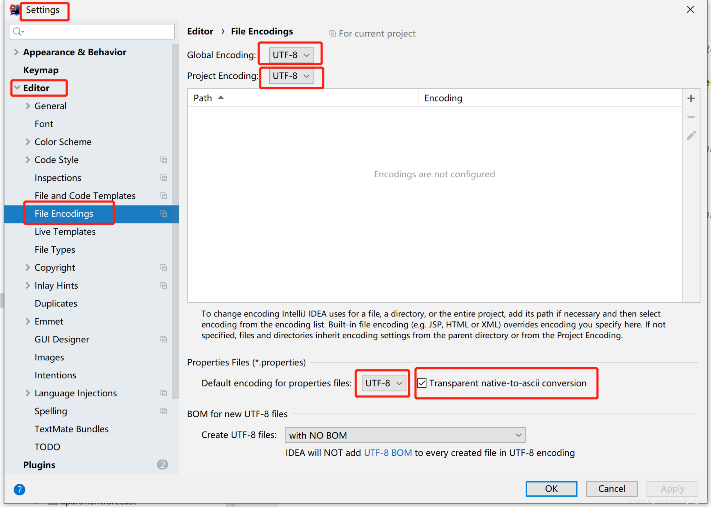
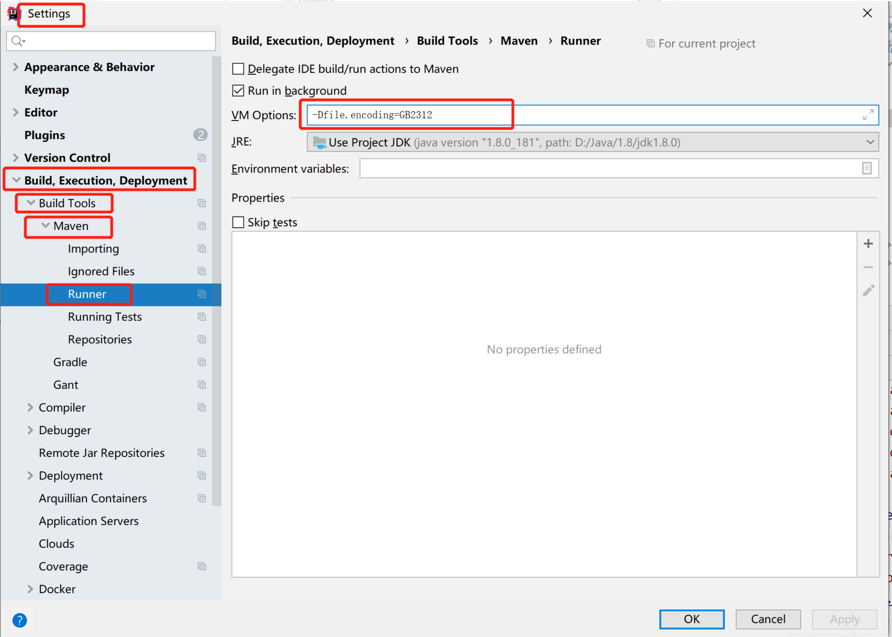
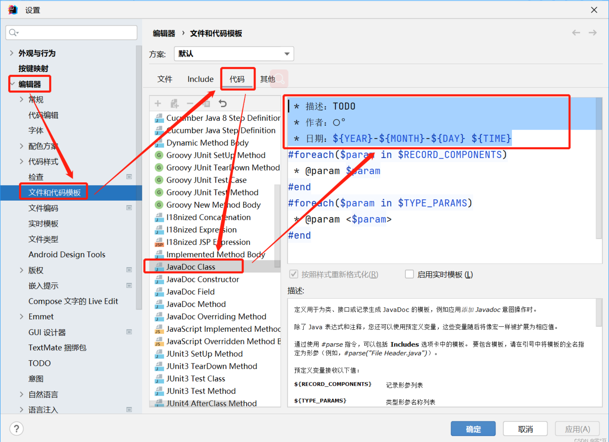
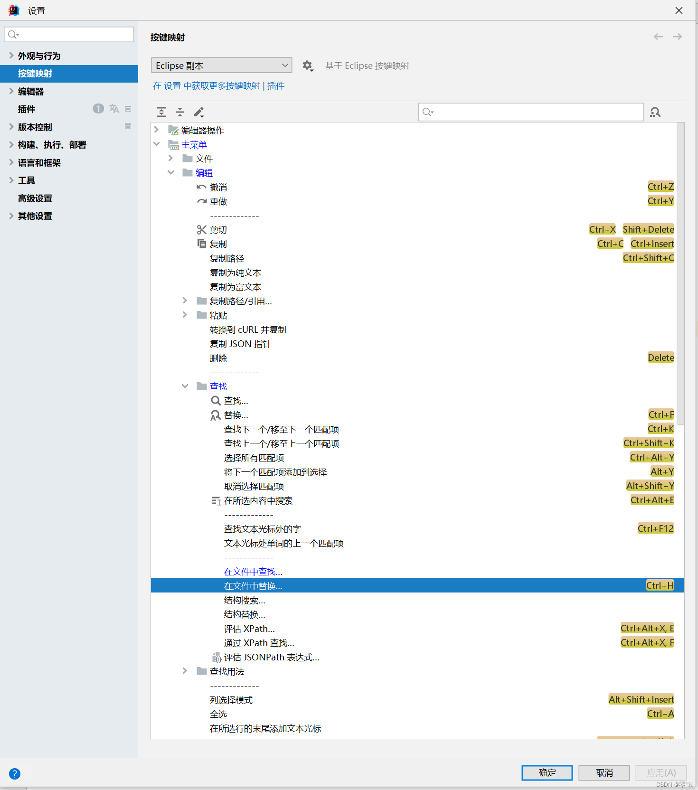
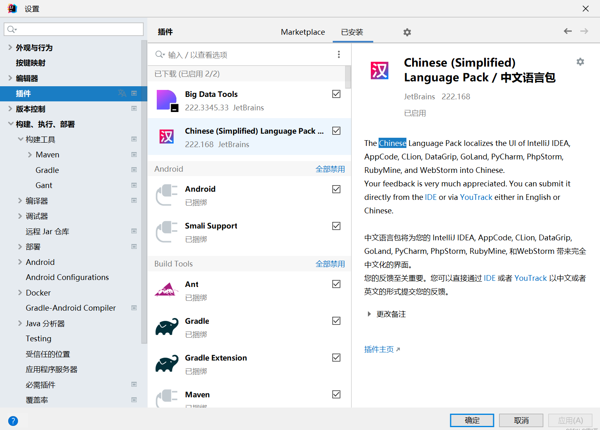
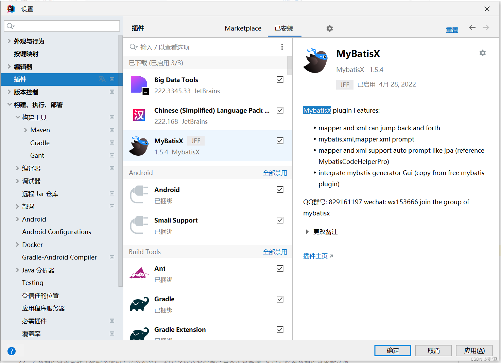
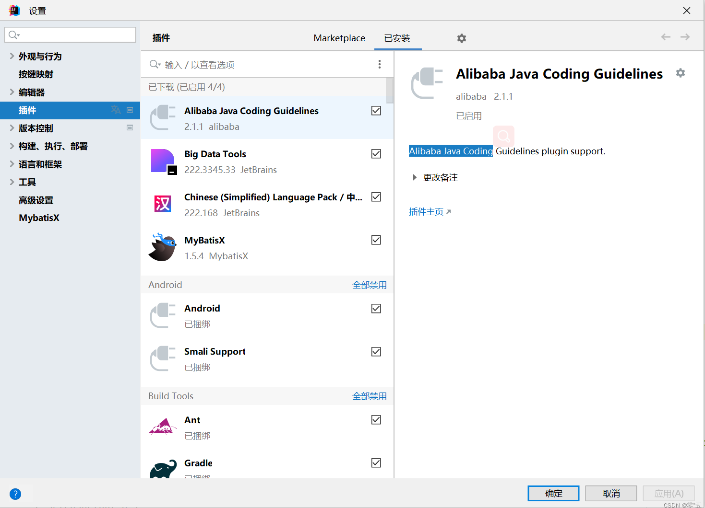
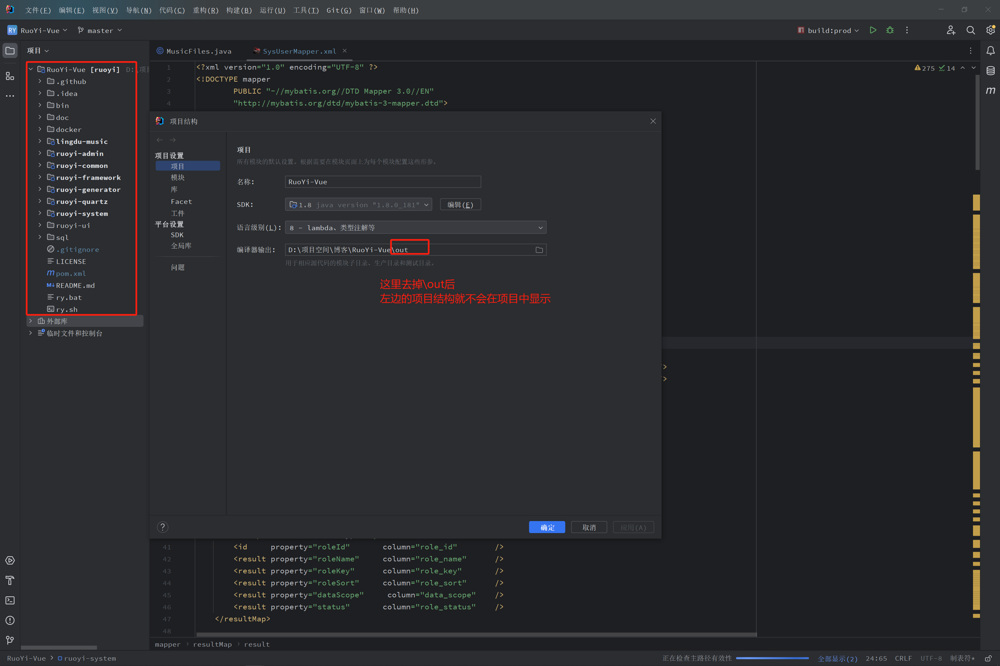

# IntelliJ IDEA

**[官网](https://www.jetbrains.com/idea/)**


## 介绍

IDEA 全称IntelliJ IDEA，是用于java语言开发的集成环境（也可用于其他语言），IntelliJ在业界被公认为最好的java开发工具之一，尤其在智能代码助手、代码自动提示、重构、J2EE支持、Ant、JUnit、CVS整合等方面的功能可以说是超常的。IDEA是JetBrains公司的产品。

idea分为旗舰版和社区版：旗舰版收费，功能多于旗舰版；社区版免费，功能少一些。

## 下载和安装
[下载安装教程](https://www.exception.site)

## 设置字符编码


## 乱码问题
### maven
Maven 执行 clean、compile、package等操作时控制台 中文乱码问题解决  
::: tip 参数值
`-Dfile.encoding=GB2312`
:::



## 提示非法字符
解决方法：  
  将编码格式UTF-8+BOM文件转为普通的UTF-8文件。  
  在AS右下角，将编码改为GBK，再转为UTF-8,可以解决。  


## 类注释快捷方式生成补全模板设置

::: tip 注释值
```java
 * 描述：TODO
 * 作者：⭕°
 * 日期：${YEAR}-${MONTH}-${DAY} ${TIME}
#foreach($param in $RECORD_COMPONENTS)
 * @param $param
#end
#foreach($param in $TYPE_PARAMS)
 * @param <$param>
#end

```
```java
 * @作者 <b><a class=b href="https://blog.csdn.net/lingdu_dou" color="red">⭕°</a></b>
 * @创建时间 ${YEAR}-${MONTH}-${DAY} ${TIME}

```
:::

## 全局查找替换快捷键设置


## 插件推荐
### 1. 汉化插件 Chinese

### 2. MybatisX

### 3. 阿里代码规范插件 Alibaba Java Coding

### 4. [IDEA配置JRebel热部署](https://blog.csdn.net/weixin_42694593/article/details/126448828)

## 项目结构显示问题


