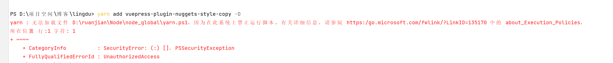
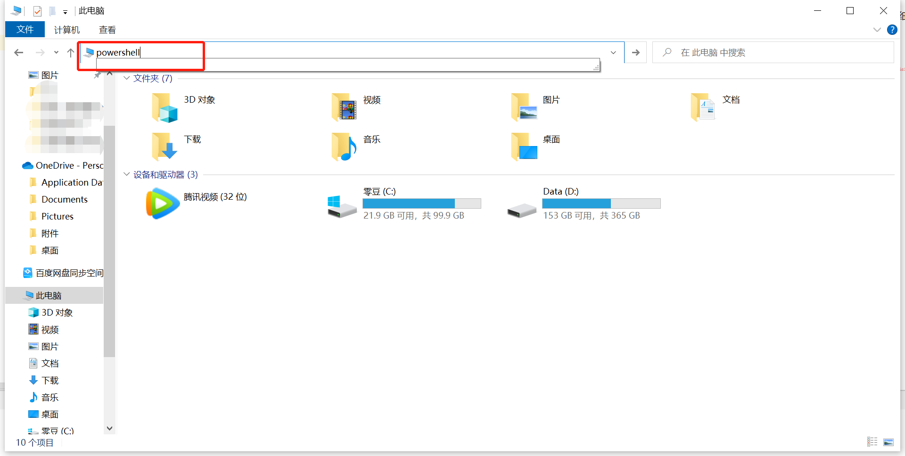
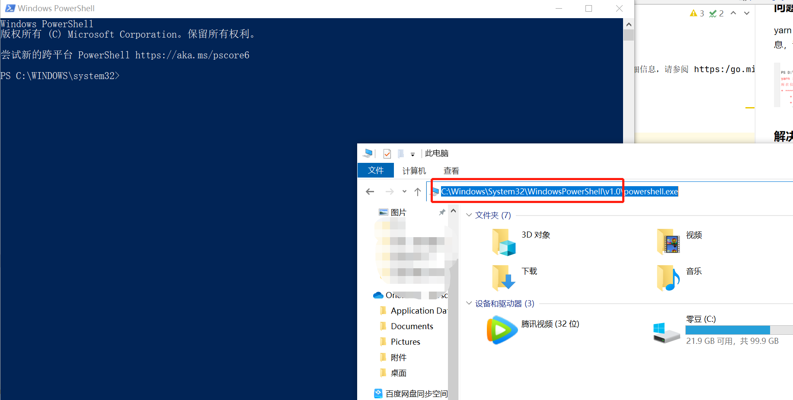
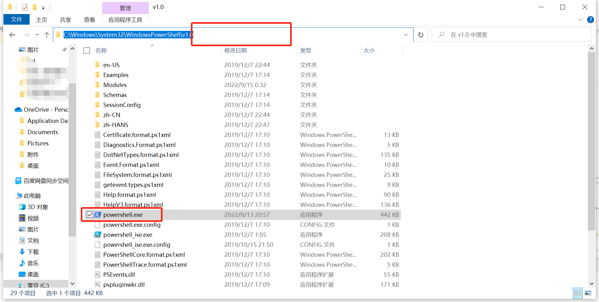
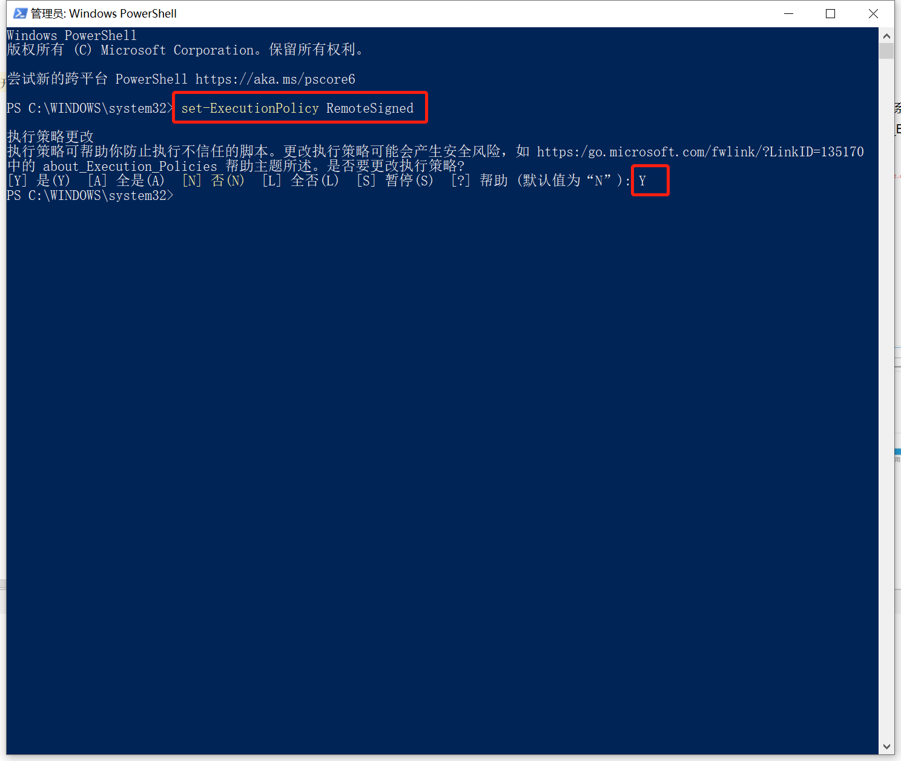

# Node

## yarn 
### 问题
yarn : 无法加载文件 D:\ruanjian\Node\node_global\yarn.ps1，因为在此系统上禁止运行脚本。有关详细信息，请参阅 https:/go.microsoft.com/fwlink/?LinkID=135170 中的 about_Execution_Policies。


### 解决
1. 在windows搜索powershell，右键以管理员身份运行  
直接在文件地址栏输入`powershell` ,然后回车会自动打开程序


去掉最后的`powershell.exe`再回车到达目标文件夹，右键以管理员身份运行


2. 在本地计算机上运行您编写的未签名脚本和来自其他用户的签名脚本，使用以下命令将计算机上的 执行策略更改为 RemoteSigned  
   执行：
```shell
set-ExecutionPolicy RemoteSigned
```

选择Y，回车

再次运行yarn ***，问题解决了

## npm
### 问题
npm install卡住 获取不到core-js问题解决
- 1.卡住的地方
```shell
# 卡住的地方
reify:core-js: http fetch GET 200 https://cdn.npmmirror.com/packages/core-js/3.19.1/core-js-3.19.1.tgz 9260ms (cache miss)
```
- 2.解决方案
```shell
# 解决方案 执行
npm install core-js@3
# 看你自己的core-js版本 有的是 core-js@2
npm install core-js@2

```
