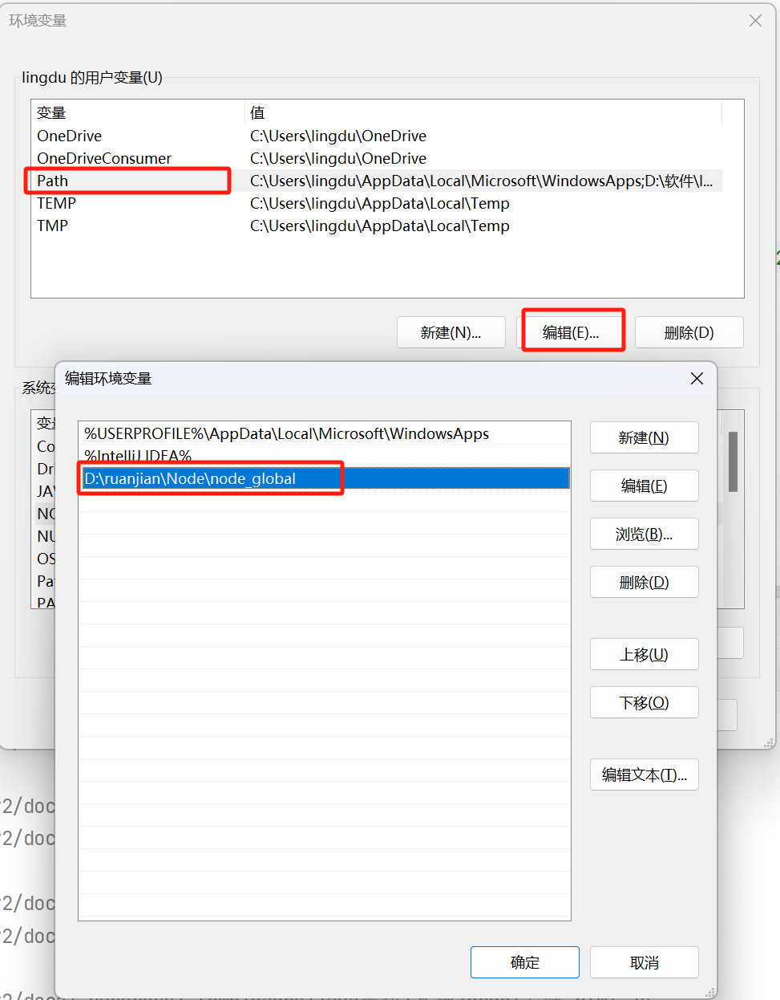

# 安装

::: tip 简介  
npm是Node Package Manager的缩写，是Node.js的包管理工具。它允许用户从npm服务器下载并安装别人编写的第三方包，也可以让用户将自己编写的包或命令行程序上传到npm服务器供别人使用。

npm是Node.js的包管理工具。它允许用户从npm服务器下载并安装别人编写的第三方包，也可以让用户将自己编写的包或命令行程序上传到npm服务器供别人使用。  

npm的背后是基于CouchDB的一个数据库，详细记录了每个包的信息，包括作者、版本、依赖、授权信息等。它的一个很重要的作用就是将开发者从繁琐的包管理工作（版本、依赖等）中解放出来，更加专注于功能的开发。

:::


## 1.下载
[下载地址](https://nodejs.org/zh-cn/download/prebuilt-installer)

## 2.安装
1.双击安装文件，安装即可  
2.安装完成后，打开cmd，输入`node -v`查看node版本，如果出现版本号，则安装成功

## 3.设置npm全局模块路径和缓存路径

### 1.创建文件夹
> 在安装目录下创建`node_cache`和`node_global`目录。
> 分别设置node_global和node_cache文件夹的安全允许权限，以便写入、修改文件夹中的内容，我们鼠标右键文件夹→属性→安全，其中，第三个文件夹node_modules为安装node时自动生成的，用来存放安装node.js时自动安装的内置模块(也称为标准包)。
> 
>> 这两个目录用于存放npm全局模块和缓存，默认安装位置在`C:\Users\用户名\AppData\Roaming\npm`，可以修改为任意位置  

>执行命令,使用管理员权限执行cmd窗口  
> 

### 2.设置文件夹路径
- 使用 `npm config set prefix` 命令修改全局模块安装位置  
打开cmd，输入:
```cmd
npm config set prefix "D:\安装目录\node_global"
```
- 使用 `npm config set cache` 命令修改缓存位置  
输入:  
```cmd
npm config set cache "D:\安装目录\node_cache"
```
- 使用 `npm config get prefix` 命令查看全局模块安装位置，输入`npm config get cache`查看npm缓存位置  
输入`npm config get prefix`查看npm全局模块路径，输入`npm config get cache`查看npm缓存路径
```cmd
npm config get prefix
npm config get cache
```

### 3.设置环境变量

:::tip 环境变量
环境变量是在操作系统中一个具有特定名字的对象，它代表了一个或者多个应用程序所将使用到的信息。当要求系统运行一个程序而没有告诉它程序所在的完整路径时，系统除了在当前目录下面寻找此程序外，还会到环境变量path中指定的路径去找可运行的对象。

环境变量中的系统变量是对所有用户有效，用户变量是对当前登录的windows账号有效，当系统变量查找不到时，会到当前用户变量中查找。另外，环境变量名称是不区分大小写的，比如：PATH和path，两个名称是一样的。

因此，为方便调用安装的包，我们需要配置环境变量(environment variable)，把包的安装路径设置为环境变量的值，以方便调用包。
:::

>在安装完node.js时，默认设置了环境变量，因而在用户变量或系统变量中的`Path`中已经设置了值，这里我们只需要对其进行修改就可以了，把原来的值换成`D:\安装目录\node_global`即可，比如：原来默认的是用户变量`Path`，我们双击`Path`，其值为`C:\Users\用户名\AppData\Roaming\npm`，编辑换成`D:\安装目录\node_global`。
>
>修改后，单击所有的确定后，环境变量配置成功。在调用时，当未指明路径时系统会自动进入该配置的位置匹配调用。 若默认的是系统变量，同理进行修改。

## 4.配置npm镜像

镜像源(Mirror)的作用是为用户提供下载、分发和管理服务。在CMD命令行窗口中使用命令`npm get registry`(或`npm config get registry`)查看当前使用的镜像源地址，npm默认使用的镜像源地址为`https://registry.npmjs.org/`，在使用 npm下包的时候，默认从国外的 npm 服务器进行下载，可能速度比较慢，我们可以更换为国内镜像源。淘宝在国内搭建了一个服务器，专门把国外官方服务器上的包同步到国内的服务器，然后在国内提供下包的服务，有时候考虑到下载网速，我们可以更换为淘宝镜像源，在cmd命令行窗口中输入命令(下面`npm config set`也可以写成`npm set`)：

1.打开cmd，输入`npm config set registry https://registry.npm.taobao.org`
```cmd
npm config set registry https://registry.npmmirror.com
```

2.输入`npm config get registry`查看npm镜像，如果出现淘宝镜像地址，则配置成功
```cmd
npm config get registry
```

更换镜像源后，我们可以用npm下载淘宝镜像源的包。

上面我们是通过手动设置镜像源，我们可以安装镜像源管理工具nrm，通过nrm切换镜像源。可以在cmd命令行窗口中输入命令`npm install nrm -g`安装nrm，安装后可以使用命令`nrm ls`查看支持的镜像源，并且通过镜像源名称直接切换镜像源，比如：命令`nrm taobao`，即可切换到使用淘宝镜像源，命令`nrm current`可以查看当前使用的镜像源名名称，具体命令操作如图所示。


## 5.配置包管理工具
上面我们使用npm包管理工具，我们也可以使用其他包管理工具，比如：cnpm、yarn等。我们可以在cmd命令行窗口中输入下面命令分别安装cnpm、yarn包管理工具：

```shell
npm install cnpm -g

npm install yarn -g
```

安装完成后可以在cmd窗口分别使用`cnpm -v`和`yarn -v`命令查看版本情况，出现版本信息即表示已安装成功。

npm是node官方的包管理器。

cnpm是中国版的npm，通常因网络等各类因素无法使用npm时， cnpm就派上用场了，但cnpm一般只用于安装时候，所以在项目创建、卸载等操作时我们还是使用npm，因而cnpm不能用来卸载包。

yarn是由Facebook、Google、Exponent 和 Tilde 联合推出了一个新的 JS 包管理工具，是为了弥补 npm 的一些缺陷而出现。

npm、cnpm、yarn等包管理工具有各自的特色，一般来讲，上图列出的镜像源可以用这些包管理工具来操作。但在使用时，它们的操作命令有的存在差异，在使用时应注意命令格式，另外，考虑到网络、包等因素，当一种包管理工具在使用时遇到问题时，可以尝试使用另一种包管理工具来实现需求。


>[参考链接：https://blog.csdn.net/thefg/article/details/132410794](https://blog.csdn.net/thefg/article/details/132410794)