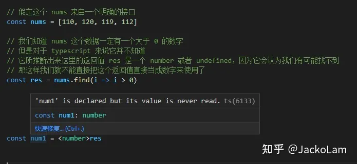

# TypeScript

[转载地址](https://zhuanlan.zhihu.com/p/599379881)

## 概述

TypeScript 基于 Javascript 基础之上的编程语言，是 JavaScript 的超集，或者叫扩展集。所谓超集就是在JavaScript
原有的基础上多了一些扩展特性，多出来的其实是一套更强大的类型系统，以及对 ECMAScript的新特性支持，它最终会编译成原始的
JavaScript。


因为TypeScript最终会编译成JavaScript去工作，所以任何一种Javascript运行环境都支持，例如我们传统的浏览器应用，或者是node应用，reactNative，桌面应用Electron，它们都可以使用TypeScript来开发。相比于Flow，TypeScript作为一门完整的编程语言，他的功能更为强大，生态也更健全、更完善。

### 缺点

● 语言本身多了很多概念，比如接口，枚举等等，提高学习成本；

● 项目初期，TypeScript会增加一些成本;

## 快速上手

### 安装

```shell
yarn add typescript --dev
```

安装完成之后在 node_modules/.bin 中 有一个 tsc

tsc命令：用来编译Typescript代码

### 编译转换

```shell
yarn tsc [文件名]
```

编译前

```typescript
// 可以完全按照 JavaScript 标准语法编写代码

const hello = name => {
    console.log(`Hello, ${name}`)
}

hello('TypeScript')
```

编译后

```javascript
// 可以完全按照 JavaScript 标准语法编写代码
var hello = function (name) {
    console.log("Hello, " + name);
};
hello('TypeScript');
```

## 配置文件

tsc命令不仅仅可以去编译指定某个ts文件，它还可以去编译整个项目，编译整个工程。

### 创建 TypeScript 配置文件

```shell
yarn tsc --init
```

命令之后，会生成一个 tsconfig.json 文件。

compilerOptions：typescript编译器所对应的选项

### 常用的选项

**target：** 作用就是用设置编译过后 Javascript 所采用的 ECMA 标准；

**module：** 输出的代码采用什么样的方式去进行模块化；

**outDir：** 设置编译结果输出到的文件夹，一般我们会输出到 dist 文件夹；

**rootDir：** 配置我们源代码，也就是 Typescript 的代码所在的文件夹，一般我们会把源代码放在src目录；

**sourceMap：** 开启源代码映射，开启之后，调试的时候可以 sourceMap 文件进行调试源代码；

**strict：** 开启所有严格检查选项，严格模式下，需要我们对每一个成员都要指定明确的类型等等；

*需要注意的是，如果我们还是使用 tsc 编译某个 ts
文件时，配置文件是不起作用的，只有当我们直接运行tsc命令去编译整个项目时，配置文件才生效。*

## 标准库声明 （内置对象类型）

标准库就是内置对象所对应的声明，我们在代码中使用内置对象，就必须要引用对应的标准库，否则 typescript 就会找不到对应的类型，就会报错。

可通过配置文件lib选项添加我们要使用的标准库：

```json
{
  "compilerOptions": {
    "lib": [
      "es2015",
      "DOM"
    ]
  }
}
```

## 作用域问题

不同文件可能会存在相同名称的变量，比如 a 文件定义了一个全局的变量 a，b文件也定义了一个全局变量 a，那么就会产生异常。

### 解决方法

- **用一个立即执行函数创建一个单独的作用域**

```typescript
(function () {
    const a: string = 'foobar'
})()
```

- **使用export 导出，这样的话这个文件就会作为一个模块导出，模块有单独的模块作用域**

```typescript
const a: string = 'foobar'

export {}
```

**注意export后面的{ }，是export 的语法，并不是表示导出一个空对象**

当然，这样的一个问题在实际开发并不会用到，因为在绝大多数情况下，每个文件都会以模块的形式去工作。

## 原始类型（Primitive Types）

**string、number、boolean**

```typescript
const a: string = 'foobar'

const b: number = 100 // 包括NaN Infinity

const c: boolean = true // false
```

跟 flow 不同，以上这三种类型在**非严格模式**（strictNullChecks）是允许为空的，也就是说我们可以赋值为 null 或者是 undefined。

```typescript
const a: string = null // undefined
const b: number = null // undefined
const c: boolean = null // undefined
```

***但需要注意的是：在严格模式下是不允许的.***

**viod、null、undefined**

```typescript
const e: void = undefined

const f: null = null

const g: undefined = undefined
```

**Symbol**

Symbol 是 ES2015 标准中定义的成员，**使用它的前提是必须确保有对应的 ES2015 标准库引用**，也就是 tsconfig.json 中的 **lib
选项必须包含 ES2015** 。

**配置tsconfig.json**

```typescript
{
    "compilerOptions"
:
    {
        "lib"
    :
        ["es2015"]
    }
}
```

**定义symbol类型**

```typescript
const h: symbol = Symbol()
```

## object 类型（Object Types）

Typescript 中 **Object 类型不单是指普通对象类型，它泛指所有的非原始类型**，也就是对象，数组还有函数。

```typescript
// 注意这里的 object 类型首字母是小写的

// 函数
const fn: object = function () {
}

// 普通对象
const obj: object = {}

// 数组
const arr: object = []
```

如果需要普通对象类型，就要使用类似对象字面量的语法去标记类型，这种对象类型限制，它要求我们赋值对象的结果必须要跟我们标记类型的
**结构完全一致**，不能多，也不能少。

```typescript
const obj: { foo: number, str: string } = {foo: 123, str: '123'}
```

更好的方式是**使用接口**的方式，下面会有讲哦。

## 数组类型（Array Types）

TypeScript 定义数组的方式跟 flow 几乎完全一致。

- **使用 Array 泛型**

```typescript
// 元素类型选择 number，表示纯数字数组

const arr1: Array<number> = [1, 2, 3]
```

- **使用元素类型 + [ ]**

```typescript
// 元素类型选择 number，表示纯数字数组

const arr1: number[] = [1, 2, 3]
```

## 元组类型（Tuple Types）

元组就是一个明确元素数量以及每一个元素类型的数组。

**定义元组类型的方式：可类似数组字面量**

```typescript
// 这个时候表示：只能存储两个对应类型的元素

const tuple: [number, string] = [18, 'zhangsan']
```

**访问元组当中元素的方式**

- 可以使用数组下标的方式去访问

```typescript
const tuple: [number, string] = [18, 'zhangsan']

const age = tuple[0]
const name = tuple[1]
```

- 使用数组解构的方式去提取

```typescript
const tuple: [number, string] = [18, 'zhangsan']

const [age, name] = tuple
```

**元组一般用于一个函数中返回多个返回值**

```typescript
const entries: [string, number][] = Object.entries({
    foo: 123,
    bar: 456
})

const [key, value] = entries[0]
// key => foo, value => 123
```

## 枚举类型（Enum Types）

### 枚举的介绍

**枚举类型的特点**

- 可以给一组数值取上一个更好理解的名字；

- 一个枚举中只会存在几个固定的值，并不会出现超出范围的可能性；

在很多编程语言中都会有枚举这种数据结构，但是**在 JavaScript 中没有这种枚举数据结构**，很多时候都是用一个对象来模拟枚举，如下：

```javascript
const PostStatus = {
    Draft: 0,
    Unpublished: 1,
    Published: 2
}

const post = {
    title: 'Hello TypeScript',
    content: 'TypeScript is a typed superset of JavaScript.',
    status: PostStatus.Draft // 0 // 1 // 2
}
```

在 Typescript 当中可以用 **enum 关键词**声明一个枚举，{ } 里面是枚举的值，注意的是**用 = 号**，使用方式跟对象一样。

```typescript
enum PostStatus {
    Draft = 0,
    Unpublished = 1,
    Published = 2
}

const post = {
    title: 'Hello TypeScript',
    content: 'TypeScript is a typed superset of JavaScript.',
    status: PostStatus.Draft // 0 // 1 // 2
}
```

### 数字枚举

枚举值自动基于前一个值自增，如果没指定具体数值，则从 0 开始。

```typescript
enum PostStatus1 {
    Draft, // 0
    Unpublished, // 1
    Published // 2
}

enum PostStatus2 {
    Draft = 6, // 6
    Unpublished, // 7
    Published2 // 8
}

const post = {
    title: 'Hello TypeScript',
    content: 'TypeScript is a typed superset of JavaScript.',
    status: PostStatus1.Draft // 0 // 1 // 2
}
```

### 字符串枚举

字符串枚举无法自增，需要手动添加，字符串枚举不太常见。

```typescript
enum PostStatus {
    Draft = 'a',
    Unpublished = 'b',
    Published2 = 'c'
}

const post = {
    title: 'Hello TypeScript',
    content: 'TypeScript is a typed superset of JavaScript.',
    status: PostStatus.Draft // a // b // c
}
```

### 枚举类型会影响编译结果

枚举类型会入侵到我们的运行时的代码，也就是说**它会影响我们编译后的结果**
，我们在Typescript当中使用大量的大多数类型，经过编译转换过后都会被移除掉，因为它们只是为了我们在编译过程中可以进行类型检查；但是枚举类型不会，
**它最终会编译成一个双向的键值对对象**，目的是可以让我们动态的根据枚举值去或者枚举的名称，也就是说**我们可以通过索引器的方式去访问对应的枚举名称
**。

**编译前**

```typescript
enum PostStatus {
    Draft,
    Unpublished,
    Published
}

const post = {
    title: 'Hello TypeScript',
    content: 'TypeScript is a typed superset of JavaScript.',
    status: PostStatus.Draft // 0 // 1 // 2
}
```

**编译后**

```javascript
"use strict";
var PostStatus;
(function (PostStatus) {
    PostStatus[PostStatus["Draft"] = 0] = "Draft";
    PostStatus[PostStatus["Unpublished"] = 1] = "Unpublished";
    PostStatus[PostStatus["Published"] = 2] = "Published";
})(PostStatus || (PostStatus = {}));
var post = {
    title: 'Hello TypeScript',
    content: 'TypeScript is a typed superset of JavaScript.',
    status: PostStatus.Draft // 0 // 1 // 2
};
```

### 常量枚举

如果我们确认我们代码中不会使用索引器的方式去访问枚举，那推荐使用常量枚举，常量枚举：enum 前面加个关键词 const。

**编译前**

```typescript
const enum PostStatus {
    Draft,
    Unpublished,
    Published
}

const post = {
    title: 'Hello TypeScript',
    content: 'TypeScript is a typed superset of JavaScript.',
    status: PostStatus.Draft // 0 // 1 // 2
}
```

**编译后**

```javascript
"use strict";
var post = {
    title: 'Hello TypeScript',
    content: 'TypeScript is a typed superset of JavaScript.',
    status: 0 /* Draft */ // 0 // 1 // 2
};
```

## 函数类型（Function Types）

无非是对输入输出做限制，也就是参数和返回值。

### 函数声明的类型限制

**基本用法**

```typescript
function func(a: number, b: number): string {
    return 'func1'
}

func(100, 200)
```

需要注意，**形参和实参的个数要一致**

**可选参数**

- 在参数后面加一个 ? 号

```typescript
function func(a: number, b?: number): string {
    return 'func1'
}

func(100)
```

- 使用 es6，添加默认参数，因为添加默认值的参数就可有可无。

```typescript
function func(a: number, b: number = 10): string {
    return 'func1'
}

func(100)
```

注意：使用**可选参数**或者是**默认参数**，都**必须要在参数列表的最后**.

**接收任意个数参数**

使用 es6 的 ... 操作符.

```typescript
function func(a: number, ...rest: number[]): string {
    return 'func1'
}

func(100, 200, 300, 400)
```

**函数表达式的类型限制**

因为函数表达式最终是放在一个变量上的，接收这个函数的变量，也是应该有类型的.

```typescript
const func = function (a: number, b: number): string {
    return 'func1'
}
```

typescript一般会**根据函数表达式推断出这个变量的类型**

如果是把一个函数作为参数传递，也就是回调函数的方式，一般我们就会去约束我们这个回调函数形参的类型，使用类似箭头函数的方式去表示我们这个参数接收什么类型的函数，这种方式在定义接口的时候经常用到。

```typescript
const func: (a: number, b: number) => string = function (a: number, b: number): string {
    return 'func1'
}
```

## 任意类型（Any Types）

由于 JavaScript 自身是**弱类型**的关系，很多内置的 API 它本身就支持接收任意类型的参数，而 Typescript 它又是基于 Javascript
的基础之上的，所以说我们难免会在代码当中需要去用一个变量接收任意类型的数据。

```typescript
// 任意类型（弱类型）
function stringify(value: any) {
    return JSON.stringify(value)
}

stringify('string')

stringify(100)

stringify(true)

// any 类型仍然属于动态类型，它的特点跟普通 JavaScript 变量是一样的
// 也就是可以接收任意类型的值
let foo: any = 'string'

// 在运行当中还可以接收其他类型的值
foo = 100

foo.bar()

// any 类型是不安全的
```

any 类型，typescript 不会去做类型检查，仍然会存在**类型安全的问题**。所以**不要轻易去使用这种类型**。

## 隐式类型推断

在 Typescript中，如果我们没有通过类型注解去明确一个变量的类型，那么 typescript 会根据变量的使用情况，来推断这个变量的类型，这样一种特性叫
**隐式类型推断**。

定义一个变量赋值一个 number 类型的值，typescript会推断这个变量为 number 类型，如下：


此时我们在给变量赋值为 string 类型的话就会 typescript 就会报错提示，如下：


如果 typescript 无法推断变量的类型，就会把它当成 any 类型，如下：


虽然 Typescript 中支持隐式类型推断，而且这种隐式类型推断可以帮我们简化一部分代码，**但仍然建议为每个变量添加明确的类型，方便以后我们能更好理解我们的代码
**。

## 类型断言（Type assertions）

有时候在某些特殊情况下，typescript **无法推断变量的具体类型**，但是我们作为开发者，根据代码的具体情况，是可以明确知道这个变量的类型的，那么我们
**可以通过类型断言告诉 typescript 这个变量的类型**。


这种情况我们就可以去断言 res 是个 number 类型。

- 使用 as 关键词（推荐）

```typescript
const num1 = res as number
```


- 在变量的前面使用 <类型> 的方式断言

这种方式需要注意的是**不能在 jsx 中使用**，<> 会跟 jsx 中的标签**产生语法上的冲突**。

```typescript
const num1 = <number>res
```



注意：**类型断言并不是类型转换**，因为类型转换是代码在运行时的概念，而**类型断言它只是在编译过程当中的概念**，当**代码编译过后
**这个**断言就不会存在**了，所以它跟类型转换是有本质的差异的。

## 接口（Interfaces）

可以理解为**一种规范**或者**契约**，它可以**用来约定对象的结构**，我们去使用一个接口就要去遵循这个接口的所有约定。在
typescript 中，接口最直观的体现是，约定一个对象当中具体应该有那些成员，并且这些成员是什么类型的。

### 基本用法

```typescript
interface Post {
    // 多个成员可使用 ','、';' 分割，也可以不用
    title: string
    content: string
}

// 对于这个函数所接收的 post 对象，他就有一定的要求
// 所传入的对象必须要有一个 title 属性和 content 属性
// 只不过这种要求实际上是隐性的，它没有明确的表达出来
// 这种情况下我们就可以使用接口去表现出来这种约束
function printPost(post: Post) {
    console.log(post.title)
    console.log(post.content)
}

printPost({
    title: 'Hello TypeScript',
    content: 'A javascript superset'
})
```

**编译之后，我们没有发现任何有关接口的代码**，其实 typescript 的接口**只是为我们有结构的数据做类型约束**，在运行阶段这种接口没有意义。


### 可选成员

果说我们在一个对象当中，我们某个成员是可有可无的，那对于约束这个对象的接口来说，我们可以使用可选成员这样的一个特性。

```typescript
interface Post {
    title: string
    content: string
    subtitle?: string // 可选成员
}
```

### 只读成员

初始化过后不能再修改

```typescript
interface Post {
    title: string
    content: string
    subtitle?: string // 可选成员
    readonly summary: string // 只读成员
}
```


### 动态成员

一般用于一些有动态成员的对象，例如程序当中的缓存对象，它在运行当中会出现一些动态的键值。

```typescript
interface Cache {
// [属性名称（不是固定的，可以是任意名称）, 键的类型]：值的类型
    [prop: string]: string
}

// 创建一个 cache 对象实现这个 Cache 接口
const cache: Cache = {}

// 动态添加任意的成员，这些成员都必须遵循 Cache 接口的类型约束
cache.foo = 'value1'
cache.bar = 'value2'
```


## 类 （Classes）

### 类的基本使用

**作用**：描述一类具体事物的抽象特征。

例如：手机就是一个类型，这个类型的特征就是可以用来打电话和发短信，在这个类型下面还有一些细分的子类，而这些子类一定会满足父类的所有特征，而还会多出一些额外的特征。如智能手机，除了可以打电话和发短信，还可以使用一些 app，而我们是不能直接去使用类的，而是使用属于这个类的具体事物，例如我手上的智能手机。类比到程序的角度，类也是一样的，它是用来描述一类具体对象的抽象成员。ES6 以前，都是使用函数+原型 模拟实现类，ES6 开始 JavaScript中 有了专门的 class。而在 TypeScript 当中，除了可以使用 ECMA 标准当中所有类的功能，TypeScript 还增强了 class 的相关语法。


在 ES6 以前，都是通过 函数 + 原型 模拟实现类，从 ES6 开始 JavaScript 中有了专门的 class，在 TypeScript 中 增强了 class 的相关语法。


**类的使用注意点**：

- **直接使用 this 去访问当前类的属性会报错**，是因为在 TypeScript 当中，我们要明确在类型当中去声明它所拥有的一些属性，而不是直接在构造函数当中通过 this 动态添加。


- 在 typescript 当中，**类的属性必须要有一个初始值**，要么在声明的时候通过=号去赋值，要么就在构造函数里初始化。


**类的基本写法**

```typescript
class Person {

// 声明这个类所拥有的一些属性
    name: string
    age: number

    constructor(name: string, age: number) {

        // 类的属性必须要有一个初始值
        // 一般我们都是在构造函数里面去动态设置一个初始值
        this.name = name
        this.age = age
    }

    sayHi(msg: string): void {
        console.log(`I am ${this.name}, ${msg}`)
    }
}
```

### 访问修饰符

类中的每一个成员我们都可以使用访问修饰符去修饰。

**private：私有成员，只能在类的内部访问**


**public：公有成员（默认是public）**


**protected：受保护的成员（外部不能访问）**


但可以在**子类中访问**


**构造函数的访问修饰符**

**默认也是 public**，如果我们在构造函数**前面加一个 private**，那么这个类就**不能在外部被实例化**，**也不能被继承**，这样的一种情况下我们只能够在类的内部添加一个**静态方法**，然后在这个静态方法当中创建这个类的实例。

```typescript
class Person {
    public name: string
    private age: number
    protected gender: boolean

    constructor(name: string, age: number) {
        this.name = name
        this.age = age
        this.gender = true
    }

    sayHi(msg: string): void {
        console.log(`I am ${this.name}, ${msg}`)
    }
}

class Student extends Person {
    private constructor(name: string, age: number) {
        super(name, age)
    }

    static create(name: string, age: number) {
        return new Student(name, age)
    }
}

const jack = Student.create('jack', 18)
```

如果将构造函数标记为 Protected，也是不能够在外部被实例化，但是相比于 private ，它是运行继承的。

### 只读属性

使用 **readonly 关键词**设置成员只读，初始化过后，readonly **不管在外部还是内部都不允许再修改**。

```typescript
class Person {
    public name: string
    private age: number
    protected readonly gender: boolean

    constructor(name: string, age: number) {
        this.name = name
        this.age = age
        this.gender = true
    }

    sayHi(msg: string): void {
        console.log(`I am ${this.name}, ${msg}`)
    }
}
```

### 类与接口

类与类之间的一些共同点可以用接口去抽象，比如 人 和 动物 都有相同的特点，吃和行走，我们就可以通过接口去约束这两个类的公共能力。

```typescript
interface EatAndRUn {
    eat(food: string): void

    run(distance: number): void
}

// 通过关键字 implements 实现 这个 EatAndRUn 接口
// 此时这个类必须要有这个接口对应的成员
class Person implements EatAndRUn {
    eat(food: string): void {
        console.log(`优雅的进餐：${food}`)
    }

    run(distance: number) {
        console.log(`直立行走：${distance}`)
    }
}

class Animal implements EatAndRUn {
    eat(food: string): void {
        console.log(`呼噜呼噜的吃：${food}`)
    }

    run(distance: number) {
        console.log(`爬行：${distance}`)
    }
}
```

需要注意的是：在 C# 和 Java 这些语言当中，它建议我们尽可能让每个接口的定义更加简单更加细化，因此我们**建议一个接口只去约束一个能力，让一个类同时实现多个接口**。

```typescript
interface Eat {
    eat(food: string): void
}

interface Run {
    run(distance: number): void
}

class Person implements Eat, Run {
    eat(food: string): void {
        console.log(`优雅的进餐: ${food}`)
    }

    run(distance: number) {
        console.log(`直立行走: ${distance}`)
    }
}

class Animal implements Eat, Run {
    eat(food: string): void {
        console.log(`呼噜呼噜的吃: ${food}`)
    }

    run(distance: number) {
        console.log(`爬行: ${distance}`)
    }
}
```

### 抽象类

抽象类在某种程度上跟接口有点类似，它也是用来约束子类当中必须要拥有某些成员，但是不同于接口的是，抽象类可以包含一些具体的实现，而接口只能够是一些成员的抽象，不包含具体的实现，一些比较大的类目建议使用抽象类，比如动物类，因为我们所说的动物它只是一个泛指，并不够具体，那在它的下面一定有更细化的分类，例如小狗小猫之类。

定义抽象类的方式：通过**关键词 abstract**

- 类型被定义为抽象类过后，它**只能够被继承**，不能够再使用 new 的方式去创建对应的实例对象，在这种情况下我们就**必须要使用 子类 去继承这个类型**。

- 在抽象类当中我们还可以去定义一些抽象方法，需要注意的是**抽象方法也不需要方法体**。

- 当我们的父类有抽象方法时，我们的**子类就必须要实现这个方法**。

```typescript
abstract class Animal {
    eat(food: string): void {
        console.log(`呼噜呼噜的吃: ${food}`)
    }

    abstract run(distance: number): void
}

class Dog extends Animal {
    run(distance: number): void {
        console.log('四脚爬行', distance)
    }

}

const d = new Dog()
d.eat('嗯西马')
d.run(100)
```

可以使用 vscoe 的代码修正功能，自动去生成所对应的方法现实：


## 泛型（Generics）

指的是我们去定义函数，接口，类的时候没有去定义具体类型，我们**在使用的时候再去定义指定类型**的这一种特征。

以函数为例，泛型 就是我们在声明一个函数的时候不去指定一个类型，等我们调用的时候再传入一个具体的类型，这样做的**目的是极大程度的复用我们的代码**。

比如 定义一个创建 number 类型和 string 类型数组的方法：

**不使用泛型：**

```typescript
// 定义一个创建 number 类型的方法
function createNumberArray(length: number, value: number): number[] {
    const arr = Array<number>(length).fill(value)
    return arr
}

// 定义一个创建 string 类型的方法
function createStringArray(length: number, value: string): string[] {
    const arr = Array<string>(length).fill(value)
    return arr
}

const numArr = createNumberArray(3, 100)
const strArr = createNumberArray(3, 'foo')
```

**使用泛型：**

把类型用一个泛型参数 T 表示，把函数当中不明确类型用 T 去代表，在使用的时候再传递具体类型。如下：

```typescript
function createArray<T>(length: number, value: T): T[] {
    const arr = Array<T>(length).fill(value)
    return arr
}

const numArr = createArray<number>(3, 100)
const strArr = createNumberArray<string>(3, 'foo')
```

**其实 Array 是一个泛型类**，在 typescript 中去定义这个 Array 类型时，它不知道我们使用它去存放什么样类型的数据，所以它就使用泛型参数，在我们去调用的时候再传入具体类型，这是一个泛型提现。


**总的来说，泛型就是在我们定义的时候把不明确的类型，变成一个参数，在我们使用的时候再传递这样的一个类型参数。**


## 类型声明

在实际开发过程中，难免会使用一些第三方 npm 模块，而这些第三方模块不一定是通过 typescript 编写的，所以它提供的成员就不会有强类型的体验。

比如我们常见的 lodash：


**解决方式**

- **单独的类型声明，使用 declare 语句声明一下函数的类型；**

```typescript
import {camelCase} from 'lodash'

declare function camelCase(input: string): string

const res = camelCase('hello typed')
```

这就是所谓的类型声明，说白了就是一个成员在定义的时候由于某种原因，还没声明一个明确的类型，我们在使用的时候可以单独为它再做一次声明，这种用法存在的原因，为的是考虑**兼容一些普通模块的js**。


- **安装其所对应的类型声明模块**

由于 typescript 的社区很强大，绝大部分的常用的 npm 模块都已经做了对应的类型声明，我们只需要安装其所对应的类型声明模块就行了。

其实我们可以在导入时候的错误信息看到对应的提示：


比如 lodash 安装其所对应的类型声明模块

```shell
yarn add @types/lodash --dev
```

安装完毕之后我们就可以看到相应的类型提示了：


现在越来越多模块已经在内部集成了这些类型声明的文件，很多时候我们都不需要单独安装类型声明模块了。

[看完之后，如果能帮到你，麻烦给个赞支持一下哦，谢谢！](https://zhuanlan.zhihu.com/p/599379881)

