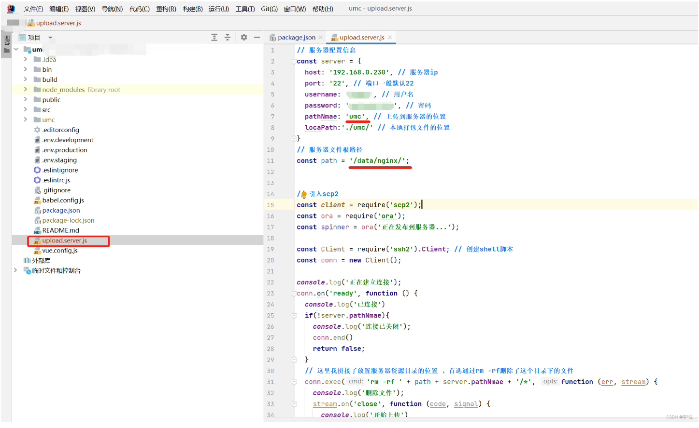
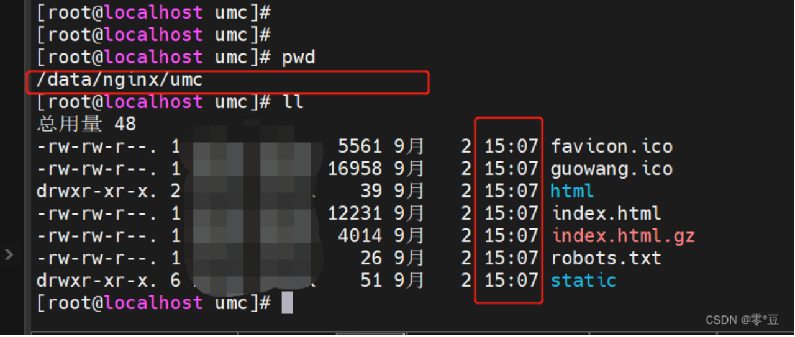
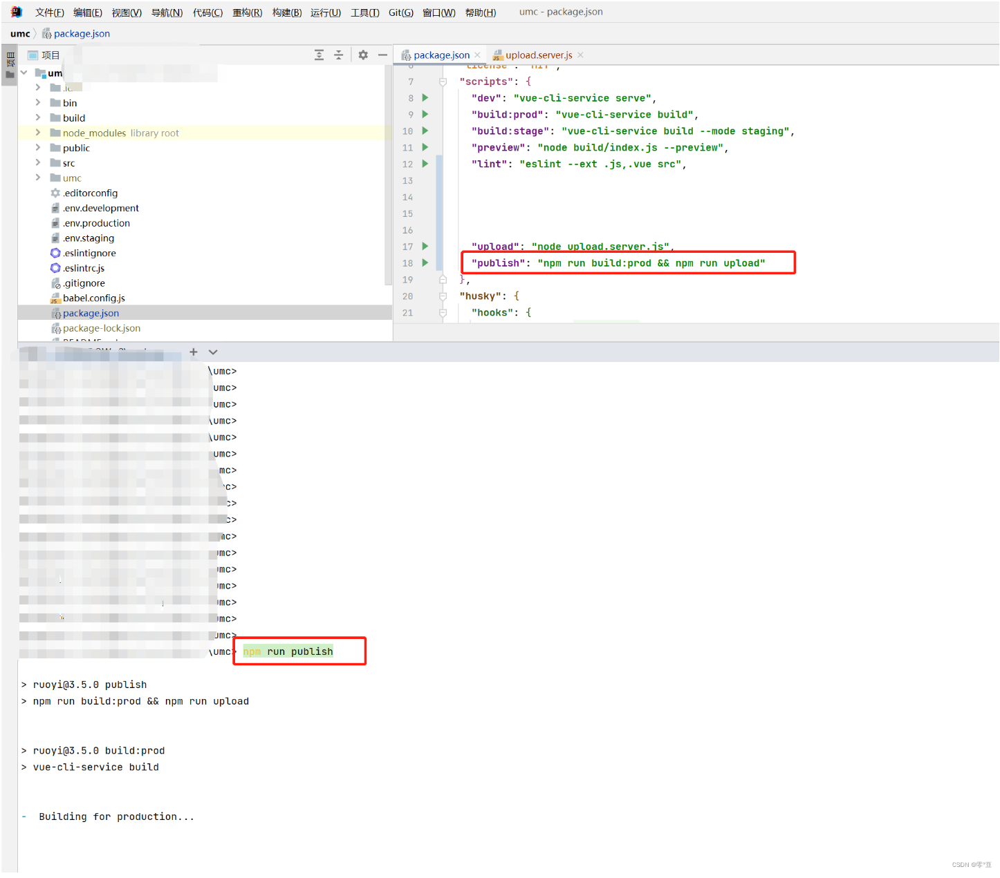
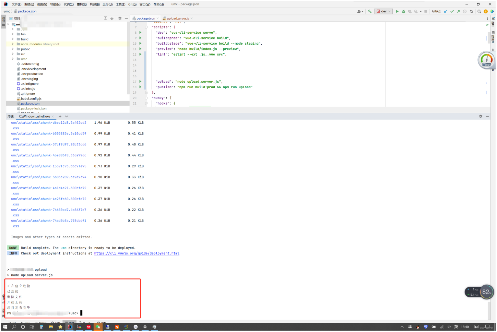
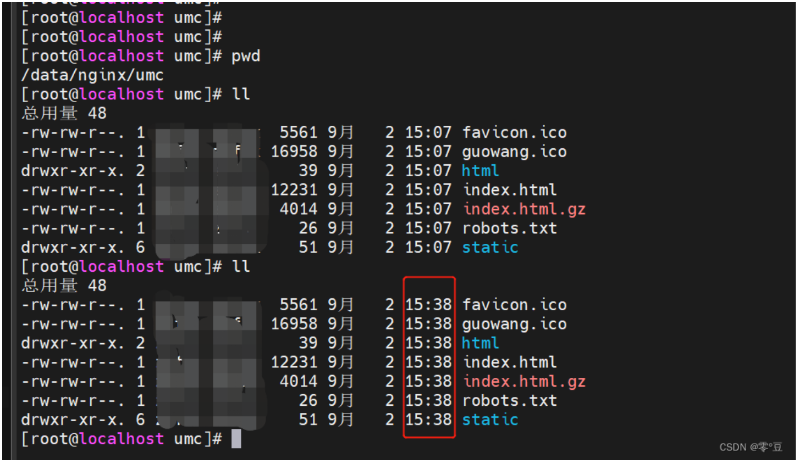

# vue自动部署

## 1.用到的依赖
```shell
npm install scp2 --save-dev 
npm install chalk --save-dev 
npm install ssh2 --save-dev 
npm install cross-env --save-dev 
```

## 2.在vue项目根目录新建upload.server.js文件
`upload.server.js`
```js
// 服务器配置信息
const server = {
  host: '192.168.0.230', // 服务器ip
  port: '22', // 端口一般默认22
  username: 'root', // 用户名
  password: '12345', // 密码
  pathNmae: '一般就是打包后的文件夹名', // 上传到服务器的位置
  locaPath:'./本地打包后的文件夹名/' // 本地打包文件的位置
}
// 服务器文件根路径 服务器nginx 项目存放路径
const path = '/data/nginx/';


// 引入scp2
const client = require('scp2');
const ora = require('ora');
const spinner = ora('正在发布到服务器...');

const Client = require('ssh2').Client; // 创建shell脚本
const conn = new Client();

console.log('正在建立连接');
conn.on('ready', function () {
  console.log('已连接')
  if(!server.pathNmae){
    console.log('连接已关闭');
    conn.end()
    return false;
  }
  // 这里我拼接了放置服务器资源目录的位置 ，首选通过rm -rf删除了这个目录下的文件
  conn.exec('rm -rf ' + path + server.pathNmae + '/*', function (err, stream) {
    console.log('删除文件');
    stream.on('close', function (code, signal) {
      console.log('开始上传')
      spinner.start();
      client.scp(server.locaPath, {
        "host": server.host,
        "port": server.port,
        "username": server.username,
        "password": server.password,
        "path": path + server.pathNmae
      }, err => {
        spinner.stop();
        if (!err) {
          console.log('项目发布完毕');
        } else {
          console.log("err", err)
        }
        conn.end() // 结束命令
      })
    })
    // 补充
      .on('data', function (data) {
        console.log('STDOUT: ' + data);
      })
      .stderr.on('data', function (data) {
      console.log('STDERR: ' + data);
    });
  })
}).connect({
  host: server.host,
  port: server.port,
  username: server.username,
  password: server.password
  //privateKey: '' //使用 私钥密钥登录 目前测试服务器不需要用到
});


```

## 3.在package.json中"scripts"节点新加执行方法

```json
"scripts": {
    // 原有的测试、打包、等
    "dev": "vue-cli-service serve",
    "build:prod": "vue-cli-service build",
    "build:stage": "vue-cli-service build --mode staging",
    "preview": "node build/index.js --preview",
    "lint": "eslint --ext .js,.vue src",


	// 补充的 
    "upload": "node upload.server.js", // 上传
    "publish": "npm run build:prod && npm run upload" // 打包并上传到服务器
  }

```
## 演示


## 执行之前


## 执行




## 执行后



