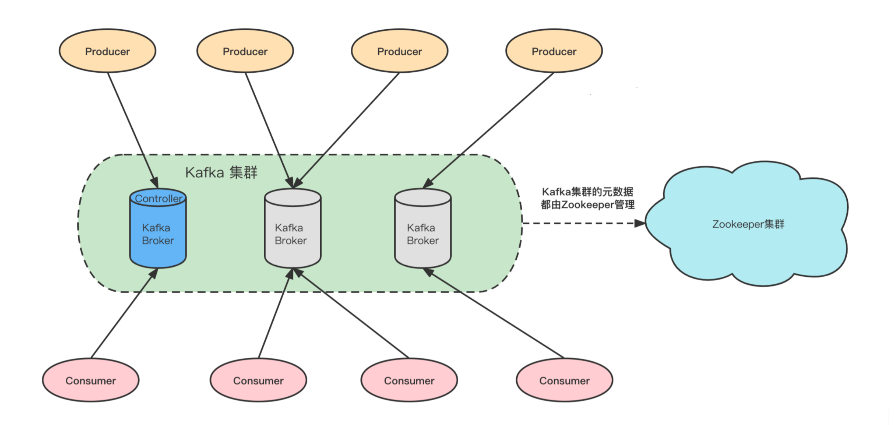
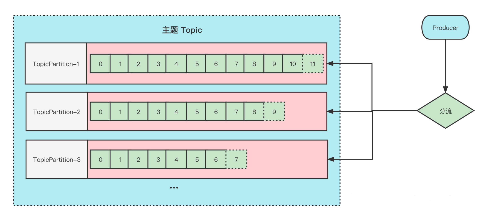
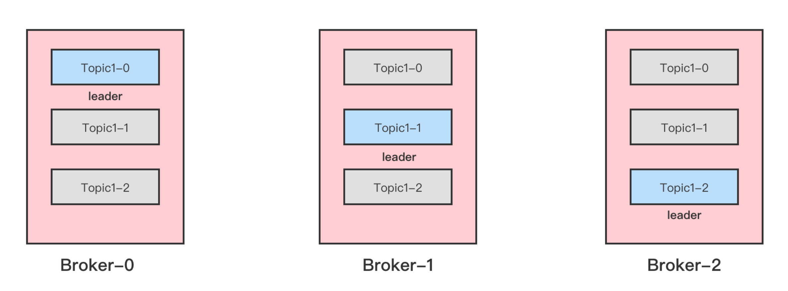
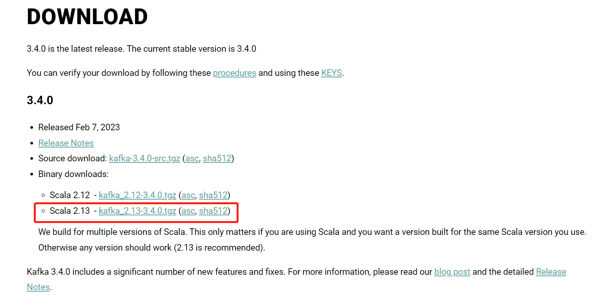
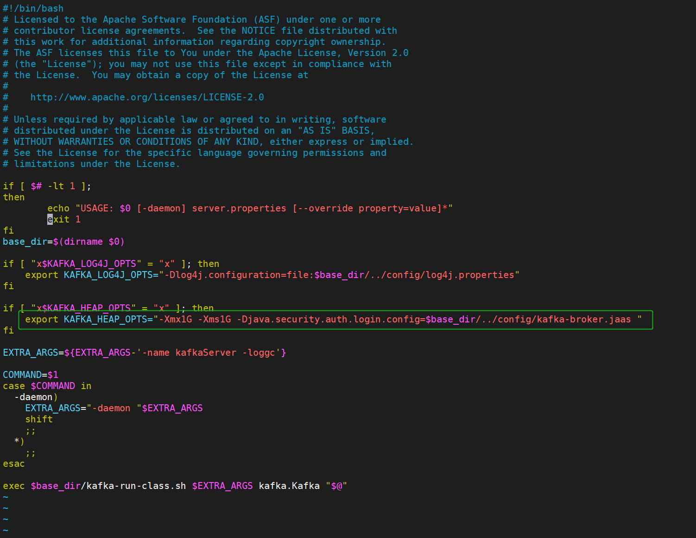
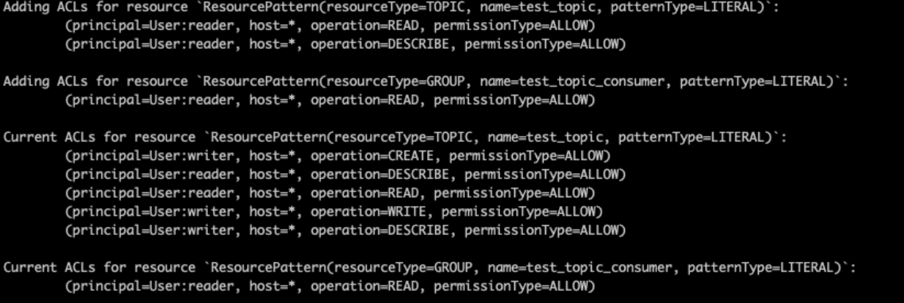

# Kafka

<div  class="gpt_html_div">
    <div id="scrollRef" class="h-full overflow-hidden overflow-y-auto">
        <div id="image-wrapper" class="w-full max-w-screen-xl m-auto dark:bg-[#101014] p-4">
<!--问-->
<div class="flex w-full mb-6 overflow-hidden flex-row-reverse"><div class="flex items-center justify-center flex-shrink-0 h-8 overflow-hidden rounded-full basis-8 ml-2"><span class="n-avatar" style="--n-font-size:14px; --n-border:none; --n-border-radius:3px; --n-color:rgba(204, 204, 204, 1); --n-color-modal:rgba(204, 204, 204, 1); --n-color-popover:rgba(204, 204, 204, 1); --n-bezier:cubic-bezier(0.4, 0, 0.2, 1); --n-merged-size:var(--n-avatar-size-override, 34px);"><!----></span></div><div class="overflow-hidden text-sm items-end"><p class="text-xs text-[#b4bbc4] text-right">2023/8/7 17:45:02</p><div class="flex items-end gap-1 mt-2 flex-row-reverse"><div class="text-black text-wrap min-w-[20px] rounded-md px-3 py-2 bg-[#d2f9d1] dark:bg-[#a1dc95]"><div class="leading-relaxed break-words"><div class="whitespace-pre-wrap">Kafka</div></div></div><div class="flex flex-col"><!----><!----><button class="transition text-neutral-300 hover:text-neutral-800 dark:hover:text-neutral-200"><svg xmlns="http://www.w3.org/2000/svg" xmlns:xlink="http://www.w3.org/1999/xlink" aria-hidden="true" role="img" class=" iconify iconify--ri" width="1em" height="1em" viewBox="0 0 24 24"><path fill="currentColor" d="M12 3c-1.1 0-2 .9-2 2s.9 2 2 2s2-.9 2-2s-.9-2-2-2Zm0 14c-1.1 0-2 .9-2 2s.9 2 2 2s2-.9 2-2s-.9-2-2-2Zm0-7c-1.1 0-2 .9-2 2s.9 2 2 2s2-.9 2-2s-.9-2-2-2Z"></path></svg></button><!----></div></div></div></div>
<!--答-->
<div class="flex w-full mb-6 overflow-hidden"><div class="flex items-center justify-center flex-shrink-0 h-8 overflow-hidden rounded-full basis-8 mr-2"><span class="text-[28px] dark:text-white"><svg xmlns="http://www.w3.org/2000/svg" viewBox="0 0 32 32" aria-hidden="true" width="1em" height="1em"><path d="M29.71,13.09A8.09,8.09,0,0,0,20.34,2.68a8.08,8.08,0,0,0-13.7,2.9A8.08,8.08,0,0,0,2.3,18.9,8,8,0,0,0,3,25.45a8.08,8.08,0,0,0,8.69,3.87,8,8,0,0,0,6,2.68,8.09,8.09,0,0,0,7.7-5.61,8,8,0,0,0,5.33-3.86A8.09,8.09,0,0,0,29.71,13.09Zm-12,16.82a6,6,0,0,1-3.84-1.39l.19-.11,6.37-3.68a1,1,0,0,0,.53-.91v-9l2.69,1.56a.08.08,0,0,1,.05.07v7.44A6,6,0,0,1,17.68,29.91ZM4.8,24.41a6,6,0,0,1-.71-4l.19.11,6.37,3.68a1,1,0,0,0,1,0l7.79-4.49V22.8a.09.09,0,0,1,0,.08L13,26.6A6,6,0,0,1,4.8,24.41ZM3.12,10.53A6,6,0,0,1,6.28,7.9v7.57a1,1,0,0,0,.51.9l7.75,4.47L11.85,22.4a.14.14,0,0,1-.09,0L5.32,18.68a6,6,0,0,1-2.2-8.18Zm22.13,5.14-7.78-4.52L20.16,9.6a.08.08,0,0,1,.09,0l6.44,3.72a6,6,0,0,1-.9,10.81V16.56A1.06,1.06,0,0,0,25.25,15.67Zm2.68-4-.19-.12-6.36-3.7a1,1,0,0,0-1.05,0l-7.78,4.49V9.2a.09.09,0,0,1,0-.09L19,5.4a6,6,0,0,1,8.91,6.21ZM11.08,17.15,8.38,15.6a.14.14,0,0,1-.05-.08V8.1a6,6,0,0,1,9.84-4.61L18,3.6,11.61,7.28a1,1,0,0,0-.53.91ZM12.54,14,16,12l3.47,2v4L16,20l-3.47-2Z" fill="currentColor"></path></svg></span></div><div class="overflow-hidden text-sm items-start"><p class="text-xs text-[#b4bbc4] text-left">2023/8/7 17:45:23</p><div class="flex items-end gap-1 mt-2 flex-row"><div class="text-black text-wrap min-w-[20px] rounded-md px-3 py-2 bg-[#f4f6f8] dark:bg-[#1e1e20]"><div class="leading-relaxed break-words"><div class="markdown-body"><p>Kafka是由Apache软件基金会开发的一个高吞吐量的分布式消息队列系统，它主要用于处理实时数据流和大规模日志数据的传输和处理。Kafka被设计为一个可持久化的、分布式的发布-订阅消息系统，具有高性能、可扩展、高可靠性和持久性等特点。</p>
<p>Kafka的核心概念和组件包括：</p>
<ol>
<li>生产者（Producer）：将数据发布到Kafka的应用程序。</li>
<li>消费者（Consumer）：从Kafka订阅数据并进行处理的应用程序。</li>
<li>主题（Topic）：由一个或多个分区（Partition）组成的数据分类，生产者将数据发布到特定主题，消费者从特定主题订阅数据。</li>
<li>分区（Partition）：每个主题可以分为多个分区，每个分区在物理上是一个独立的日志文件，以实现数据的水平扩展和负载均衡。</li>
<li>消息（Message）：存储在Kafka中的实际数据单元，由键值对组成，包括消息的偏移量、键、值和时间戳等信息。</li>
<li>副本（Replica）：每个分区可以有多个副本，副本用于实现数据的冗余和容错性。</li>
<li>生产者 API：用于将数据发布到Kafka的编程接口。</li>
<li>消费者 API：用于从Kafka订阅和消费数据的编程接口。</li>
<li>ZooKeeper：Kafka使用ZooKeeper来进行集群协调和元数据管理。</li>
</ol>
<p>Kafka提供了高性能的消息传输、持久化和存储能力，适用于处理大规模的实时数据流和日志数据。它在实时数据处理、日志传输、事件驱动架构等场景中得到了广泛的应用，可以作为消息中间件、数据管道和可靠性数据存储系统使用。</p>
</div></div></div><div class="flex flex-col"><button class="mb-2 transition text-neutral-300 hover:text-neutral-800 dark:hover:text-neutral-300"><svg xmlns="http://www.w3.org/2000/svg" xmlns:xlink="http://www.w3.org/1999/xlink" aria-hidden="true" role="img" class=" iconify iconify--ri" width="1em" height="1em" viewBox="0 0 24 24"><path fill="currentColor" d="M18.537 19.567A9.961 9.961 0 0 1 12 22C6.477 22 2 17.523 2 12S6.477 2 12 2s10 4.477 10 10c0 2.136-.67 4.116-1.81 5.74L17 12h3a8 8 0 1 0-2.46 5.772l.997 1.795Z"></path></svg></button><!----><button class="transition text-neutral-300 hover:text-neutral-800 dark:hover:text-neutral-200"><svg xmlns="http://www.w3.org/2000/svg" xmlns:xlink="http://www.w3.org/1999/xlink" aria-hidden="true" role="img" class=" iconify iconify--ri" width="1em" height="1em" viewBox="0 0 24 24"><path fill="currentColor" d="M12 3c-1.1 0-2 .9-2 2s.9 2 2 2s2-.9 2-2s-.9-2-2-2Zm0 14c-1.1 0-2 .9-2 2s.9 2 2 2s2-.9 2-2s-.9-2-2-2Zm0-7c-1.1 0-2 .9-2 2s.9 2 2 2s2-.9 2-2s-.9-2-2-2Z"></path></svg></button><!----></div></div></div></div>
        </div>
    </div>
</div>

## 1.1简介
### 什么是事件流？
>从技术上讲，事件流是从事件源（如数据库、传感器、移动设备、云服务和软件应用程序）以事件流的形式实时捕获数据的实践；持久存储这些事件流以供以后检索；实时和回顾性地操作、处理和响应事件流；并根据需要将事件流路由到不同的目标技术。因此，事件流确保了数据的连续流动和解释，以便正确的信息在正确的时间出现在正确的位置。

### 我可以将事件流用于什么？
事件流应用于 众多行业和组织的各种场景。它的许多例子包括：
>- 实时处理支付和金融交易，例如在证券交易所、银行和保险中。
>- 实时跟踪和监控汽车、卡车、车队和货运，例如在物流和汽车行业。
>- 持续捕获和分析来自物联网设备或其他设备的传感器数据，例如工厂和风电场。
>- 收集并立即响应客户互动和订单，例如零售、酒店和旅游行业以及移动应用程序。
>- 监测住院病人，预测病情变化，确保在紧急情况下及时治疗。
>- 连接、存储和提供公司不同部门产生的数据。
>- 作为数据平台、事件驱动架构和微服务的基础。

### Apache Kafka 是一个事件流平台

Kafka 结合了三个关键功能，因此您可以 通过一个经过实战考验的解决方案实现端到端的事件流

发布（写入）和订阅（读取）事件流，包括从其他系统持续导入/导出数据 。
根据需要持久可靠地 存储事件流。
在事件发生时或回顾性 地处理事件流。
所有这些功能都以分布式、高度可扩展、弹性、容错和安全的方式提供。Kafka 可以部署在裸机硬件、虚拟机和容器上，也可以部署在本地和云端。您可以在自行管理 Kafka 环境和使用各种供应商提供的完全托管服务之间进行选择。

### Apache Kafka 整体架构


**Kafka 是一个分布式系统**，由通过高性能TCP 网络协议进行通信的 服务器和 客户端组成。它可以部署在本地和云环境中的裸机硬件、虚拟机和容器上。

**服务器**： Kafka 作为一个或多个服务器的集群运行，可以跨越多个数据中心或云区域。其中一些服务器形成存储层，称为代理(Broker)。其他服务器运行 Kafka Connect 以将数据作为事件流持续导入和导出，将 Kafka 与您现有的系统（如关系数据库以及其他 Kafka 集群）集成。为了让您实现关键任务用例，Kafka 集群具有高度可扩展性和容错性：如果其中任何一个服务器出现故障，其他服务器将接管它们的工作，以确保持续运行而不会丢失任何数据。

**客户端**：它们允许您编写分布式应用程序和微服务，以并行、大规模和容错方式读取、写入和处理事件流，即使在网络问题或机器故障的情况下也是如此。Kafka 附带了一些这样的客户端，这些客户端由 Kafka 社区提供的 数十个客户端进行了扩充：客户端可用于 Java 和 Scala，包括更高级别的 Kafka Streams 库，用于 Go、Python、C/C++ 和许多其他编程语言以及 REST API。

**主题分区与副本**

在 kafka 中有 2 个非常重要的概念, 主题（Topic）和分区（Partition）, Kafka 中的消息是以 Topic 为单位进行归类。

生产者发送消息的是必须指定消息 Topic, 消费组则订阅具体的 Topic 来消费。

**主题**（Topic）是逻辑上的概念, 它有一个或多个分区（Partition）, 消息就是存在这些具体的分区里面。

**分区**（Partition）其实也是一个逻辑上的概念, 每个主题会有一个/多个 分区, 我们生产的消息会追加到这些分区的 Log 文件里面, 同一个主题下的分区包含的消息是不同的。消息是以追加的形式存储在分区中。消息在被追加到分区日志文件的时候都会分配一个特定的偏移量(offset)，offset 是消息在分区中的唯一标识。Kafka 保证分区有序,并不保证主题消息有序。

**副本**（Replica）是分区的物理实现, 一个分区可以有多个副本, 一个分区的多个副本分为 Leader 副本、Follower 副本, Leader 副本负责提供读写能力，Follower 副本会从Leader 副本 同步数据用于备份。

**多分区解决了 I/O 性能瓶颈问题多副本解决了高可用问题**

**主题与分区**


1. 在消息发送到 Broker 之前,会经过一定的 分配策略 来选择存储到哪个具体的分区, 合理的分配方式能够尽量的让数据更均衡的分配在各个分区上。
2. 同一个主题的多个分区可以分配在同一个 Brker 上。

**分区与副本***


看上面的图示, Topic1 有 3 个分区分别是 Topic1-0、 Topic1-1、 Topic1-2 每个分区有 3 个副本(包括 Leader 副本), 均衡的分配在 3 个 Broker 中。

例如分区 Topic-0 的 Leader 副本在 Broker-0 上, 那么它承担着读写, Broker-1 和 Broker-2 上的 Topic-0 Follower 副本会从 Broker-0 中的 Leader 副本去同步数据。

1. 同一个分区的多个副本不可以分配在同一个 Broker 上。
2. 分区的 Leader 副本角色可以切换, 遵循优先副本选举原则
3. 只有 Leader 副本才会承担读写职责, Follower 副本用于同步备份

**我们往往会在口述中把分区和副本给搞混, 一般默认情况下,我们说分区的时候潜台词说的是 Leader 副本, 说副本的时候实际上是 Follower 副本**

### Kafka Api

除了用于管理和任务的命令行工具外，Kafka 还为 Java 和 Scala 提供了五个核心 API：

- 用于管理和检查主题（Topic）、代理（Broker）和其他 Kafka 对象 的管理 API 。
- 将事件流发布（写入）到一个或多个 Kafka 主题 的 Producer API 。
- Consumer API 订阅（读取）一个或多个主题并处理向它们生成的事件流 。
- 用于实现流处理应用程序和微服务 的 Kafka Streams API 。它提供了更高级别的函数来处理事件流，包括转换、聚合和连接等有状态操作、窗口化、基于事件时间的处理等等。从一个或多个主题读取输入以生成一个或多个主题的输出，有效地将输入流转换为输出流。
- Kafka Connect API 用于构建和运行可重用 的数据导入/导出连接器，这些连接器从外部系统和应用程序消耗（读取）或生成（写入）事件流，以便它们可以与 Kafka 集成。例如，与 PostgreSQL 等关系数据库的连接器可能会捕获对一组表的每次更改。但是，在实践中，您通常不需要实现自己的连接器，因为 Kafka 社区已经提供了数百个即用型连接器。

## 1.2 使用场景

### **消息队列**

Kafka 可以很好的替代更传统的消息队列, 与大部分消息队列相比, Kafka 具有更好的吞吐量、内置的分区、复制和容错能力，这使其成为大规模消息处理应用程序的良好解决方案。

### **网站活动跟踪**

Kafka 的原始用例是能够将用户活动跟踪管道重建为一组实时发布-订阅源。这意味着站点活动（页面查看、搜索或用户可能采取的其他操作）将发布到中心主题，每种活动类型都有一个主题。这些订阅源可用于订阅一系列用例，包括实时处理、实时监控以及加载到 Hadoop 或离线数据仓库系统以进行离线处理和报告。 活动跟踪的数量通常非常高，因为每个用户页面查看都会生成许多活动消息。

### **指标**

Kafka 常用于运营监控数据。这涉及聚合来自分布式应用程序的统计数据以生成操作数据的集中提要。

### **日志聚合**

许多人使用 Kafka 作为日志聚合解决方案的替代品。日志聚合通常从服务器收集物理日志文件，并将它们放在一个中心位置（可能是文件服务器或 HDFS）进行处理。Kafka 抽象出文件的细节，并将日志或事件数据更清晰地抽象为消息流。这允许更低延迟的处理和更容易支持多个数据源和分布式数据消费。与 Scribe 或 Flume 等以日志为中心的系统相比，Kafka 提供同样出色的性能、由于复制而产生的更强大的持久性保证以及更低的端到端延迟。

### **流处理**

许多 Kafka 用户在由多个阶段组成的处理管道中处理数据，其中原始输入数据从 Kafka 主题中消费，然后聚合、丰富或以其他方式转换为新主题以供进一步消费或后续处理。例如，用于推荐新闻文章的处理管道可能会从 RSS 提要中抓取文章内容并将其发布到“文章”主题；进一步的处理可能会对该内容进行规范化或去重，并将清理后的文章内容发布到新主题；最终处理阶段可能会尝试向用户推荐此内容。此类处理管道基于各个主题创建实时数据流图。从 0.10.0.0 开始，一个轻量级但功能强大的流处理库，称为 Kafka Streams 可以在 Apache Kafka 中执行上述数据处理。除了 Kafka Streams，替代的开源流处理工具包括 Apache Storm 和 Apache Samza。

### **事件溯源**

事件溯源是一种应用程序设计风格，其中状态更改被记录为按时间排序的记录序列。Kafka 对非常大的存储日志数据的支持使其成为以这种风格构建的应用程序的出色后端。

### **提交日志**

Kafka 可以作为分布式系统的一种外部提交日志。该日志有助于在节点之间复制数据，并充当故障节点恢复其数据的重新同步机制。Kafka 中的日志压缩功能有助于支持这种用法。在这种用法中，Kafka 类似于 Apache BookKeeper 项目。

## 1.3 快速入门
### 第 1 步：获取 KAFKA

选择并下载 [Kafka 安装包](https://kafka.apache.org/downloads), 并解压 例如这里我下载 3.4.0 版本的


解压
```shell
tar -xzf kafka_2.13-3.4.0.tgz
cd kafka_2.13-3.4.0/
```
### 第 2 步：启动 KAFKA 环境
:::tip
注意：您的本地环境必须安装 Java 8+
:::
1. 启动zookeeper
```shell
# Start the ZooKeeper service
# Note: Soon, ZooKeeper will no longer be required by Apache Kafka.
$ bin/zookeeper-server-start.sh config/zookeeper.properties
```
:::tip
以服务方式启动（后台启动）：
```shell
$ bin/zookeeper-server-start.sh -daemon config/zookeeper.properties
```
:::
2. 启动kafka
> 打开另一个终端会话并运行：

```shell
# Start the Kafka broker service
$ bin/kafka-server-start.sh config/server.properties
```
:::tip
以服务方式启动（后台启动）：
```shell
$ bin/kafka-server-start.sh -daemon config/server.properties
```
:::

**成功启动所有服务后，您将拥有一个基本的 Kafka 环境运行并可以使用**
### 第 3 步：创建一个主题(Topic)来存储您的事件

Kafka 是一个分布式事件流平台，可让您跨多台机器 读取、写入、存储和处理 事件（在文档中也称为记录或 消息）。

在您编写第一个事件之前，您必须创建一个主题。打开另一个终端会话并运行：

```shell
$ bin/kafka-topics.sh --create --topic quickstart-events --bootstrap-server localhost:9092
```

查看一下该 Topic 的的详情
```shell
$ bin/kafka-topics.sh --describe --topic quickstart-events --bootstrap-server localhost:9092

Topic:quickstart-events  PartitionCount:1    ReplicationFactor:1 Configs:
    Topic: quickstart-events Partition: 0    Leader: 0   Replicas: 0 Isr: 0
```
### 第 4 步：将一些事件写入主题

Kafka 客户端通过网络与 Kafka Broker 通信以写入（或读取）事件。一旦收到，Broker 将以持久和容错的方式存储事件，只要您需要 - 甚至永远。
```shell
$ bin/kafka-console-producer.sh --topic quickstart-events --bootstrap-server localhost:9092
这是第一条消息
这是第二条消息
```
您可以随时停止生产者客户端 Ctrl-C。

### 第 5 步：读取事件

打开另一个终端会话并运行控制台使用者客户端以读取您刚刚创建的事件：

```shell
$ bin/kafka-console-consumer.sh --topic quickstart-events --from-beginning --bootstrap-server localhost:9092
这是第一条消息
这是第二条消息
```

您可以随时停止消费者客户端 Ctrl-C.

因为事件被持久地存储在 Kafka 中，所以它们可以被尽可能多的消费者多次读取。您可以通过打开另一个终端会话并再次重新运行上一个命令来轻松验证这一点。

### 第 6 步：使用 KAFKA CONNECT 将数据作为事件流导入/导出

您可能在现有系统（如关系数据库或传统消息传递系统）中拥有大量数据，以及许多已经使用这些系统的应用程序。 Kafka Connect 允许您不断地将来自外部系统的数据摄取到 Kafka 中，反之亦然。因此很容易将现有系统与 Kafka 集成。为了使这个过程更容易，有数百个这样的连接器随时可用。

### 第 7 步：使用 KAFKA STREAMS 处理您的事件

一旦您的数据作为事件存储在 Kafka 中，您就可以使用 Java/Scala 的 [Kafka Streams](https://kafka.apache.org/documentation/streams/)客户端库处理数据。它允许您实现关键任务的实时应用程序和微服务，其中输入和/或输出数据存储在 Kafka 主题中。Kafka Streams 将在客户端编写和部署标准 Java 和 Scala 应用程序的简单性与 Kafka 的服务器端集群技术的优势相结合，使这些应用程序具有高度可扩展性、弹性、容错性和分布式性。该库支持一次性处理、有状态操作和聚合、窗口化、连接、基于事件时间的处理等等。

为了让您初步了解，以下是实现流行 WordCount 算法的方法：
```shell
KStream<String, String> textLines = builder.stream("quickstart-events");

KTable<String, Long> wordCounts = textLines
            .flatMapValues(line -> Arrays.asList(line.toLowerCase().split(" ")))
            .groupBy((keyIgnored, word) -> word)
            .count();

wordCounts.toStream().to("output-topic", Produced.with(Serdes.String(), Serdes.Long()));
```
[Kafka Streams 演示](https://kafka.apache.org/25/documentation/streams/quickstart) 和[应用程序开发教程](https://kafka.apache.org/25/documentation/streams/tutorial) 演示了如何从头到尾编写和运行这样的流应用程序 。

### 第 8 步：终止 KAFKA 环境

现在您已经完成了快速入门，请随意拆除 Kafka 环境，或者继续玩。

1. 停止生产者和消费组客户端
2. 停止 Broker 按 Ctrl-C
3. 最后，使用 Ctrl-C 停止 ZooKeeper 服务器
如果您还想删除本地 Kafka 环境的任何数据，包括您在此过程中创建的任何事件，请运行以下命令：
```shell
$ rm -rf /tmp/kafka-logs /tmp/zookeeper
```


### 后台启动
```shell
nohup ./kafka-server-start.sh ../config/server.properties 2>&1 &
```
或
```shell
./kafka-server-start.sh -daemon ../config/server.properties
```
---

-------------------------------------------------------------------------------------------------------

---
***kafka快速配置启用ACL示例***
## 认证
### 1. 创建管理员用户
>用户/密码  
> admin/admin

- **老版本创建方法**
>启动zookeeper，未启动broker
```shell
sh bin/kafka-configs.sh --zookeeper localhost:2181 --alter --add-config 'SCRAM-SHA-256=[password=admin],SCRAM-SHA-512=[password=admin]' --entity-type users --entity-name admin
```

- **新版本建议使用下面的命令**
>启动zookeeper、启动broker后执行，执行完成后停掉broker
```shell
sh bin/kafka-configs.sh --bootstrap-server localhost:9092 --alter --add-config 'SCRAM-SHA-256=[password=admin],SCRAM-SHA-512=[password=admin]' --entity-type users --entity-name admin
```

### 2. 启用ACL配置

在server.properties增加如下配置：
```properties
listeners=SASL_PLAINTEXT://0.0.0.0:9091
advertised.listeners=SASL_PLAINTEXT://192.168.0.236:9091
# 启用SASL机制
sasl.enabled.mechanisms=SCRAM-SHA-256,SCRAM-SHA-512
# broker之间通讯 机制
sasl.mechanism.inter.broker.protocol=SCRAM-SHA-256
security.inter.broker.protocol=SASL_PLAINTEXT

authorizer.class.name=kafka.security.authorizer.AclAuthorizer
# 设置管理员账号
super.users=User:admin;User:lingdu
```
>最后一项配置super.users是配置超级管理员，示例是配置了两个用户：admin和lingdu，前面新增管理员的命令
> 只增加admin这个用户，增加lingdu请再执行一次命令，这里配置2个只是示例，多个用户就这样配置(User:用户名,
> 然后以分号分隔)。

**完整配置参考：**

```shell
# Licensed to the Apache Software Foundation (ASF) under one or more
# contributor license agreements.  See the NOTICE file distributed with
# this work for additional information regarding copyright ownership.
# The ASF licenses this file to You under the Apache License, Version 2.0
# (the "License"); you may not use this file except in compliance with
# the License.  You may obtain a copy of the License at
#
#    http://www.apache.org/licenses/LICENSE-2.0
#
# Unless required by applicable law or agreed to in writing, software
# distributed under the License is distributed on an "AS IS" BASIS,
# WITHOUT WARRANTIES OR CONDITIONS OF ANY KIND, either express or implied.
# See the License for the specific language governing permissions and
# limitations under the License.

#
# This configuration file is intended for use in ZK-based mode, where Apache ZooKeeper is required.
# See kafka.server.KafkaConfig for additional details and defaults
#

############################# Server Basics #############################

# The id of the broker. This must be set to a unique integer for each broker.
broker.id=1

############################# Socket Server Settings #############################

# The address the socket server listens on. If not configured, the host name will be equal to the value of
# java.net.InetAddress.getCanonicalHostName(), with PLAINTEXT listener name, and port 9092.
#   FORMAT:
#     listeners = listener_name://host_name:port
#   EXAMPLE:
#     listeners = PLAINTEXT://your.host.name:9092
#listeners=PLAINTEXT://:9092

# Listener name, hostname and port the broker will advertise to clients.
# If not set, it uses the value for "listeners".
#advertised.listeners=PLAINTEXT://your.host.name:9092

# Maps listener names to security protocols, the default is for them to be the same. See the config documentation for more details
#listener.security.protocol.map=PLAINTEXT:PLAINTEXT,SSL:SSL,SASL_PLAINTEXT:SASL_PLAINTEXT,SASL_SSL:SASL_SSL

# The number of threads that the server uses for receiving requests from the network and sending responses to the network
num.network.threads=3

# The number of threads that the server uses for processing requests, which may include disk I/O
num.io.threads=8

# The send buffer (SO_SNDBUF) used by the socket server
socket.send.buffer.bytes=102400

# The receive buffer (SO_RCVBUF) used by the socket server
socket.receive.buffer.bytes=102400

# The maximum size of a request that the socket server will accept (protection against OOM)
socket.request.max.bytes=104857600


############################# Log Basics #############################

# A comma separated list of directories under which to store log files
log.dirs=/tmp/kafka-logs-1

# The default number of log partitions per topic. More partitions allow greater
# parallelism for consumption, but this will also result in more files across
# the brokers.
num.partitions=1

# The number of threads per data directory to be used for log recovery at startup and flushing at shutdown.
# This value is recommended to be increased for installations with data dirs located in RAID array.
num.recovery.threads.per.data.dir=1

############################# Internal Topic Settings  #############################
# The replication factor for the group metadata internal topics "__consumer_offsets" and "__transaction_state"
# For anything other than development testing, a value greater than 1 is recommended to ensure availability such as 3.
offsets.topic.replication.factor=1
transaction.state.log.replication.factor=1
transaction.state.log.min.isr=1

############################# Log Flush Policy #############################

# Messages are immediately written to the filesystem but by default we only fsync() to sync
# the OS cache lazily. The following configurations control the flush of data to disk.
# There are a few important trade-offs here:
#    1. Durability: Unflushed data may be lost if you are not using replication.
#    2. Latency: Very large flush intervals may lead to latency spikes when the flush does occur as there will be a lot of data to flush.
#    3. Throughput: The flush is generally the most expensive operation, and a small flush interval may lead to excessive seeks.
# The settings below allow one to configure the flush policy to flush data after a period of time or
# every N messages (or both). This can be done globally and overridden on a per-topic basis.

# The number of messages to accept before forcing a flush of data to disk
#log.flush.interval.messages=10000

# The maximum amount of time a message can sit in a log before we force a flush
#log.flush.interval.ms=1000

############################# Log Retention Policy #############################

# The following configurations control the disposal of log segments. The policy can
# be set to delete segments after a period of time, or after a given size has accumulated.
# A segment will be deleted whenever *either* of these criteria are met. Deletion always happens
# from the end of the log.

# The minimum age of a log file to be eligible for deletion due to age
log.retention.hours=168

# A size-based retention policy for logs. Segments are pruned from the log unless the remaining
# segments drop below log.retention.bytes. Functions independently of log.retention.hours.
#log.retention.bytes=1073741824

# The maximum size of a log segment file. When this size is reached a new log segment will be created.
#log.segment.bytes=1073741824

# The interval at which log segments are checked to see if they can be deleted according
# to the retention policies
log.retention.check.interval.ms=300000

############################# Zookeeper #############################

# Zookeeper connection string (see zookeeper docs for details).
# This is a comma separated host:port pairs, each corresponding to a zk
# server. e.g. "127.0.0.1:3000,127.0.0.1:3001,127.0.0.1:3002".
# You can also append an optional chroot string to the urls to specify the
# root directory for all kafka znodes.
#zookeeper.connect=localhost:2181
zookeeper.connect=localhost:2181,localhost:2182,localhost:2183

# Timeout in ms for connecting to zookeeper
zookeeper.connection.timeout.ms=18000


############################# Group Coordinator Settings #############################

# The following configuration specifies the time, in milliseconds, that the GroupCoordinator will delay the initial consumer rebalance.
# The rebalance will be further delayed by the value of group.initial.rebalance.delay.ms as new members join the group, up to a maximum of max.poll.interval.ms.
# The default value for this is 3 seconds.
# We override this to 0 here as it makes for a better out-of-the-box experience for development and testing.
# However, in production environments the default value of 3 seconds is more suitable as this will help to avoid unnecessary, and potentially expensive, rebalances during application startup.
group.initial.rebalance.delay.ms=3000
#group.initial.rebalance.delay.ms=0


#########初始化管理员账号的时候禁止使用下面的配置


listeners=SASL_PLAINTEXT://0.0.0.0:9091
advertised.listeners=SASL_PLAINTEXT://192.168.0.236:9091
# 启用SASL机制
sasl.enabled.mechanisms=SCRAM-SHA-256,SCRAM-SHA-512
# broker之间通讯 机制
sasl.mechanism.inter.broker.protocol=SCRAM-SHA-256
security.inter.broker.protocol=SASL_PLAINTEXT

authorizer.class.name=kafka.security.authorizer.AclAuthorizer
# 设置管理员账号
super.users=User:admin;


```

### 3. 配置jaas

在config目录下创建：kafka-broker.jaas文件，内容如下：

```jaas
KafkaServer {
    org.apache.kafka.common.security.scram.ScramLoginModule required
    username="admin"
    password="admin";
};
```
> 如果有多个broker，第2、3步，每个broker都需要这样配置。

### 4. 启动broker

修改启动脚本bin/kafka-server-start.sh，在前面几行找个地方增加如下启动参数：
```shell
export KAFKA_HEAP_OPTS="-Xmx1G -Xms1G -Djava.security.auth.login.config=$base_dir/../config/kafka-broker.jaas "
```

> 配置里需要指定第3步的jaas文件。

> **服务器端的配置已经结束，启动broker。**
```shell
./kafka-server-start.sh -daemon ../config/server.properties
```
### 5. 新增用户

增加两个用户，一个叫writer，后面用来给topic发送消息，一个叫reader，后面用来消费消息。
:::danger
启用SASL机制后，执行命令配置一下相关认证信息，否则授权失败，命令是不会正常处理的
:::
```shell
sh bin/kafka-configs.sh --bootstrap-server localhost:9092 --alter --add-config 'SCRAM-SHA-256=[password=writer],SCRAM-SHA-512=[password=writer]' --entity-type users --entity-name writer --command-config config/cmd-config
 
 
sh bin/kafka-configs.sh --bootstrap-server localhost:9092 --alter --add-config 'SCRAM-SHA-256=[password=reader],SCRAM-SHA-512=[password=reader]' --entity-type users --entity-name reader --command-config config/cmd-config 
```
:::tip
注意命令最后有个--command-config config/cmd-config，这是因为启用权限认证后，执行命令配置一下相关认证信息，否则授权失败，命令是不会正常处理的，cmd-config内容如下：
:::
在`config/`文件夹下创建`cmd-config`文件：
```shell
cd config/
vim cmd-config
```
内容如下：
```cmd-config
security.protocol=SASL_PLAINTEXT
sasl.mechanism=SCRAM-SHA-256
sasl.jaas.config=org.apache.kafka.common.security.scram.ScramLoginModule required username="admin" password="admin";
```


## 授权

这里新增用户和授权是分开的，需要单独再配置，admin用户就不用了，因为在前面已经作为超级管理员配置过了。

但是前面增加了writer和reader两个用户，是没有权限发送或消费消息的，需要单独给他们配置权限。

**1. 给writer用户配置发送到test_topic这个主题的消息发送权限**

```shell
sh bin/kafka-acls.sh --bootstrap-server 'localhost:9092' --add --allow-principal User:"writer" --producer --topic 'test_topic' --command-config config/cmd-config
```

**2. 给reader用户配置使用消费组test_topic_consumer消费test_topic消息的权限**

```shell
sh bin/kafka-acls.sh --bootstrap-server 'localhost:9092' --add --allow-principal User:"reader" --consumer --topic 'test_topic' --group 'test_topic_consumer' --command-config config/cmd-config
```

配置完之后，可以看到输出的权限信息如下：



