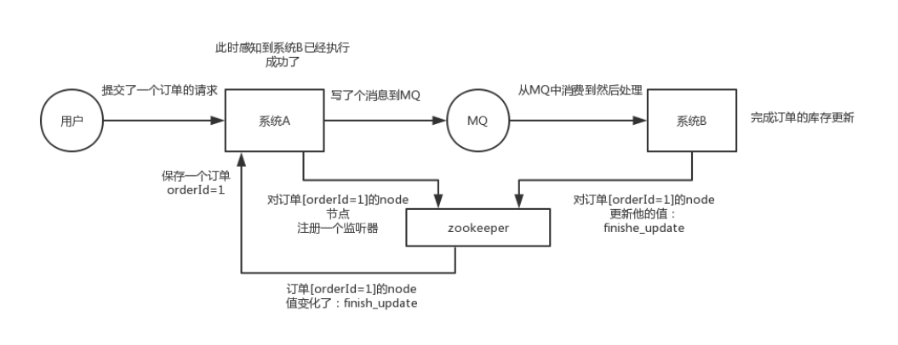
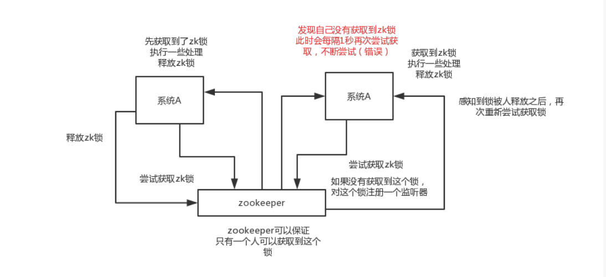
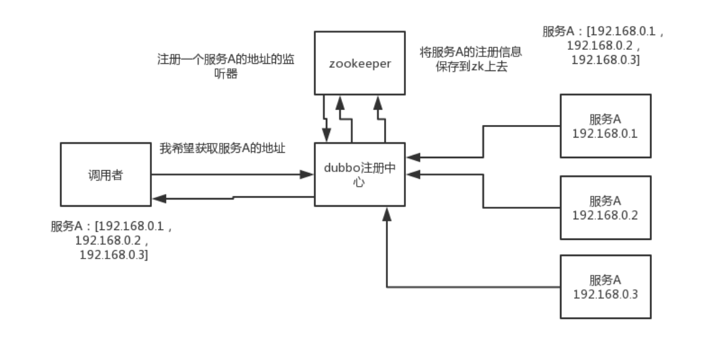
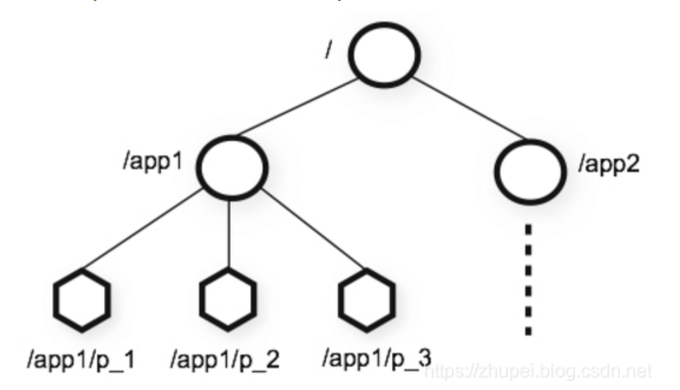

# zookeeper和kafka的SASL认证以及生产实践
:::tip
**简介：** 一、什么是zookeeper？ ZooKeeper是一个集中的服务，用于维护配置信息、命名、提供分布式同步以及提供组服务。所有这些类型的服务都以某种形式被分布式应用程序使用。每次它们被实现时，都有大量的工作需要去修复不可避免的bug和竞争条件。
:::

## 一、什么是zookeeper？
ZooKeeper是一个集中的服务，用于维护配置信息、命名、提供分布式同步以及提供组服务。所有这些类型的服务都以某种形式被分布式应用程序使用。每次它们被实现时，都有大量的工作需要去修复不可避免的bug和竞争条件。由于实现这类服务的困难，应用程序最初通常会略过它们，这使得它们在出现变化时变得脆弱，难以管理。即使做得正确，这些服务的不同实现在部署应用程序时也会导致管理复杂性。

总之：zookeeper是一种高可靠的分布式协调组件，主要用来解决分布式一致性和分布式锁、元数据/配置信息管理的问题。

## 二、zookeeper的使用场景

- 分布式协调：这个其实是zk很经典的一个用法，简单来说，就好比，你A系统发送个请求到mq，然后B消息消费之后处理了。那A系统如何知道B系统的处理结果？用zk就可以实现分布式系统之间的协调工作。A系统发送请求之后可以在zk上对某个节点的值注册个监听器，一旦B系统处理完了就修改zk那个节点的值，A立马就可以收到通知，完美解决。


- 分布式锁：对某一个数据连续发出两个修改操作，两台机器同时收到了请求，但是只能一台机器先执行另外一个机器再执行。那么此时就可以使用zk分布式锁，一个机器接收到了请求之后先获取zk上的一把分布式锁，就是可以去创建一个znode，接着执行操作；然后另外一个机器也尝试去创建那个znode，结果发现自己创建不了，因为被别人创建了,那只能等着，等第一个机器执行完了自己再执行。


- 元数据/配置信息管理：zk可以用作很多系统的配置信息的管理，比如kafka、storm、Doubbo等等很多分布式系统都会选用zk来做一些元数据、配置信息的管理


## 三、zookeeper节点有哪些特性，什么时候使用什么特性的节点？
在 ZooKeeper 中，节点类型可以分为持久节点（PERSISTENT ）、临时节点（EPHEMERAL），以及有序节点（SEQUENTIAL ），具体在节点创建过程中，一般是组合使用。

- 持久节点：是指在节点创建后，就一直存在，直到有删除操作来主动清除这个节点——不会因为创建该节点的客户端会话失效而消失。
- 持久顺序节点：这类节点的基本特性和上面的节点类型是一致的。额外的特性是，在ZK中，每个父节点会为他的第一级子节点维护一份时序，会记录每个子节点创建的先后顺序。基于这个特性，在创建子节点的时候，可以设置这个属性，那么在创建节点过程中，ZK会自动为给定节点名加上一个数字后缀，作为新的节点名。这个数字后缀的范围是整型的最大值。
- 临时节点：与持久节点不同的是，临时节点的生命周期和客户端会话绑定。也就是说，如果客户端会话失效，那么这个节点就会自动被清除掉。注意，这里提到的是会话失效，而非连接断开。另外，在临时节点下面不能创建子节点。
- 事件监听：在读取数据时，我们可以同时对节点设置事件监听，当节点数据或结构变化时，zookeeper会通知客户端。当前zookeeper有如下四种事件：1)节点创建;2)节点删除;3)节点数据修改;4)子节点变更。

## 四、使用zookeeper实现服务注册中心，原理是什么？用到了zk的哪些特性？
zookeeper可以充当一个服务注册表（Service Registry），让多个服务提供者形成一个集群，让服务消费者通过服务注册表获取具体的服务访问地址（ip+端口）去访问具体的服务提供者。具体来说，zookeeper就是个分布式文件系统，每当一个服务提供者部署后都要将自己的服务注册到zookeeper的某一路径上,每当一个服务启动后会将自己的服务名称、IP等信息注册到zookeeper的ZNode上。


服务调用者第一次请求过来的时候会返回集群的IP地址的集合并注册一个服务的监听，然后在前端通过负载均衡算法(随机，轮询，加权轮询，最小连接数，hash)将对应的请求发到对应的设备上，而zookeeper和服务提供者之间会存在一个心跳机制，定时发送一个数据包来检查该服务器的状态，当接收不到数据包时，则会将该设备注册的相对应的服务进行删除，然后会push到服务调用者将对应的ip进行删除防止后续请求转发到已经宕掉的服务器上。

使用了数据节点持久化，事件监听的特性，分布式一致性特性

## 五、zookeeper集群搭建
多年之前我写了一篇简易的zookeeper入门教程，如果是搭建伪集群的话可以参考以上这篇文章，地址：[https://zhupei.blog.csdn.net/article/details/51517460
](https://zhupei.blog.csdn.net/article/details/51517460 "https://zhupei.blog.csdn.net/article/details/51517460")

下面是搭建生产环境的步骤：

准备3台服务器，例如node1、node2、node3，首先进入node1中

1. 下载zk3.5版本的，http://www.apache.org/dyn/closer.cgi/zookeeper/
2. 解压到相应目录,并在目录下新建dataDir文件夹
3. 在conf目录在做配置：先拷贝一份 zoo_sample.cfg为zoo.cfg，然后编辑zoo.cfg：
```shell
tickTime=2000
initLimit=10
syncLimit=5
dataDir=/mnt/tools/zookeeper/apache-zookeeper-3.5.5/dataDir/
clientPort=2181
server.1=0.0.0.0:2888:3888
server.2=node2:2888:3888
server.3=node3:2888:3888
```
这里注意，node2、node3替换为真实服务器的ip地址，其中在node1中，这个ip地址要设置为0.0.0.0，不然肯会出现Cannot open channel to 1 at election address /xx.xx.xx.xx:3888的错误，特别是在真实的云服务器上面很容易出现这个问题。

4. 参照前面3步，分别在node2,node3机器上面进行配置，在node2中cong文件就修改为：
```shell
server.1=node1:2888:3888
server.2=0.0.0.0:2888:3888
server.3=node3:2888:3888
```
5. 在node3中cong文件就修改为：
```shell
server.1=node1:2888:3888
server.2=node2:2888:3888
server.3=0.0.0.0:2888:3888
```
6. 启动，分别在3个节点执行进行启动
```shell
bin/zkServer.sh  start
```
7. 查看状态，可以看到3个节点随机有是1个master和2个follow
```shell
 `bin/zkServer.sh  status`
```

## 六、kafka集群搭建
因为本文主要讲zookeeper，所以对于kafka的搭建的就简易的说一下。这里提到kafka是因为下面要讲到到zookeeper和kafka的SASL机制认证。
安装kafka集群之前，确保zookeeper服务已经正常运行。准备3台服务器，例如node1、node2、node3，首先进入node1中

1. 下载kafka,地址 http://kafka.apache.org/downloads
2. 解压到相应目录，并在安装目录下新建logs目录
3. 编辑config中的server.properties文件，注意这里的broker.id，部署在不同机器上面的id需要不同，例如在node1中部署，这里就填写1，在node2机器上面就填写2，依次类推。
```shell
broker.id=1
listeners=SASL_PLAINTEXT://0.0.0.0:9092
log.dirs=/mnt/tools/kafka/kafka_2.12/logs
num.partitions=3
zookeeper.connect=node1:2181,node2:2181,node3:2181
```
4. 以上设置都完毕，保存配置并退出，然后将kafka目录发送至其他主机
5. 在各个节点上启动
```shell
bin/kafka-server-start.sh -daemon config/server.properties
```
6. 通过jps可以看到有kafka的进程以及查看日志都正常的话就表示启动成功了

## 七、zookeeper和kafka的安全认证机制SASL
zookeeper在生产环境中，如果不是只在内网开放的话，就需要设置安全认证，可以选择SASL的安全认证。以下是和kafka的联合配置，如果不需要kafka可以去掉kafka相关的权限即可，以下基于zk3.5.5和kafka2.12进行操作。
下面就是详细的部署步骤：

### 7.1 zookeeper的安全认证配置
zookeeper所有节点都是对等的，只是各个节点角色可能不相同。以下步骤所有的节点配置相同。

1. 导入kafka的相关jar  
从kafka/lib目录下复制以下几个jar包到zookeeper的lib目录下：

```shell
kafka-clients-2.3.0.jar
lz4-java-1.6.0.jar
slf4j-api-1.7.25.jar
slf4j-log4j12-1.7.25.jar
snappy-java-1.1.7.3.jar
```
2. zoo.cfg文件配置
添加如下配置：
```shell
authProvider.1=org.apache.zookeeper.server.auth.SASLAuthenticationProvider
requireClientAuthScheme=sasl
jaasLoginRenew=3600000
```
3. 编写JAAS文件，zk_server_jaas.conf，放置在conf目录下  
这个文件定义需要链接到Zookeeper服务器的用户名和密码。JAAS配置节默认为Server：
```shell
Server {
org.apache.kafka.common.security.plain.PlainLoginModule required 
    username="admin" 
    password="admin-2019" 
    user_kafka="kafka-2019" 
    user_producer="prod-2019";
};
```
这个文件中定义了两个用户，一个是kafka，一个是producer，这些用user_配置出来的用户都可以提供给生产者程序和消费者程序认证使用。还有两个属性，username和password，其中username是配置Zookeeper节点之间内部认证的用户名，password是对应的密码。

4. 修改zkEnv.sh  
在zkEnv.sh添加以下内容，路径按你直接的实际路径来填写：
```shell
export SERVER_JVMFLAGS=" -Djava.security.auth.login.config=/mnt/tools/zookeeper/apache-zookeeper-3.5.5/conf/zk_server_jaas.conf "
```
5. 在各个节点分别执行bin/zkServer.sh start启动zk。如果启动异常查看日志排查问题。

### 7.2 kafka的安全认证配置  
zookeeper启动之后，就配置kafka,下面步骤的配置在所有节点上都相同。

1. 在kafka的config目录下，新建kafka_server_jaas.conf文件，内容如下：
```shell
KafkaServer {
      org.apache.kafka.common.security.plain.PlainLoginModule required
    username="admin"
    password="admin-2019"
    user_admin="admin-2019"
    user_producer="prod-2019"
    user_consumer="cons-2019";
};

Client {
  org.apache.kafka.common.security.plain.PlainLoginModule required
    username="kafka"
    password="kafka-2019";
};
```
KafkaServer配置的是kafka的账号和密码，Client配置节主要配置了broker到Zookeeper的链接用户名密码，这里要和前面zookeeper配置中的zk_server_jaas.conf中user_kafka的账号和密码相同。

2. 配置server.properties，同样的在config目录下
```shell
listeners=SASL_PLAINTEXT://0.0.0.0:9092
advertised.listeners=SASL_PLAINTEXT://node1:9092
security.inter.broker.protocol=SASL_PLAINTEXT  
sasl.enabled.mechanisms=PLAIN  
sasl.mechanism.inter.broker.protocol=PLAIN  
authorizer.class.name=kafka.security.auth.SimpleAclAuthorizer
allow.everyone.if.no.acl.found=true
```
:::tip
kafka3.0之后版本弃用了SimpleAclAuthorizer验证，改为kafka.security.authorizer.AclAuthorizer
:::
这里注意listeners配置项，将主机名部分（本例主机名是node1）替换成当前节点的主机名。其他在各个节点的配置一致。注意，allow.everyone.if.no.acl.found这个配置项默认是false，若不配置成true，后续生产者、消费者无法正常使用Kafka。

3. 在server启动脚本JVM参数,在bin目录下的kafka-server-start.sh中，将
```shell
export KAFKA_HEAP_OPTS="-Xmx1G -Xms1G"
```
这一行修改为
```shell
export KAFKA_HEAP_OPTS="-Xmx1G -Xms1G -Djava.security.auth.login.config=/mnt/tools/kafka/kafka_2.12/config/kafka_server_jaas.conf"
```
4. 配置其他节点
配置剩余的kafka broker节点，注意server.properties的listeners配置项

5. 启动各个节点的kafka服务端，在bin目录下执行
```shell
./kafka-server-start.sh ../config/server.properties
```
## 八、springboot中使用kafka
在springboot项目中，注意：如果在springboot1.x的版本中报错，请升级为speingboot2.x的版本，本例使用的是2.1.1.RELEASE

1. 新建sprinboot工程，添加pom依赖，设置parent为2.1.1.RELEASE,这样就不需要在dependency中添加版本号了
```xml
<dependency>
        <groupId>org.springframework.boot</groupId>
        <artifactId>spring-boot-starter-web</artifactId>
    </dependency>
    <dependency>
        <groupId>org.springframework.kafka</groupId>
        <artifactId>spring-kafka</artifactId>
</dependency>
```
2. 在resource下新建文件kafka_client_jaas.conf，内容如下：
```shell
KafkaClient {
     org.apache.kafka.common.security.plain.PlainLoginModule required
    username="admin"
    password="admin-2019";
};
```
这个用户名和密码要和前面kafka中使用的账号密码相同，这样才能有访问权限

3. 在application.yml文件配置,注意这里将node1,2,3替换为你真实的服务器地址
```yaml
spring:
  kafka:
    listener:
      batch-listener: true                                #是否开启批量消费，true表示批量消费
      concurrency: 10                                      #设置消费的线程数
      poll-timeout: 1500                                  #自动提交设置，如果消息队列中没有消息，等待timeout毫秒后，调用poll()方法。如果队列中有消息，立即消费消息，每次消费的消息的多少可以通过max.poll.records配置。
    template:
      default-topic: probe2
    producer:
      bootstrap-servers: node1:9092,node2,node3:9092
      key-deserializer: org.apache.kafka.common.serialization.StringDeserializer
      value-deserializer: org.apache.kafka.common.serialization.StringDeserializer
      properties: 
        sasl.mechanism: PLAIN
        security.protocol: SASL_PLAINTEXT      
    consumer: 
      bootstrap-servers: node1:9092,node2:9092,node3:9092
      group-id: group-2
      key-deserializer: org.apache.kafka.common.serialization.StringDeserializer
      value-deserializer: org.apache.kafka.common.serialization.StringDeserializer
      properties: 
        sasl.mechanism: PLAIN
        security.protocol: SASL_PLAINTEXT
      auto:
        offset: 
            reset: latest
      enable:
        auto: 
          commit: true
```
在这里开启了消费者10个线程，这里可以根据你实际业务来调整消费者的数量

4. 程序启动类：
```java
@SpringBootApplication
public class ProbeApplication {
    
    //初始化系统属性
    static {
        ClassLoader loader = Thread.currentThread().getContextClassLoader();
        System.setProperty("java.security.auth.login.config", 
                loader.getResource("").getPath()+File.separator+"kafka_client_jaas.conf");
    }

    public static void main(String[] args) {
         SpringApplication.run(ProbeApplication.class, args);
    }
}
```
5. 生产者：
```java
@Component
public class Sender {
    private static final Logger LOG = LoggerFactory.getLogger(Sender.class);
    @Autowired
    private KafkaTemplate<String, String> template;
    
    public void send(String message) {
        ListenableFuture<SendResult<String, String>> future = this.template.sendDefault(message);
        future.addCallback(success -> LOG.info("KafkaMessageProducer 发送消息成功！消息内容是:"+message),
                fail -> LOG.error("KafkaMessageProducer 发送消息失败！消息内容是:"+message));
    }
}
```
6. 消费者，将生产者发过来的消息进行处理
```java
@Component
public class Receiver {
    
    @KafkaListener(topics = "probe2")
    public void receiveMessage(ConsumerRecord<String, String> record) {
            System.out.println("【*** 消费者开始接收消息 ***】key = " + record.key() + "、value = " + record.value());
           //TODO，在这里进行自己的业务操作，例如入库
    }
}
```
7. controller
```java
@RestController
public class KafkaController {
    @Autowired
    private Sender sender;

    @PostMapping("/send/{msg}")
    public String send(@PathVariable("msg") String msg) {
        sender.send(msg);
        return msg;
    }
}
```
8. 启动springboot工程，然后访问相应的地址即可得到想要的结果

如果生产者的速度大于消费者的速度，可以适当调整生产者和消费者的数量来处理，同时不要在消费者进行太过于耗时的操作。

## 九、总结
本文主要分享了zookeeper的应用场景和节点特性、注册原理、zookeeper集群搭建和kafka集群搭建、zookeeper和kafka的SASL认证机制、在springboot中实操基于SASL认证的kafka。


