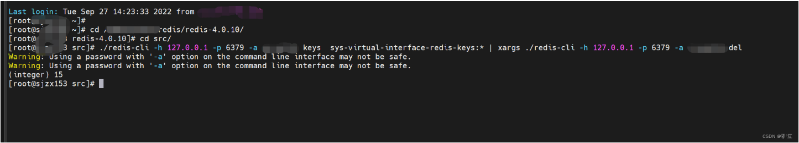

# 批量删除
## Redis 按关键字批量删除

## 1.执行命令
```shell
redis-cli -h ip -p 端口 -a 密码 keys  关键字* | xargs redis-cli -h ip -p 端口 -a 密码 del
```

## 2.参数说明
|参数|说明|
|:--:|:--:|
|-h|ip地址 在本地的话可以不用 默认是127.0.0.1|
|-p|端口 不设置的话默认是6379|
|-a|redis连接密码没有密码可以不设置|
|-keys|后面跟key的模糊搜索关键词，*号模糊匹配|
|-del|删除匹配到的key|

::: tip 亲测成功

:::
