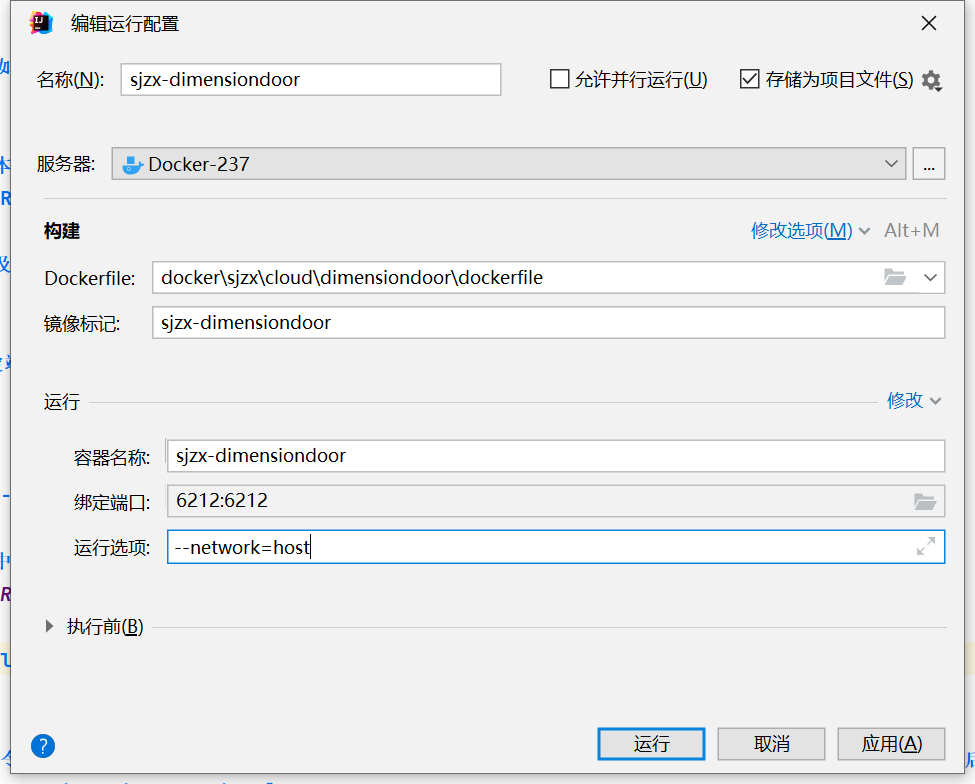

# Docker

## 基本介绍
**[http://doc.ruoyi.vip/ruoyi-cloud/cloud/dokcer.html](http://doc.ruoyi.vip/ruoyi-cloud/cloud/dokcer.html)**

## DockerFile

**示例**
```dockerfile
# 基础镜像 指明构建的新镜像是来自于哪个基础镜像，如果没有选择tag，那么默认值为latest
FROM  openjdk:8-jre
# author 指明镜像维护者及其联系方式（一般是邮箱地址）。官方说明已过时，推荐使用LABEL
#MAINTAINER sjzx
# 功能是为镜像指定标签。也可以使用LABEL来指定镜像作者
LABEL 作者="〇°"

# 设置局部变量 定义参数（build构建时使用）
ARG JAR_NAME=sjzx-cloud-dimensiondoor.jar

#设置容器环境变量（程序运行时使用）
ENV RUN_JAR_NAME=$JAR_NAME

# 挂载目录 指定容器挂载点到宿主机自动生成的目录或其他容器。一般的使用场景为需要持久化存储数据时
VOLUME /home/sjzx

# 创建目录 构建镜像时运行的Shell命令，比如构建的新镜像中我们想在/usr/local目录下创建一个java目录
RUN mkdir -p /home/sjzx

# 拷贝文件或目录到镜像中。src 可以是一个本地文件，还可以是一个url。然后自动下载和解压
#ADD ./jar/$JAR_NAME /home/sjzx/$JAR_NAME

# 指定路径 为 RUN、CMD、ENTRYPOINT 以及 COPY 和 AND 设置工作目录
WORKDIR /home/sjzx

# 暴露容器运行时的监听端口给外部，可以指定端口是监听 TCP 还是 UDP，如果未指定协议，则默认为 TCP
EXPOSE 6212

# 运行选项添加
# 当 docker 容器使用 host 连接方式的时候，容器与宿主共用网络，这样就能从容器中访问宿主网络了
# 容器中的 localhost 就等于宿主的 localhost 了.
# 在 docker 命令中使用 --network host 来为容器配置host网络
# --network=host
# --restart=always --network=host --env GO_APP_PORT=6212 --expose 6212 -d --security-opt=seccomp:unconfined

# 复制jar文件到路径 拷贝文件或目录到镜像中。用法同 ADD，只是不支持自动下载和解压
COPY ./jar/$JAR_NAME /home/sjzx/$JAR_NAME

# 启动容器时执行的Shell命令。在Dockerfile中只能有一条CMD指令。如果设置了多条CMD，只有最后一条会生效
#CMD []

# 启动网关服务 启动容器时执行的 Shell 命令，同 CMD 类似，不会被 docker run 命令行指定的参数所覆盖，如果设置了多条ENTRYPOINT，只有最后一条会生效
#ENTRYPOINT ["java","-jar","sjzx-cloud-dimensiondoor.jar"]
# 若想使用变量则使用下面的方式
# 报错：ORA-01882: timezone region not found 则添加启动参数 -Duser.timezone=GMT+08
ENTRYPOINT java -Duser.timezone=GMT+08 -Xms100m -Xmx100m -jar $RUN_JAR_NAME

```

**idea中运行配置示例**


