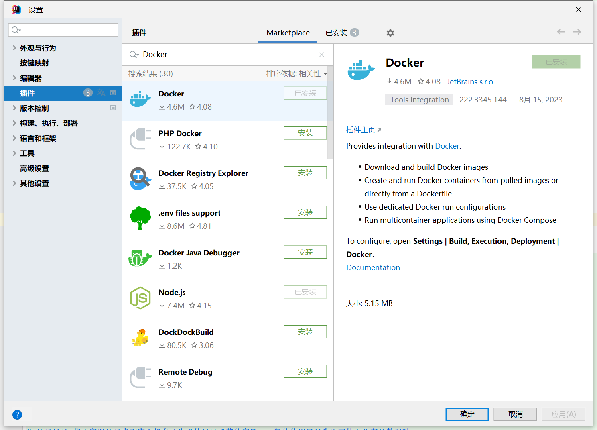
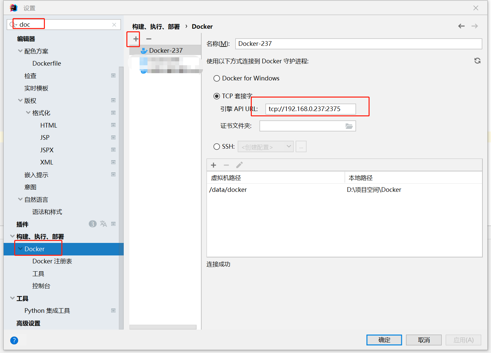

# Docker

## 基本介绍
**[http://doc.ruoyi.vip/ruoyi-cloud/cloud/dokcer.html](http://doc.ruoyi.vip/ruoyi-cloud/cloud/dokcer.html)**

## Docker 开启远程访问

### 1、配置docker远程连接端口

```shell
vim /usr/lib/systemd/system/docker.service
```

### 2、找到 ExecStart，在最后面添加 -H tcp://0.0.0.0:2375

```service
[Unit]
Description=Docker Application Container Engine
Documentation=https://docs.docker.com
After=network-online.target docker.socket firewalld.service containerd.service time-set.target
Wants=network-online.target containerd.service
Requires=docker.socket

[Service]
Type=notify
# the default is not to use systemd for cgroups because the delegate issues still
# exists and systemd currently does not support the cgroup feature set required
# for containers run by docker
ExecStart=/usr/bin/dockerd -H fd:// --containerd=/run/containerd/containerd.sock -H tcp://0.0.0.0:2375 # 这里添加
ExecReload=/bin/kill -s HUP $MAINPID
TimeoutStartSec=0
RestartSec=2
Restart=always

# Note that StartLimit* options were moved from "Service" to "Unit" in systemd 229.
# Both the old, and new location are accepted by systemd 229 and up, so using the old location
# to make them work for either version of systemd.
StartLimitBurst=3

# Note that StartLimitInterval was renamed to StartLimitIntervalSec in systemd 230.
# Both the old, and new name are accepted by systemd 230 and up, so using the old name to make
# this option work for either version of systemd.
StartLimitInterval=60s

# Having non-zero Limit*s causes performance problems due to accounting overhead
# in the kernel. We recommend using cgroups to do container-local accounting.
LimitNOFILE=infinity
LimitNPROC=infinity
LimitCORE=infinity

# Comment TasksMax if your systemd version does not support it.
# Only systemd 226 and above support this option.
TasksMax=infinity

# set delegate yes so that systemd does not reset the cgroups of docker containers
Delegate=yes

# kill only the docker process, not all processes in the cgroup
KillMode=process
OOMScoreAdjust=-500

[Install]
WantedBy=multi-user.target
```

### 3、重启docker

```shell
systemctl daemon-reload && systemctl start docker

systemctl restart docker
```

### 4、开放端口和防火墙

```shell
firewall-cmd --zone=public --add-port=2375/tcp --permanent
iptables -I INPUT -p tcp --dport 2375 -j ACCEPT
```

### 5、验证

```shell

curl http://192.168.0.205:2375/version

# 返回结果
{"Platform":{"Name":"Docker Engine - Community"},"Components":[{"Name":"Engine","Version":"24.0.5","Details":{"ApiVersion":"1.43","Arch":"amd64","BuildTime":"2023-07-21T20:38:05.000000000+00:00","Experimental":"false","GitCommit":"a61e2b4","GoVersion":"go1.20.6","KernelVersion":"3.10.0-957.21.3.el7.x86_64","MinAPIVersion":"1.12","Os":"linux"}},{"Name":"containerd","Version":"1.6.22","Details":{"GitCommit":"8165feabfdfe38c65b599c4993d227328c231fca"}},{"Name":"runc","Version":"1.1.8","Details":{"GitCommit":"v1.1.8-0-g82f18fe"}},{"Name":"docker-init","Version":"0.19.0","Details":{"GitCommit":"de40ad0"}}],"Version":"24.0.5","ApiVersion":"1.43","MinAPIVersion":"1.12","GitCommit":"a61e2b4","GoVersion":"go1.20.6","Os":"linux","Arch":"amd64","KernelVersion":"3.10.0-957.21.3.el7.x86_64","BuildTime":"2023-07-21T20:38:05.000000000+00:00"}
```

## IDEA远程访问

### 1、安装docker插件并重启

File->Settings->Plugins->Marketplace->搜索docker->Docker安装


### 2、配置连接远程docker



[//]: # (### 3、配置docker远程仓库)


[//]: # (### 4、创建一个Dockerfile配置)


## DockerFile

**示例**
```dockerfile
# 基础镜像 指明构建的新镜像是来自于哪个基础镜像，如果没有选择tag，那么默认值为latest
FROM  openjdk:8-jre
# author 指明镜像维护者及其联系方式（一般是邮箱地址）。官方说明已过时，推荐使用LABEL
#MAINTAINER sjzx
# 功能是为镜像指定标签。也可以使用LABEL来指定镜像作者
LABEL 作者="〇°"

# 设置局部变量 定义参数（build构建时使用）
ARG JAR_NAME=sjzx-cloud-dimensiondoor.jar

#设置容器环境变量（程序运行时使用）
ENV RUN_JAR_NAME=$JAR_NAME

# 挂载目录 指定容器挂载点到宿主机自动生成的目录或其他容器。一般的使用场景为需要持久化存储数据时
VOLUME /home/sjzx

# 创建目录 构建镜像时运行的Shell命令，比如构建的新镜像中我们想在/usr/local目录下创建一个java目录
RUN mkdir -p /home/sjzx

# 拷贝文件或目录到镜像中。src 可以是一个本地文件，还可以是一个url。然后自动下载和解压
#ADD ./jar/$JAR_NAME /home/sjzx/$JAR_NAME

# 指定路径 为 RUN、CMD、ENTRYPOINT 以及 COPY 和 AND 设置工作目录
WORKDIR /home/sjzx

# 暴露容器运行时的监听端口给外部，可以指定端口是监听 TCP 还是 UDP，如果未指定协议，则默认为 TCP
EXPOSE 6212

# 运行选项添加
# 当 docker 容器使用 host 连接方式的时候，容器与宿主共用网络，这样就能从容器中访问宿主网络了
# 容器中的 localhost 就等于宿主的 localhost 了.
# 在 docker 命令中使用 --network host 来为容器配置host网络
# --network=host
# --restart=always --network=host --env GO_APP_PORT=6212 --expose 6212 -d --security-opt=seccomp:unconfined

# 复制jar文件到路径 拷贝文件或目录到镜像中。用法同 ADD，只是不支持自动下载和解压
COPY ./jar/$JAR_NAME /home/sjzx/$JAR_NAME

# 启动容器时执行的Shell命令。在Dockerfile中只能有一条CMD指令。如果设置了多条CMD，只有最后一条会生效
#CMD []

# 启动网关服务 启动容器时执行的 Shell 命令，同 CMD 类似，不会被 docker run 命令行指定的参数所覆盖，如果设置了多条ENTRYPOINT，只有最后一条会生效
#ENTRYPOINT ["java","-jar","sjzx-cloud-dimensiondoor.jar"]
# 若想使用变量则使用下面的方式
# 报错：ORA-01882: timezone region not found 则添加启动参数 -Duser.timezone=GMT+08
ENTRYPOINT java -Duser.timezone=GMT+08 -Xms100m -Xmx100m -jar $RUN_JAR_NAME

```

**idea中运行配置示例**


