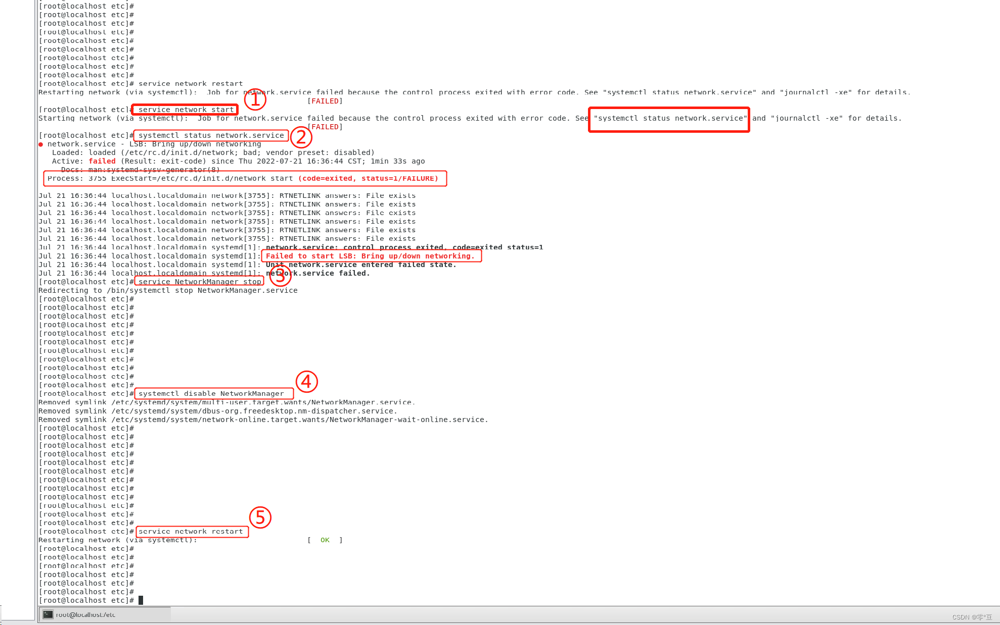

# 网卡启动失败参考

## 背景
:::tip 问题发生在将虚拟机关机后再开机网卡未能正常启动的场景下
:::



**①重启/启动网卡失败**

```shell
# ①重启/启动网卡失败👇
[root@localhost etc]# service network start
Starting network (via systemctl):  Job for network.service failed because the control process exited with error code. See "systemctl status network.service" and "journalctl -xe" for details.
                                                           [FAILED]

```

**②使用systemctl status network.service命令查看错误详情。**

```shell
# ②使用systemctl status network.service命令查看错误详情。
[root@localhost etc]# systemctl status network.service
● network.service - LSB: Bring up/down networking
   Loaded: loaded (/etc/rc.d/init.d/network; bad; vendor preset: disabled)
   Active: failed (Result: exit-code) since Thu 2022-07-21 16:36:44 CST; 1min 33s ago
     Docs: man:systemd-sysv-generator(8)
  Process: 3755 ExecStart=/etc/rc.d/init.d/network start (code=exited, status=1/FAILURE)

Jul 21 16:36:44 localhost.localdomain network[3755]: RTNETLINK answers: File exists
Jul 21 16:36:44 localhost.localdomain network[3755]: RTNETLINK answers: File exists
Jul 21 16:36:44 localhost.localdomain network[3755]: RTNETLINK answers: File exists
Jul 21 16:36:44 localhost.localdomain network[3755]: RTNETLINK answers: File exists
Jul 21 16:36:44 localhost.localdomain network[3755]: RTNETLINK answers: File exists
Jul 21 16:36:44 localhost.localdomain network[3755]: RTNETLINK answers: File exists
Jul 21 16:36:44 localhost.localdomain systemd[1]: network.service: control process exited, code=exited status=1
Jul 21 16:36:44 localhost.localdomain systemd[1]: Failed to start LSB: Bring up/down networking.
Jul 21 16:36:44 localhost.localdomain systemd[1]: Unit network.service entered failed state.
Jul 21 16:36:44 localhost.localdomain systemd[1]: network.service failed.

```

**③出现这种报错一般是和 NetworkManager 服务冲突导致的，直接关闭 NetworkManger 服务就好了， service NetworkManager stop**

```shell
# ③出现这种报错一般是和 NetworkManager 服务冲突导致的，直接关闭 NetworkManger 服务就好了， service NetworkManager stop
[root@localhost etc]# service NetworkManager stop
Redirecting to /bin/systemctl stop NetworkManager.service
[root@localhost etc]# 
[root@localhost etc]# 

```

**④禁止开机启动 systemctl disable NetworkManager**

```shell
# ④禁止开机启动 systemctl disable NetworkManager
[root@localhost etc]# systemctl disable NetworkManager
Removed symlink /etc/systemd/system/multi-user.target.wants/NetworkManager.service.
Removed symlink /etc/systemd/system/dbus-org.freedesktop.nm-dispatcher.service.
Removed symlink /etc/systemd/system/network-online.target.wants/NetworkManager-wait-online.service.
[root@localhost etc]# 
[root@localhost etc]# 

```

**⑤再次重启网卡,启动成功**

```shell
# ⑤再次重启网卡,启动成功
[root@localhost etc]# service network restart
Restarting network (via systemctl):                        [  OK  ]
[root@localhost etc]# 
[root@localhost etc]# 

```


