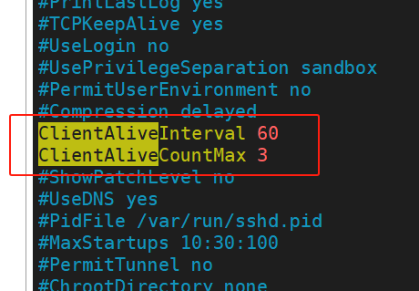
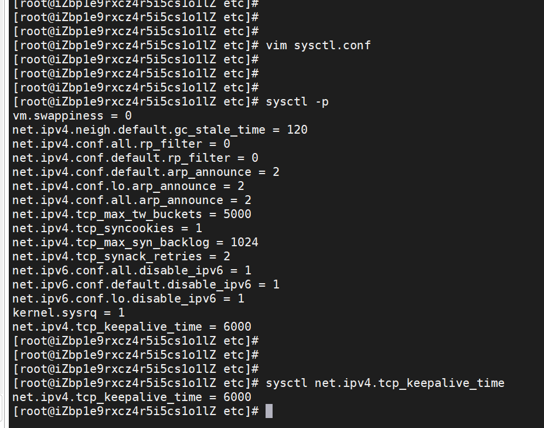

# 阿里云服务器

## 1. 修改ssh连接超时


1
修改/etc/ssh/sshd_config文件，找到 ClientAliveInterval 0和ClientAliveCountMax 3并将注释符号（“#”）去掉。

```shell
cd /etc/ssh/
vim sshd_config
```

2 将ClientAliveInterval对应的0改成60

>1、ClientAliveInterval指定了服务器端向客户端请求消息 的时间间隔, 默认是0, 不发送.
>
>2、ClientAliveInterval 60 (表示每分钟发送一次, 然后客户端响应, 这样就保持长连接了.)
>
>3、ClientAliveCountMax 3 (ClientAliveCountMax表示服务器发出请求后客户端没有响应的次数达到一定值, 就自动断开.)

3 重起sshd服务：
```shell
service sshd restart
```




## 2. 修改tcp超时

- 打开 /etc/sysctl.conf 文件，使用文本编辑器打开。

```shell
vim /etc/sysctl.conf
```
- 在文件末尾添加如下内容：

```shell
net.ipv4.tcp_keepalive_time = 30
```
- 保存并退出文件。
- 运行下面的命令使修改生效：

```shell
sysctl -p
```
- 或者重启服务器使修改生效

- 验证修改是否生效：
- 运行下面的命令查看 net.ipv4.tcp_keepalive_time 的值：

```shell
sysctl net.ipv4.tcp_keepalive_time
```


- 如果返回的值与上面设置的值一致，则修改成功。

- 其他相关配置说明：

> - 空闲多长时间后开始发送保活探测包  
> net.ipv4.tcp_keepalive_time = 60
> - 每次发送保活探测包的时间间隔  
> net.ipv4.tcp_keepalive_intvl = 10
> - 发送保活探测包的最大次数  
> net.ipv4.tcp_keepalive_probes = 5