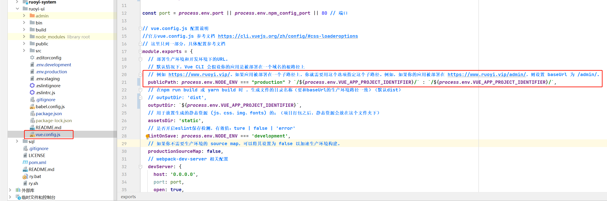
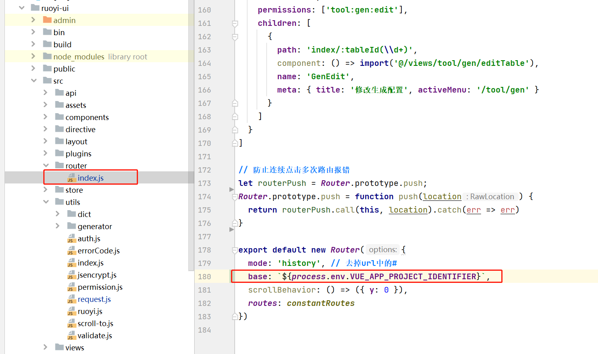
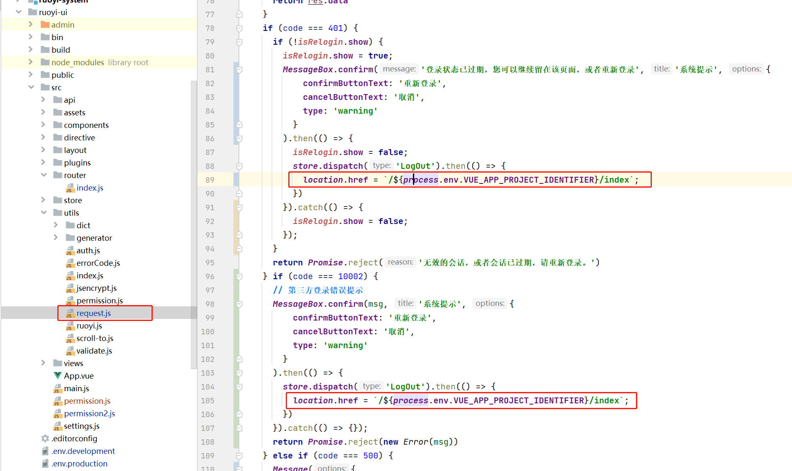
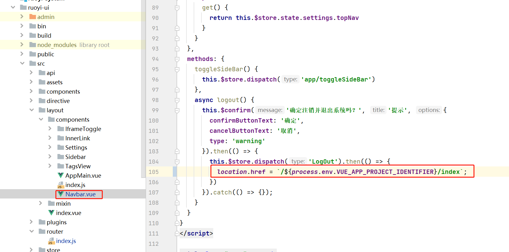

# 若依

## 前端vue设置子路径

:::tip 本文档中以前后端分离版为例，版本为:3.8.6
:::

### 一设置变量
在`.env.development`和`.env.production` 中定义一个变量如`VUE_APP_PROJECT_IDENTIFIER`
```env
# 项目标识字符
VUE_APP_PROJECT_IDENTIFIER = 'admin'
```

### 二引用路径变量
```js
${process.env.VUE_APP_PROJECT_IDENTIFIER}
```

1. ruoyi-ui/vue.config.js



2. ruoyi-ui/src/router/index.js



3. ruoyi-ui/src/utils/request.js



4. ruoyi-ui/src/layout/components/Navbar.vue


