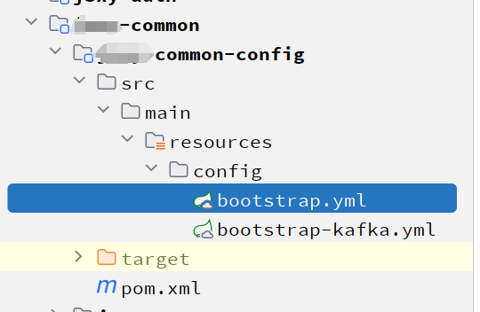
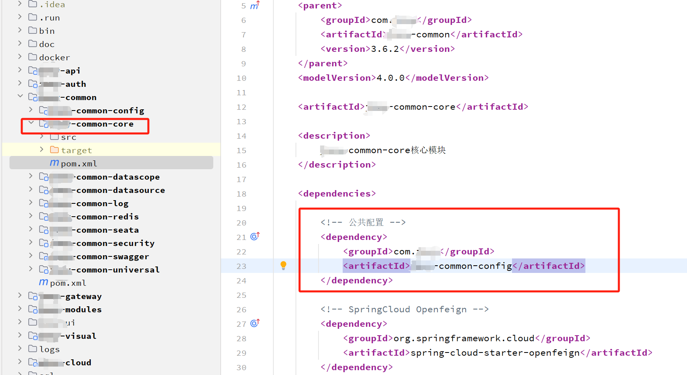
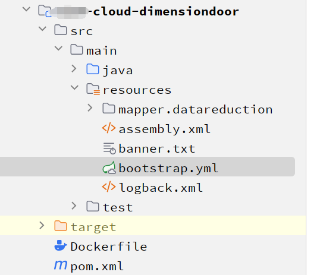

# 公共配置文件

:::tip 若依微服务版公共配置的提取
:::


::: details springboot有哪几种配置文件
<div  class="gpt_html_div">
    <div id="scrollRef" class="h-full overflow-hidden overflow-y-auto">
        <div id="image-wrapper" class="w-full max-w-screen-xl m-auto dark:bg-[#101014] p-4">
<!--问-->
<div class="flex w-full mb-6 overflow-hidden flex-row-reverse"><div class="flex items-center justify-center flex-shrink-0 h-8 overflow-hidden rounded-full basis-8 ml-2"><span class="n-avatar" style="--n-font-size:14px; --n-border:none; --n-border-radius:3px; --n-color:rgba(204, 204, 204, 1); --n-color-modal:rgba(204, 204, 204, 1); --n-color-popover:rgba(204, 204, 204, 1); --n-bezier:cubic-bezier(0.4, 0, 0.2, 1); --n-merged-size:var(--n-avatar-size-override, 34px);"><!----></span></div><div class="overflow-hidden text-sm items-end"><p class="text-xs text-[#b4bbc4] text-right">2023/10/26 11:08:15</p><div class="flex items-end gap-1 mt-2 flex-row-reverse"><div class="text-black text-wrap min-w-[20px] rounded-md px-3 py-2 bg-[#d2f9d1] dark:bg-[#a1dc95]"><div class="leading-relaxed break-words"><div class="whitespace-pre-wrap">springboot有哪几种配置文件</div></div></div><div class="flex flex-col"><!----><!----><button class="transition text-neutral-300 hover:text-neutral-800 dark:hover:text-neutral-200"><svg xmlns="http://www.w3.org/2000/svg" xmlns:xlink="http://www.w3.org/1999/xlink" aria-hidden="true" role="img" class=" iconify iconify--ri" width="1em" height="1em" viewBox="0 0 24 24"><path fill="currentColor" d="M12 3c-1.1 0-2 .9-2 2s.9 2 2 2s2-.9 2-2s-.9-2-2-2Zm0 14c-1.1 0-2 .9-2 2s.9 2 2 2s2-.9 2-2s-.9-2-2-2Zm0-7c-1.1 0-2 .9-2 2s.9 2 2 2s2-.9 2-2s-.9-2-2-2Z"></path></svg></button><!----></div></div></div></div>
<!--答-->
<div class="flex w-full mb-6 overflow-hidden"><div class="flex items-center justify-center flex-shrink-0 h-8 overflow-hidden rounded-full basis-8 mr-2"><span class="text-[28px] dark:text-white"><svg xmlns="http://www.w3.org/2000/svg" viewBox="0 0 32 32" aria-hidden="true" width="1em" height="1em"><path d="M29.71,13.09A8.09,8.09,0,0,0,20.34,2.68a8.08,8.08,0,0,0-13.7,2.9A8.08,8.08,0,0,0,2.3,18.9,8,8,0,0,0,3,25.45a8.08,8.08,0,0,0,8.69,3.87,8,8,0,0,0,6,2.68,8.09,8.09,0,0,0,7.7-5.61,8,8,0,0,0,5.33-3.86A8.09,8.09,0,0,0,29.71,13.09Zm-12,16.82a6,6,0,0,1-3.84-1.39l.19-.11,6.37-3.68a1,1,0,0,0,.53-.91v-9l2.69,1.56a.08.08,0,0,1,.05.07v7.44A6,6,0,0,1,17.68,29.91ZM4.8,24.41a6,6,0,0,1-.71-4l.19.11,6.37,3.68a1,1,0,0,0,1,0l7.79-4.49V22.8a.09.09,0,0,1,0,.08L13,26.6A6,6,0,0,1,4.8,24.41ZM3.12,10.53A6,6,0,0,1,6.28,7.9v7.57a1,1,0,0,0,.51.9l7.75,4.47L11.85,22.4a.14.14,0,0,1-.09,0L5.32,18.68a6,6,0,0,1-2.2-8.18Zm22.13,5.14-7.78-4.52L20.16,9.6a.08.08,0,0,1,.09,0l6.44,3.72a6,6,0,0,1-.9,10.81V16.56A1.06,1.06,0,0,0,25.25,15.67Zm2.68-4-.19-.12-6.36-3.7a1,1,0,0,0-1.05,0l-7.78,4.49V9.2a.09.09,0,0,1,0-.09L19,5.4a6,6,0,0,1,8.91,6.21ZM11.08,17.15,8.38,15.6a.14.14,0,0,1-.05-.08V8.1a6,6,0,0,1,9.84-4.61L18,3.6,11.61,7.28a1,1,0,0,0-.53.91ZM12.54,14,16,12l3.47,2v4L16,20l-3.47-2Z" fill="currentColor"></path></svg></span></div><div class="overflow-hidden text-sm items-start"><p class="text-xs text-[#b4bbc4] text-left">2023/10/26 11:08:54</p><div class="flex items-end gap-1 mt-2 flex-row"><div class="text-black text-wrap min-w-[20px] rounded-md px-3 py-2 bg-[#f4f6f8] dark:bg-[#1e1e20]"><div class="leading-relaxed break-words"><div class="markdown-body"><p>Spring Boot 提供了多种配置文件的方式，常见的有以下几种：</p>
<ol>
<li>
<p>application.properties：这是最常见的配置文件，使用键值对的形式进行配置。可以在其中设置各种属性，如数据库连接信息、服务器端口等。默认情况下，Spring Boot 会自动加载该文件。</p>
</li>
<li>
<p>application.yml：这是 YAML 格式的配置文件，也可以用于配置各种属性。相对于 properties 文件，YAML 文件更加简洁易读，支持层级结构和列表等特性。同样，默认情况下，Spring Boot 会自动加载该文件。</p>
</li>
<li>
<p>bootstrap.properties 或 bootstrap.yml：这些配置文件用于在应用程序启动前加载，主要用于外部配置的加载。例如，可以将一些敏感的配置信息放在这里，以便在应用程序启动时加载并覆盖默认配置。</p>
</li>
<li>
<p>application-{profile}.properties 或 application-{profile}.yml：这些配置文件是针对不同的环境或配置文件激活的特定配置。通过在文件名中使用激活的配置文件名称，可以根据不同的环境提供不同的配置。例如，可以创建 application-dev.properties 来配置开发环境，application-prod.properties 来配置生产环境。</p>
</li>
</ol>
<p>需要注意的是，Spring Boot 配置文件的加载顺序是固定的，优先级从高到低依次为：命令行参数 &gt; 外部配置文件 &gt; profile-specific 配置文件 &gt; 默认配置文件。这样可以确保在不同环境下正确加载和覆盖配置。</p>
<p>除了以上几种常见的配置文件，Spring Boot 还支持其他一些特殊的配置文件，如 application.xml（XML 格式的配置文件）和 application.groovy（Groovy 脚本格式的配置文件）。但是在实际应用中，较少使用这些特殊的配置文件格式。</p>
</div></div></div><div class="flex flex-col"><button class="mb-2 transition text-neutral-300 hover:text-neutral-800 dark:hover:text-neutral-300"><svg xmlns="http://www.w3.org/2000/svg" xmlns:xlink="http://www.w3.org/1999/xlink" aria-hidden="true" role="img" class=" iconify iconify--ri" width="1em" height="1em" viewBox="0 0 24 24"><path fill="currentColor" d="M18.537 19.567A9.961 9.961 0 0 1 12 22C6.477 22 2 17.523 2 12S6.477 2 12 2s10 4.477 10 10c0 2.136-.67 4.116-1.81 5.74L17 12h3a8 8 0 1 0-2.46 5.772l.997 1.795Z"></path></svg></button><!----><button class="transition text-neutral-300 hover:text-neutral-800 dark:hover:text-neutral-200"><svg xmlns="http://www.w3.org/2000/svg" xmlns:xlink="http://www.w3.org/1999/xlink" aria-hidden="true" role="img" class=" iconify iconify--ri" width="1em" height="1em" viewBox="0 0 24 24"><path fill="currentColor" d="M12 3c-1.1 0-2 .9-2 2s.9 2 2 2s2-.9 2-2s-.9-2-2-2Zm0 14c-1.1 0-2 .9-2 2s.9 2 2 2s2-.9 2-2s-.9-2-2-2Zm0-7c-1.1 0-2 .9-2 2s.9 2 2 2s2-.9 2-2s-.9-2-2-2Z"></path></svg></button><!----></div></div></div></div>
        </div>
    </div>
</div>
:::


1. 在公共模块`xxx-common`创建`xxx-common-config`,结构如下图所示：



2. `bootstrap.yml`示例内容
```yaml

# 注册中西、配置中心 nacos服务地址
nacos-ip: 192.168.0.237:8848 # 测试局域网
#nacos-ip: 10.10.10.10:8848 #内网

# 熔断降级服务 控制台地址
sentinel-path: 192.168.0.230:8718 # 测试局域网
#sentinel-path: 10.10.10.10:8718 #内网

# 运行环境参考字段 涉及到定时任务参数  勿改动
#deployed_environment: outer_net_prod       #外网生产环境
deployed_environment: local_area_network   #测试环境
#deployed_environment: intranet             #内网生产环境

# 定时任务参数 定时任务重要参数     勿动
org_quartz_scheduler_instanceName: Jsxy_${deployed_environment}

#act: prod
# jasypt加密秘钥，该秘钥可以自定义
jasypt:
  encryptor:
    password: 123456789
    algorithm: PBEWithMD5AndDES
    poolSize: 1
    saltGeneratorClassname: org.jasypt.salt.RandomSaltGenerator
    stringOutputType: base64
    #########重点！！！！！！！！！！！！！！！！！！！！
    iv-generator-classname: org.jasypt.iv.NoIvGenerator
#    默认解密识别是是ENC(..)，如果需要定制不同，可以进行下面配置，如下ENC@[..]
#    property:
#      prefix: "ENC@["
#      suffix: "]"

#spring配置
spring:
  profiles:
    # 环境配置prod dev
    active: prod
  cloud:
    nacos:
      discovery:
        # 服务注册地址
        server-addr: ${nacos-ip}
        namespace: JSXY
        username: nacos
        password: ENC(Zc7JtYmhgk6fQ2nKOQqCIMHsU796vlsV)
      config:
        # 配置中心地址
        server-addr: ${nacos-ip}
        namespace: JSXY
        username: nacos
        password: ENC(Zc7JtYmhgk6fQ2nKOQqCIMHsU796vlsV)
        # 配置文件格式
        file-extension: yml
        # 共享配置
        shared-configs:
          - application-${spring.profiles.active}.${spring.cloud.nacos.config.file-extension}

```

3. 各个模块一般都会引入公共模块，这时候这里面的配置就会在各个模块都生效

4. 例如其中一个模块`bootstrap.yml`配置是这样的
  
   bootstrap.yml
```yaml

# Tomcat
server:
  port: 0

#spring配置
spring:
  application:
    # 应用名称
#    name: xxxx-dimensiondoor
    name: xxxx-dimensiondoor
    # 应用路径 与网关配置中path一致 ##扫描系统接口方法中使用到##
    systemRoute: dimensiondoor
# 公共配置在公共模块xxxx-common/xxxx-common-core/src/main/resources/config/bootstrap.yml

```


