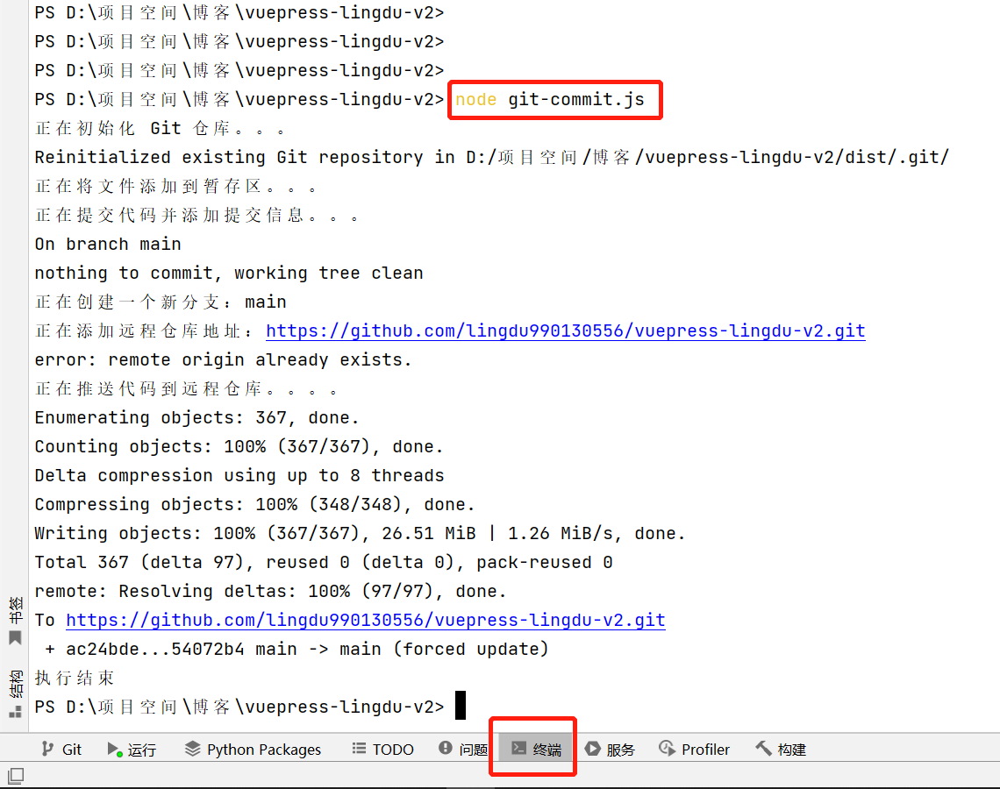
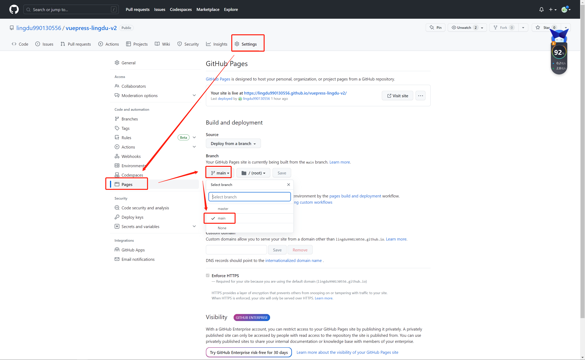
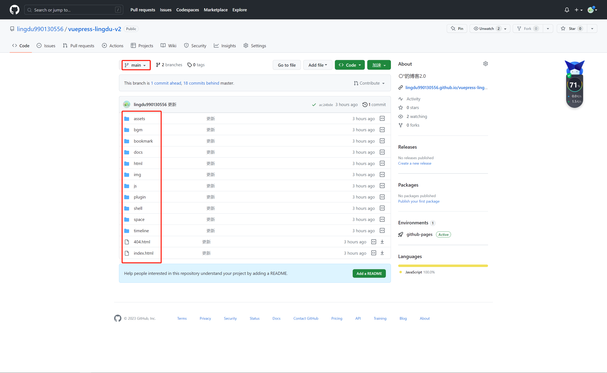

# GitHub分支自动提交策略

:::tip 提示
项目构建就不在这里赘述了
:::

目录结构
```md
├─ docs
│  ├─ .vuepress
│  │  └─ config.js
│  └─ README.md
├─ .gitignore
├─ git-commit.js    // 新增脚本文件
└─ package.json
```

## 1. 设置项目打包参数
在项目中config.js/config.ts设置属性：

<CodeGroup>
  <CodeGroupItem title="config.js" active>

```js
//docs/.vuepress/config.js

export default ({
    // 描述
    description: 'vuepress-lingdu-v2',
    // 项目打包目的地
    dest: './dist',
    // 项目访问路径前缀
    base: '/vuepress-lingdu-v2/',
    // 。。。
    
})
```

  </CodeGroupItem>

  <CodeGroupItem title="config.ts">

```ts
//docs/.vuepress/config.ts

export default ({
    // 描述
    description: 'vuepress-lingdu-v2',
    // 项目打包目的地
    dest: './dist',
    // 项目访问路径前缀
    base: '/vuepress-lingdu-v2/',
    // 。。。
    
})
```

  </CodeGroupItem>
</CodeGroup>

## 2. 添加自动提交脚本
在package.json同级目录下创建git-commit.js

:::: details git-commit.js代码
```js
// git-commit.js
// 更新代码到远程仓库

const {spawn} = require("child_process");
// 提交代码描述说明
const commitMessage = '更新';
// 远程仓库名称
const repoName = 'origin';
// 远程仓库地址
const repo = 'https://github.com/lingdu990130556/vuepress-lingdu-v2.git'
// 分支名称 放在GitHub上的话可以与主分支区别开就能开启静态页面功能了
const branch = 'main';
// 启动方法
const c=cmd();
/**
 * 执行cmd命令
 */
function cmd(opts) {
    opts = { stdio: `inherit`}
    opts.shell = opts.shell || process.platform === 'win32'

    const path = require('path');
    // 更改当前工作目录到 dist
    process.chdir(path.join(__dirname, 'dist'));// 注意要cd到要提交的代码文件夹下或者把此脚本放在要提交的代码的文件夹下！！！！！！！！！！！！！！！！！！！！！！！！！！
    console.log("正在初始化 Git 仓库。。。")
    let s=spawn('git',['init'],opts);// 初始化
    s.on('close', (code) => {
        console.log("正在将文件添加到暂存区。。。")
        s=spawn('git',['add . '],opts);// 添加文件
        s.on('close', (code) => {
            console.log("正在提交代码并添加提交信息。。。")
            s=spawn('git',['commit','-m',commitMessage],opts);// 提交到本地
            s.on('close', (code) => {
                console.log("正在创建一个新分支："+branch)
                s=spawn('git',['branch','-M',branch],opts);// 创建分支
                s.on('close', (code) => {
                    console.log("正在添加远程仓库地址："+repo)
                    s=spawn('git',['remote', 'add', repoName, repo],opts);// 添加远程仓库
                    s.on('close', (code) => {
                        console.log("正在推送代码到远程仓库。。。。")
                        let p=myspawn('git',['push', '-f', repoName, branch],opts);// 提交到远程仓库
                        p.then(r=>{
                            console.log("执行结束")
                        })
                    });
                });
            });
        });
    });
    return '〇°';
}
/**
 * 以 Promise 方式运行 spawn
 * @param {*} cmd 主程序
 * @param {*} args 程序参数数组
 * @param {*} opts spawn 选项
 */
function myspawn (cmd, args, opts) {
    return new Promise((resolve, reject) => {
        const child = spawn(cmd, args, opts)
        let stdout = ''
        let stderr = ''
        child.stdout && child.stdout.on('data', d => { stdout += d; console.log(`stdout`, stdout) })
        child.stderr && child.stderr.on('data', d => { stderr += d; console.log(`stderr`, stderr) })
        child.on('error', reject)
        child.on('close', code => {
            resolve({code, stdout, stderr})
        })
    })
}

```
::::

:::tip 提示
// 提交代码描述说明  
const commitMessage = '==更新==' ;  
// 远程仓库名称  
const repoName = '==origin==' ;  
// 远程仓库地址  
const repo = '==https://github.com/lingdu990130556/vuepress-lingdu-v2.git=='  
// 分支名称 放在GitHub上的话可以与主分支区别开就能开启静态页面功能了  
const branch = '==main==';  

上面参数中深色部分为你自己的参数项，根据你自己实际情况变更
:::

## 3. 变更打包命令
在package.json中更改：

```json
{
  "scripts": {
    "docs:build": "vuepress build docs"
  }
}
```
更改为：
```json
{
  "scripts": {
    "docs:build": "vuepress build docs && node git-commit.js"
  }
}
```
:::tip 提示
有时候国内访问GitHub会超时导致提交代码失败。  
如：
```cmd
fatal: unable to access 'https://github.com/lingdu990130556/vuepress-lingdu-v2.git/': Recv failure: Connection was reset
```
或
```cmd
fatal: unable to access 'https://github.com/lingdu990130556/vuepress-lingdu-v2.git/': Failed to connect to github.com port 443 after 21108 ms: Couldn't connect to server
```
这时候可以在控制台单独执行`node git-commit.js`命令提交代码：

:::

## 4. GitHub开启Pages


main分支中文件就是项目打包后dist中的文件



至此，你的vuepress项目就能在GitHub上访问了。且==每次本地打包的时候就会自动提交到GitHub分支上==


