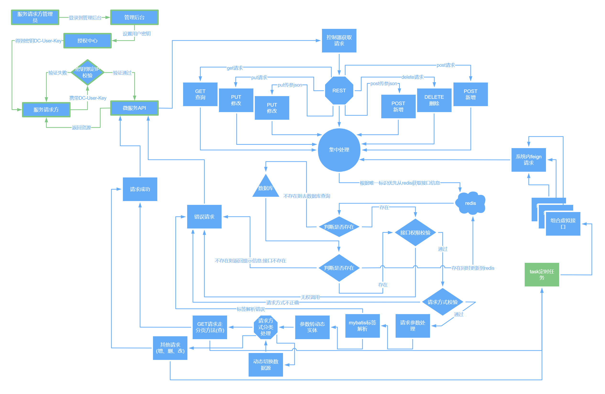
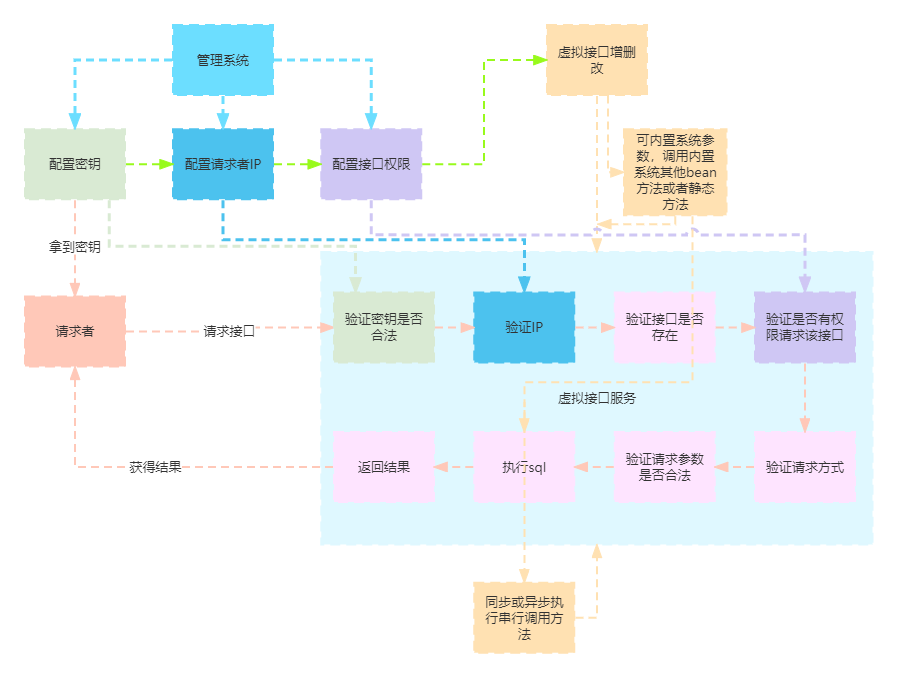

# 安徽臻峰信息科技有限公司
## [返回](../../)
>2018年-2020年  
> 参与全媒体数据中心项目的开发[简单的单表增删改查操作]  
> 该项目是第一个实战项目，开发过程中接触到java反射技术为后面的数据中心项目中的虚拟接口的业务
> 的实现奠定了思想基础

>2020-03-18 到 2020-06-30  
> 参与乐厨项目的开发  
> 一个厨师会员制管理系统

>2021年-2022年底  
> 参与数据中心项目的开发  
> 数据中心项目定义为学校的若干独立系统做数据库的抽取同步和数据清洗共享  
> 基于[若依微服务版](https://gitee.com/y_project/RuoYi-Cloud)开发  
> 数据中心中由我本人自主设计了一套线上快速接口生成的逻辑【其中动态切换数据源变相改变了分布式事务的统一事务回滚现状】： 

