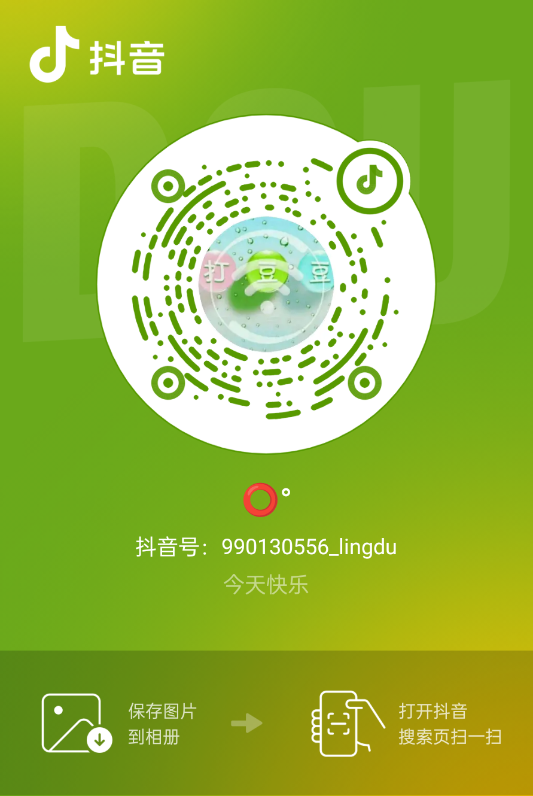

# 〇°

## [返回](./README.md)

:::  tip 基本信息  
**域名：** [lingdu.love © 2023-2033](https://lingdu.love)  
**网名：** 〇° | lingdu | lingdou | 零度 | 零豆 | 零度优 | 了赢零的雾度 | [零度忧殇](./) | ...  
**老家：** 安徽省安庆市怀宁县  
**性别：** 男  
**身高：** 170  
**体重：** 120<〇°<130  
**年份：** 1996  
**生肖：** [鼠](https://zsx.linggx365.cn/index?tab_type=luck&luck_type=year&zodiac_id=0&luck_year=&channel=sw_whxl_00001)  
**星座：** [白羊座](https://m.xzw.com/astro/aries/?appid=bds)  
**生日：** 三月初二【农历】

[//]: # (**八字：** 丙子 壬辰 丙戌 壬辰  )
**欠缺：** 原局缺金  
**格局：** 食神格命局  
**人格：** [调停者 INFP-A / INFP-T](https://www.16personalities.com/ch/infp-%E4%BA%BA%E6%A0%BC)  
[우리영원히함께해요](./空间/README.md)  
:::
---
:::tip 社交  
**[QQ](https://user.qzone.qq.com/)：** 990130556  
**[微信](https://weixin.qq.com/)：** 990130556  
**[抖音](https://www.douyin.com/)：** 990130556_lingdu  
**[哔哩哔哩](https://www.bilibili.com/)：** 了赢零的雾度  
**[微博](https://www.weibo.com/)：** 不腻不弃-零度  
**邮箱：** 990130556@qq.com  
    
:::

::: details 职业轨迹
>2024-10-17 至 2025-01-16  
> 公司名称：[安徽万链科技有限公司](/vuepress-lingdu-v2/关于/我/职业生涯/万链科技/index.html)  
> 职位：Java工程师
>2018-10-15 至 2024-10-16  
> 公司名称：[安徽臻峰信息科技有限公司](/vuepress-lingdu-v2/关于/我/职业生涯/臻峰信息/index.html)  
> 职位：Java工程师

[//]: # (>>2017-08-01 至 2018-01-05  )

[//]: # (>> 公司名称：[芜湖方特]&#40;/vuepress-lingdu-v2/关于/我/职业生涯/芜湖方特/index.html&#41;  )

[//]: # (>> 职位：仓管员)

[//]: # (>>>2016-00-00 至 2017-00-00  )

[//]: # (>>> 公司名称：[合肥联宝]&#40;https://www.lcfc.com.cn/&#41;  )

[//]: # (>>> 职位：流水线电脑组装  )
:::

::: details 学历
> 2022-03-01 至 2024-07-01  
> 学校名称：[安徽财经大学](http://www.aufe.edu.cn/)  
> 专业：计算机科学与技术  
> 学历：本科

[//]: # (>> 2018-03-01 至 2018-10-01  )

[//]: # (>> 学校名称：[达内]&#40;http://ahs.tedu.cn&#41;  )

[//]: # (>> 学习内容：Java基础  )

[//]: # (>> 学历：校外教育  )

[//]: # (>>> 2015-09-06 至 2018-07-01  )

[//]: # (>>> 学校名称：[滨湖学院]&#40;http://www.hfbhxy.com/&#41;  )

[//]: # (>>> 专业：电子设备与运行管理  )

[//]: # (>>> 学历：大专  )

[//]: # (>>>> 2012-09-01 至 2014-07-01  )

[//]: # (>>>> 学校名称：[洪镇中学]&#40;https://www.baidu.com/s?ie=utf-8&f=8&rsv_bp=1&rsv_idx=2&tn=baiduhome_pg&wd=%E6%B4%AA%E9%95%87%E4%B8%AD%E5%AD%A6&rsv_spt=1&oq=%25E9%25AB%2598%25E6%25B2%25B3%25E4%25B8%25AD%25E5%25AD%25A6&rsv_pq=b35a764100004a32&rsv_t=b037ZaYDWoGtuQZqfjyKH%2B6ej%2F6r6gqFb0sUe3kSMKAuadO3eqsJqDanBC%2FRNxiC4%2BCK&rqlang=cn&rsv_enter=0&rsv_dl=tb&rsv_btype=t&rsv_sug3=4&rsv_sug1=3&rsv_sug7=100&rsv_n=2&bs=%E9%AB%98%E6%B2%B3%E4%B8%AD%E5%AD%A6&#41;  )

[//]: # (>>>> 学历：高中  )

[//]: # (>>>> 2014-09-01 至 2015-07-01  )

[//]: # (>>>> 学校名称：[高河中学]&#40;https://www.baidu.com/s?ie=utf-8&f=8&rsv_bp=1&rsv_idx=2&tn=baiduhome_pg&wd=%E9%AB%98%E6%B2%B3%E4%B8%AD%E5%AD%A6&rsv_spt=1&oq=%25E9%25AB%2598%25E6%25B2%25B3%25E4%25B8%25AD%25E5%25AD%25A6&rsv_pq=ce9b404f0000179c&rsv_t=0712UEnICkV%2Bu9EezTjDS96VFGluLRI7uSFahy%2FrRsxmSnlD%2BxZ7aUGCSA1sHblo9LUj&rqlang=cn&rsv_enter=0&rsv_dl=tb&rsv_btype=t&#41;  )

[//]: # (>>>> 文理分班：理科班)

[//]: # (>>>> 学历：高中  )

[//]: # (>>>>> 2009-09-01 至 2012-07-01  )

[//]: # (>>>>> 学校名称：[金拱初中]&#40;https://www.baidu.com/s?wd=%E9%87%91%E6%8B%B1%E5%88%9D%E4%B8%AD&rsv_spt=1&rsv_iqid=0xa7e5542600014954&issp=1&f=8&rsv_bp=1&rsv_idx=2&ie=utf-8&rqlang=cn&tn=baiduhome_pg&rsv_enter=0&rsv_dl=tb&oq=%25E9%2587%2591%25E6%258B%25B1%25E9%2595%2587%25E9%2587%258C%25E4%25BB%2581%25E5%25B0%258F%25E5%25AD%25A6&rsv_t=ee8d7MwrOajS%2BNoIJkGgQBuG6OiPSXLki9fzp2UXjRkUaPB%2BIIca%2FF3ZxDr5WeWcVL3y&rsv_btype=t&rsv_pq=e1d9b03500000d8a&rsv_sug3=121&rsv_sug1=100&rsv_sug7=100&rsv_sug2=0&inputT=3421&rsv_sug4=4746&#41;  )

[//]: # (>>>>> 学历：初中  )

[//]: # (>>>>>> 2003-09-01 至 2009-07-01  )

[//]: # (>>>>>> 学校名称：[里仁小学]&#40;https://www.baidu.com/s?ie=utf-8&f=8&rsv_bp=1&rsv_idx=2&tn=baiduhome_pg&wd=%E9%87%91%E6%8B%B1%E9%95%87%E9%87%8C%E4%BB%81%E5%B0%8F%E5%AD%A6&rsv_spt=1&oq=%25E9%2587%2591%25E6%258B%25B1%25E9%2595%2587%25E9%2587%258C%25E4%25BB%2581%25E5%25B0%258F%25E5%25AD%25A6&rsv_pq=c17b6e5400005c68&rsv_t=5a46BR1o8Mfs%2FSC1spvxATMNu2DVSKo%2Bc7OgQ2GhR8f5QeW6EfLmXiyo0OJxokS7O9RS&rqlang=cn&rsv_enter=0&rsv_dl=tb&rsv_btype=t&#41;  )

[//]: # (>>>>>> 学历：小学  )
:::
