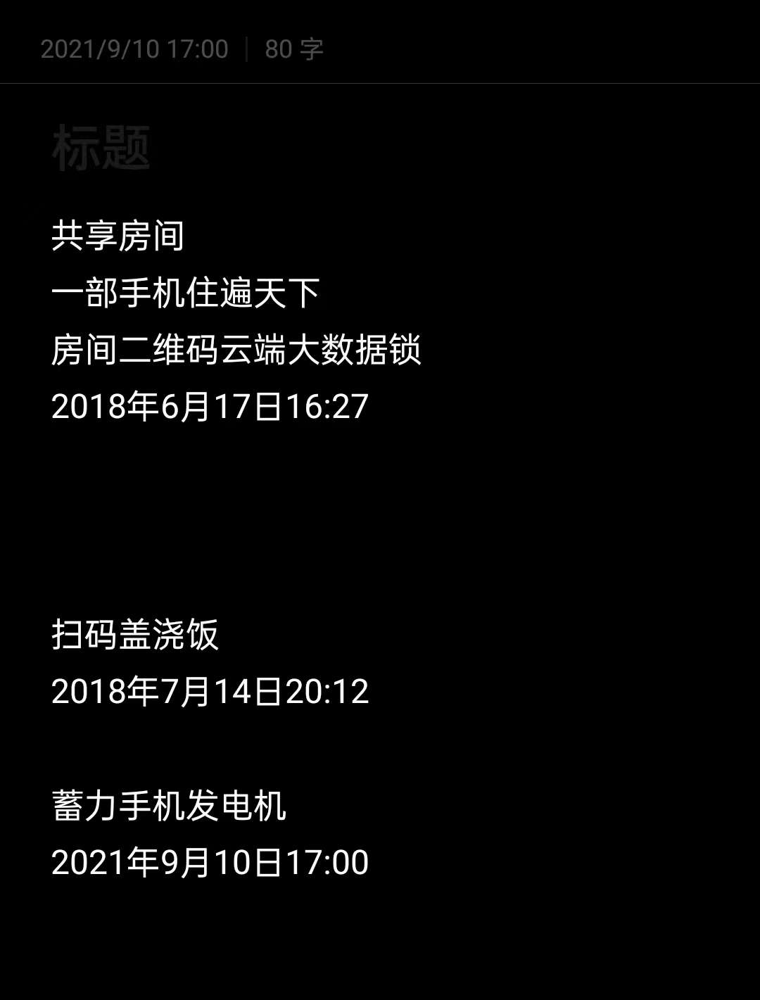
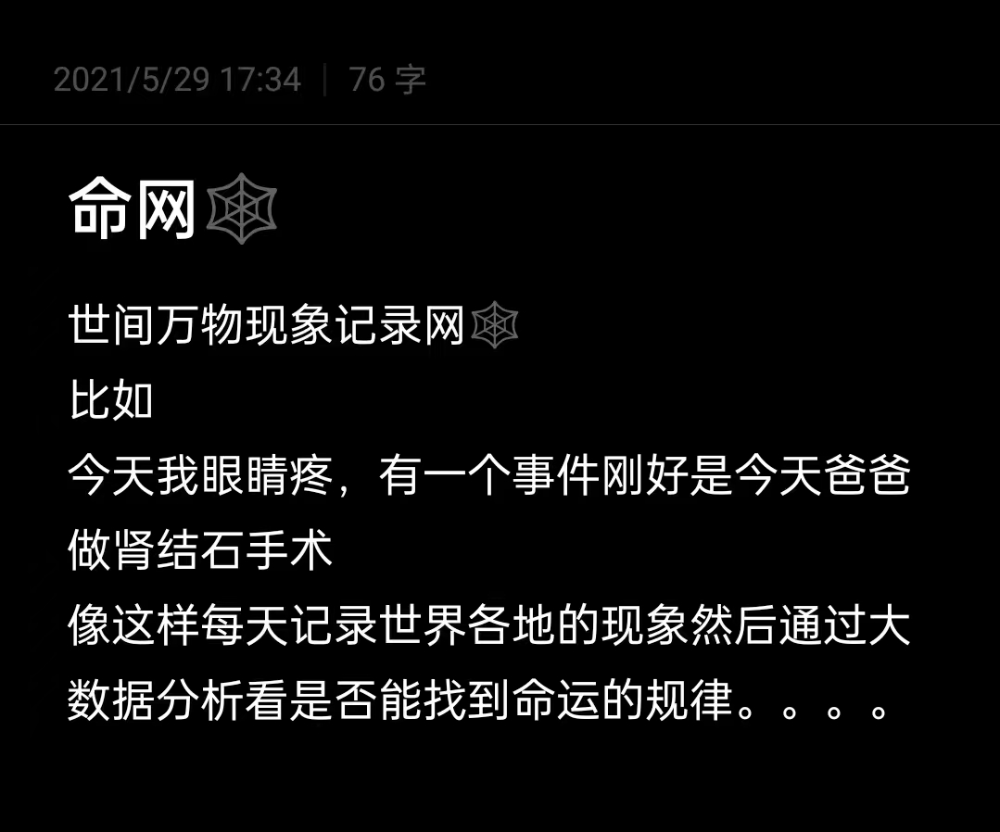
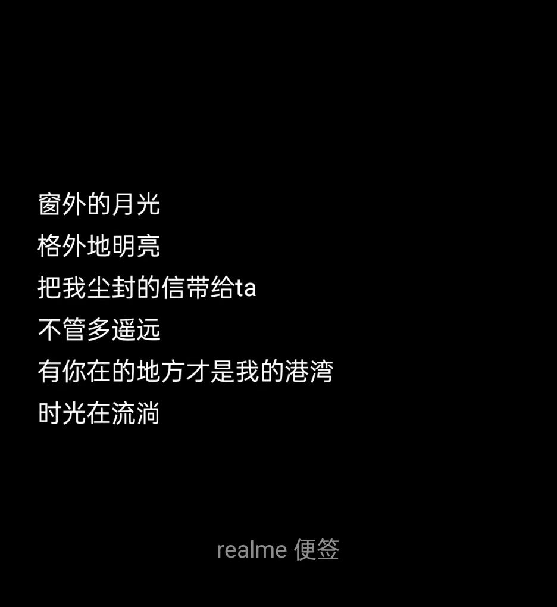

# 杂想记

## 梦恋
2023/7/1 05:45
:::center
睡着的我，意识在空间不断搜索，

直到发现你梦的波动。

进入你的梦。

在梦里，我们可以脱离一切实际，

还能无视时空。时间压缩，空间独立

如果可以，我想完成现实中的遗憾。

一秒万年，足以三生三世，

如果可以，我希望你也记住那感觉，

明天再见，又是一万年。

彼此约定，现实中碰面。

这是梦，弥补的我们浪费的青春，

梦醒时分，亦是新梦。

你得梦见我呀，我才能符合逻辑的顺利进入。
:::

## 元宵会
2023/5/8 08:17
:::center
长长的离别

淡淡的思念

机缘相见

短暂会面

短短的离别

深深的思念

恨不得立刻相见

巴不得天天会面

此夜无眠
:::

## 蓄力手机发电机

## 命网

## 2020年8月1日23:59

## 2020年2月25日

2020年2月25日晚19:多第一次刮胡子

## 2019年12月1日12:07
:::tip 2019年12月1日12:07
放大一百倍天空
室内宇宙

引力或是一种能量

受精卵-跳伞

磁流体＋音频…………

指数储存！

将一套小说导入系统，系统自动生成对应的剧情动画。
:::
ps: 上面这些我现在也看不懂了。。。只怪当时没记全

## 2018年9月13日11:36
:::center
也许

打个喷嚏

你就能看见彩虹...
:::

## 扫码盖浇饭

2017年7月14日20:12

## 共享房间
一部手机住遍天下

房间二维码云端大数据锁

2017年6月17日16:27

## 2017年2月8日23:51
:::center
把记忆哼成碎片  

过去都在眼前  

与坠落的雨点  

消失在无情人间  
:::
