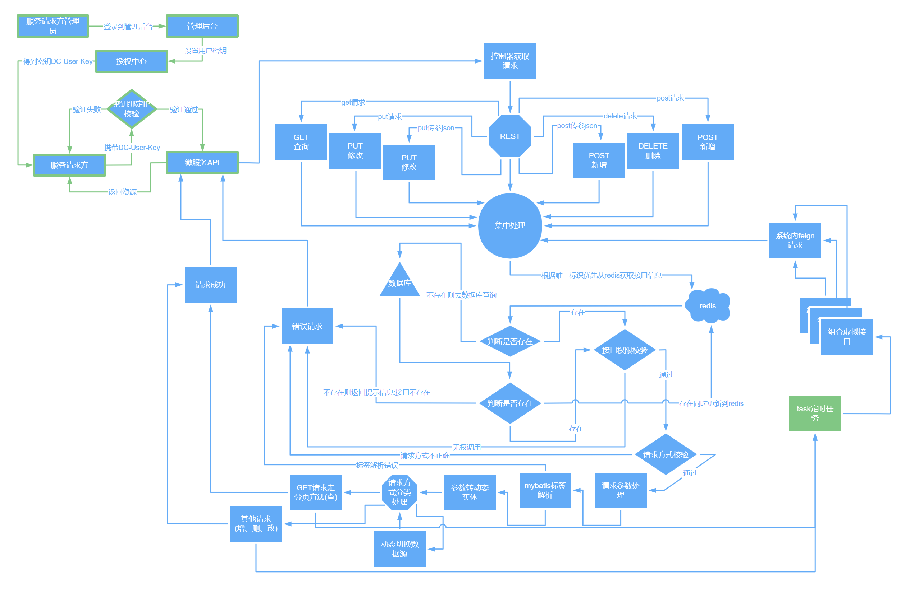
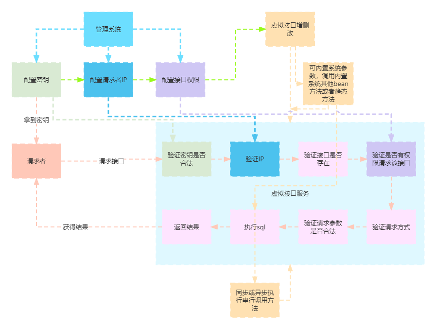

# 安徽臻峰信息科技有限公司
## [返回](../../)
> **2018年-2020年**  
> 参与全媒体数据中心项目的开发[简单的单表增删改查操作]  
> 该项目是第一个实战项目，开发过程中接触到java反射技术为后面的数据中心项目中的虚拟接口的业务
> 的实现奠定了思想基础
----
> **2020-03-18 到 2020-06-30**  
> 参与乐厨项目的开发  
> 一个厨师会员制管理系统
----
> **2021年-2022年底**  
> 参与数据中心项目的开发  
> 数据中心项目定义为学校的若干独立系统做数据库的抽取同步和数据清洗共享  
> 基于[若依微服务版](https://gitee.com/y_project/RuoYi-Cloud)框架开发  
> 其中涉及到的后端技术有：  
>> SpringBoot框架  
>> SpringCloud框架  
>> Spring Security安全控制【基于若依微服务的安全控制策略做了一些逻辑体验上的调整，比如动态更新用户权限等】  
>> MyBatis持久层框架  
>> [Nginx](/vuepress-lingdu-v2/Java周边/第三方插件/nginx/) 部署前端项目  
>> [Redis](/vuepress-lingdu-v2/Java周边/第三方插件/redis/redis.html) 内存数据存储系统  
>> [Kafka](/vuepress-lingdu-v2/Java周边/第三方插件/kafka/) 消息中间件  
>> [Nacos](/vuepress-lingdu-v2/Java周边/第三方插件/nacos/)注册中心、配置中心  
>> [MySQL](/vuepress-lingdu-v2/Java周边/基础/db/MySQL-v5.7.html)数据库、[Oracle](/vuepress-lingdu-v2/Java周边/第三方插件/ogg/)数据库【其中MySQL数据库是若依框架默认数据库，Oracle数据库为学校其他项目涉及到的数据库，在数据抽取过程中做镜像库使用】  
>> Spring Boot Admin 服务监控  
>> [Sentinel](/vuepress-lingdu-v2/Java周边/第三方插件/sentinel/sentinel.html) 熔断和降级  
>> [SkyWalking](/vuepress-lingdu-v2/Java周边/第三方插件/skywalking/skywalking.html) 链路追踪  
>> [Docker](/vuepress-lingdu-v2/Java周边/系统/docker/) 应用容器部署  
>> 
> 本项目由我本人自主设计了一套线上快速接口生成的逻辑【其中结合动态切换数据源技术，我认为变相改变了分布式事务的统一事务回滚现状，可替代现有的分布式事务处理方式(当然可能我一个人的思维使得整体逻辑暂时可能还不够完善)。
> 传统的分布式事务是远程调用其他独立接口通过seata的入口事务注解以及各子接口的事务注解由第三方统一管理事务，而本模块的事务则打破了分布式的壁垒，在一个方法中通过动态切换数据源以及级联调用，
> 把所有组合接口的事务的创建、提交及回滚，都都统一在了这个方法中】：  
>> 整个业务我称之为`虚拟接口`模块（网络上暂时没有Java在线接口的这个名词，但是也有相似的技术），基于若依微服务新建的一个独立的微服务模块可根据API访问需求横向扩展。
>> `虚拟接口`的整个逻辑为：
>>> 基于若依微服务的认证授权机制，在系统用户账号绑定一个密钥（出于安全考虑，密钥绑定了IP），这个密钥独立于账号登录，在项目`系统模块`启动后立即绑定认证信息及密钥到Redis，在本`虚拟接口`模块启动后立即将数据库中存有的虚拟接口相关SQL存储到Redis。  
>>> 第三方系统想要调用本项目的接口会：创建账号->设置密钥->绑定IP->通知管理员授权->使用密钥+接口唯一标识访问接口。  
>>> `虚拟接口`的新建结合了若依微服务版中的`BeanInvokeUtil`工具以及`Feign`，使得其可灵活配置组合接口，比如在项目中有个业务是：
>>>> A服务调用本服务接口推送数据到数据库，推送成功后分发数据给B系统。这个过程中`虚拟接口`可以完成推送接口、分发接口的组合，并且是事务关联的，组合中的任何一个接口出错所有事务都会回滚，组合接口及事务不受单数据源的限制。   
>> 
>> 业务逻辑流程图：  
>> 
>> 
>> [相关核心代码初版](https://blog.csdn.net/lingdu_dou/article/details/122537030)
----
> **2023年初-2023年5月**  
> 参与数据中心项目的升级改造“数据共享服务平台”  
> 基于之前的数据中心项目新增Kafka消息中间件做数据抽取中转，集成Kafka到项目中，实现了Kafka的topic和group以及用户、权限在线管理。
> 多数据源在线配置新增读写分离配置和一系列处理逻辑，结合`虚拟接口`实现自适应读写分离逻辑【`虚拟接口`本身按照Restful风格设计，基于该风格可自动根据请求方式决定调用读、写数据源】。
>> kafka 
----
> **2023年6月-当前**  
> 利用闲余时间搭建了基于vuepress和vuepress2的博客，也就是本站。
