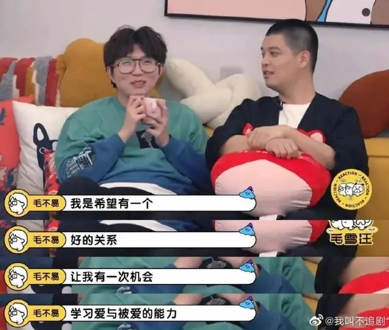

# 〇

:::tip 毛不易

“我希望有一段好的关系，能让我学习爱与被爱的能力。”
::: right
———— 毛不易
:::

:::tip 杨振宁
只要持之以恒，知识丰富了，终能发现其奥秘。  
::: right
———— 杨振宁
:::

:::tip 释迦摩尼
无论你遇见谁，  
他都是你生命中该出现的人，绝非偶然，  
他一定会教会你一些什么。    
::: right
──── 释迦摩尼
:::

:::tip 【唤醒】
你所经历的一切，都是为了唤醒你。  
如果爱不能唤醒你，那就用痛苦唤醒你。  
如果痛苦不能唤醒你，那就用更大的痛苦唤醒你。  
如果更大的痛苦不能唤醒你，那就用失去唤醒你。  
如果失去不能唤醒你，那就用生命唤醒你。  
如果生命不能唤醒你，那就用轮回唤醒你。  
直到你醒来。  
::: right
──── 【唤醒】
:::

:::tip 电影《被我弄丢的你》
在这个快餐恋爱的时代  
小火慢熬的粥格外珍贵  
能够坚定不移的爱一个人   
就足够惊天动地了  
心动不算什么   
可以一次只对一个人心动   
这才是终极浪漫  
::: right
──── 电影《被我弄丢的你》
:::