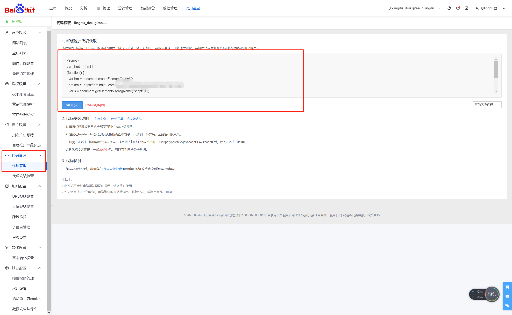

# vuepresss

## 嵌入页面
```md
# vuepresss

## 嵌入页面
/```md
<div style="width: 150%;height: 600px;margin-left: -25%">
    <iframe width="100%" height="600px" src="http://lingdu990130556.gitee.io/vuepress-lingdu-v2/"></iframe>
</div>
/```
**效果如下**
```
**效果如下**
<div style="width: 150%;height: 600px;margin-left: -25%">
  <iframe style="transform: scale(0.80,0.80)" width="100%" height="100%" src="/vuepress-lingdu-v2/"></iframe>
</div>


## 数据统计功能
### 百度统计
摘自[VuePress 博客优化之添加数据统计功能](https://segmentfault.com/a/1190000041259928)
#### 创建站点
##### 登录站点
登陆百度统计后台：[https://tongji.baidu.com/web/welcome/login](https://tongji.baidu.com/web/welcome/login)
##### 新增网站


##### 填写信息
添加网站域名、网站首页等信息：  


##### 获取代码
添加完后，会自动跳转到代码获取页面，我们可以看到根据我们填写的站点信息生成的监控代码，注意这段代码是有特殊标示的，你需要根据自己的站点信息生成并使用：

#### 引入代码
我们在 config.js 里写入生成的代码：
```js
module.exports = {
    head: [
      [
        'script', {}, `
        var _hmt = _hmt || [];
        (function() {
          var hm = document.createElement("script");
          hm.src = "https://hm.baidu.com/hm.js?xxxxxxxxxxxxxxxxxxx";
          var s = document.getElementsByTagName("script")[0]; 
          s.parentNode.insertBefore(hm, s);
        })();
        `
      ]
    ]
}
```
#### 验证

##### 本地验证
我们本地运行，刷新页面，然后查看页面请求：

可以看到页面请求了 hm.js 和 hm.gif ，表明确实发送了请求。

##### 线上验证
现在我们部署到线上。等部署完成后，我们还可以在统计后台的“代码安装检查”页面自动检测或手动检测代码安装情况。


#### 等待
如果代码安装正确，一般 20 分钟后，可以查看网站分析数据。


#### 单页应用的数据统计问题
##### 问题
我们通过在 head 中引入百度统计代码，如果是普通的页面，没有什么问题，但我们用 VuePress 搭建的是一个单页应用，页面切换过程中，不会重新加载页面，自然也不会触发百度统计。所以我们只能统计到用户访问了页面，但具体点开了哪些文章，跳转了哪些路由并不知道。为了实现路由切换时的数据统计，我们还需要监听路由改变，手动上报数据，那具体我们该怎么做呢?

##### 思路
首先根据 VuePress 官网的介绍：
>一个 VuePress 网站是一个由 Vue、Vue Router和 webpack 驱动的单页应用。

而在 VuePress 文档的基本配置中，介绍了一个应用级别的配置：
>由于 VuePress 是一个标准的 Vue 应用，你可以通过创建一个 .vuepress/client.js 文件来做一些应用级别的配置，当该文件存在的时候，会被导入到应用内部。client.js 应该 export default 一个钩子函数，并接受一个包含了一些应用级别属性的对象作为参数。你可以使用这个钩子来安装一些附加的 Vue 插件、注册全局组件，或者增加额外的路由钩子等：
```js
// 使用异步函数也是可以的
export default ({
  Vue, // VuePress 正在使用的 Vue 构造函数
  options, // 附加到根实例的一些选项
  router, // 当前应用的路由实例
  siteData, // 站点元数据
  isServer // 当前应用配置是处于 服务端渲染 或 客户端
}) => {
  // ...做一些其他的应用级别的优化
}
```
在这里我们可以看到，有提供当前应用的路由实例 router，因为 VuePress 的路由是由 Vue Router 驱动的，所以我们查下 Vue Router 的官网介绍，可以看到一个全局前置守卫：
::: tip 提示
你可以使用 router.beforeEach 注册一个全局前置守卫：
:::
```js
const router = new VueRouter({ ... })

router.beforeEach((to, from, next) => {
  // ...
})
```
::: tip 提示
>每个守卫方法接收三个参数：
>- to: Route: 即将要进入的目标 路由对象
>- from: Route: 当前导航正要离开的路由
>- next: Function: 一定要调用该方法来 resolve 这个钩子。
:::
由此得出，我们可以在获取路由实例后，注册一个全局前置守卫来监听路由改变。

现在我们能监听路由改变了，怎么手动上报数据呢？这个我们可以查看百度统计的文档，有讲到针对这种单页应用如何在 JS 中调用 PV 跟踪代码：

```js
_hmt.push(['_trackPageview', pageURL]); 

// pageURL：指定要统计PV的页面URL。此项必选。
```
现在万事俱备，我们开始写起来吧。
#### 实践
我们在 .vuepress 文件夹下新建一个 client.js 文件，代码写入：
```js
export default ({ router }) => {
    router.beforeEach((to, from, next) => {
      if (typeof _hmt !== "undefined") {
        if (to.path) {
          _hmt.push(["_trackPageview", to.fullPath]);
        }
      }
      
      next();
    });
  };
```
现在我们在本地再运行下代码，然后点击文章，包括点击文章中的锚点，查看请求就可以看到上报了数据。


## 问题
### 识别不了中文路径

[Vuepress 图片资源中文路径问题](https://segmentfault.com/a/1190000022275001?sort=votes)

>在引入静态资源的时候，如果路径中存在中文会导致加载失败，例如引入一张图片：  
> ``  
> 中文路径会导致图片加载失败

**解决方案**
- 安装 markdown-it-disable-url-encode

```shell
npm i markdown-it-disable-url-encode
```

- config.js引入模块
```js
module.exports = {
  // .....
  markdown: {
    // ......
    extendMarkdown: md => {
      md.use(require("markdown-it-disable-url-encode"));
    }
  }
};

```

### 打包后md文件引入图片显示失败

[vuepress打包后样式丢失、图片加载路径出错的问题解决方案](https://www.jianshu.com/p/f9b9edd210f8)

>按照测试时候写入文档的图片引用路径在发布后显示失败  
> ``

**解决方案**  

修改图片引用方式

```vue

```


## 升级

[参考](https://zhuanlan.zhihu.com/p/486463500)

[评论插件](https://blog.csdn.net/qq_33806001/article/details/126255433)


## 哀悼模式

:::tip 设置全局黑白
:::

```scss
// 设置全局黑白色
body {
  filter: grayscale(100%); // 将整个页面转为黑白
}

img {
  filter: grayscale(100%); // 将所有图片转为黑白
}
```


