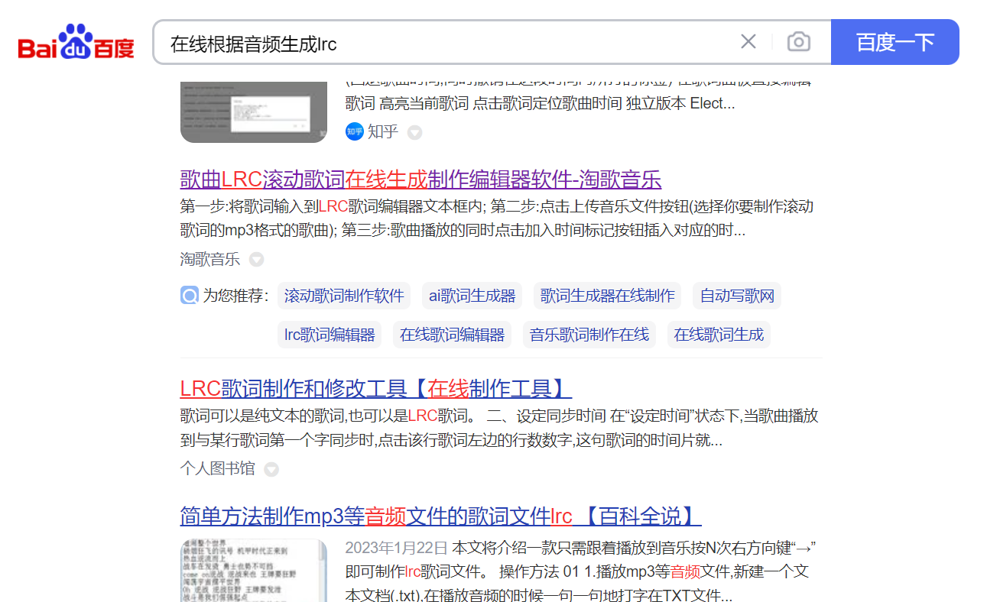
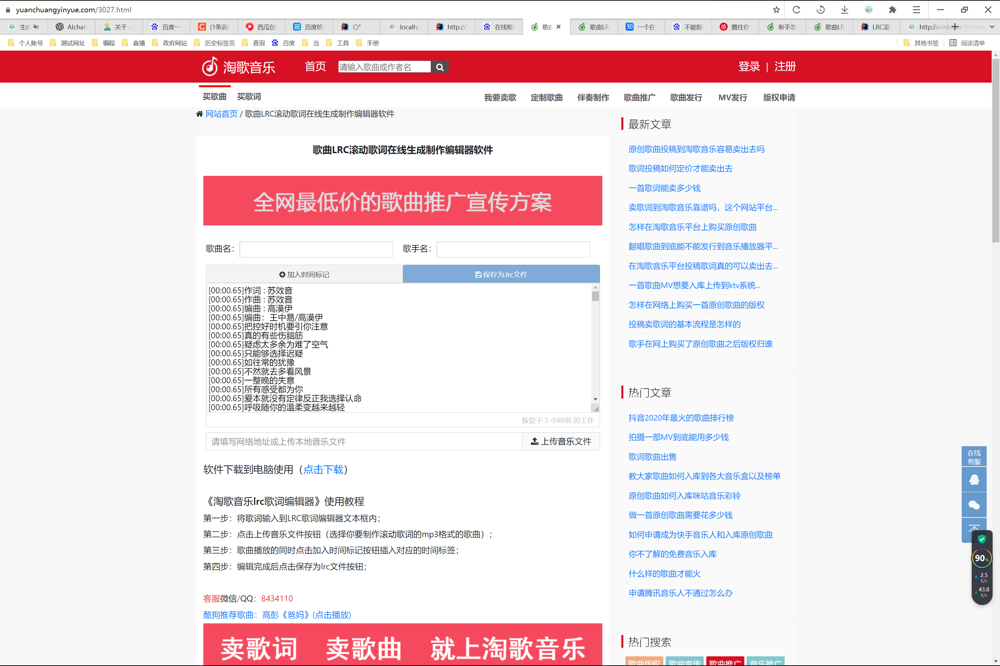
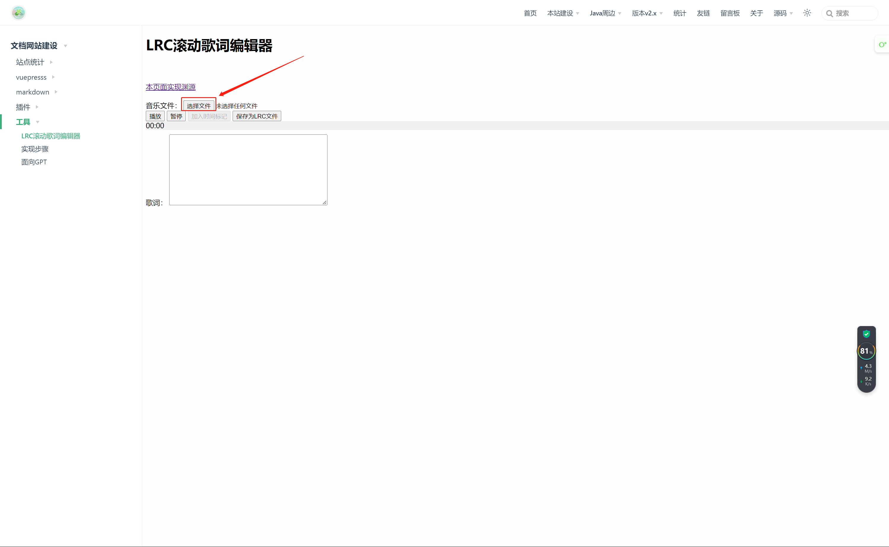
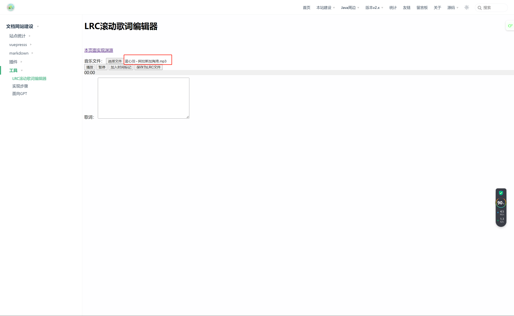
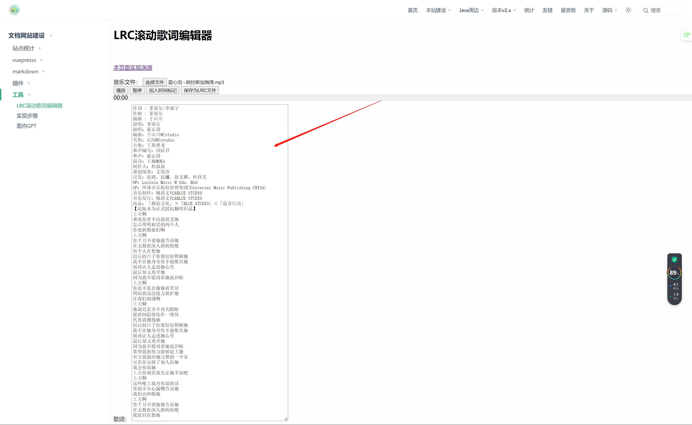
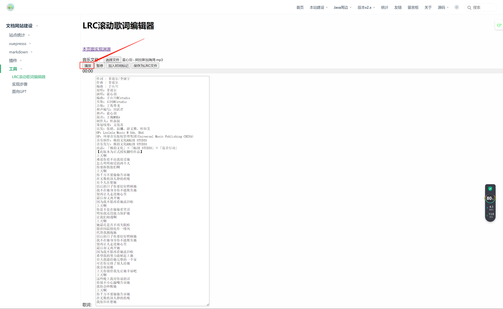
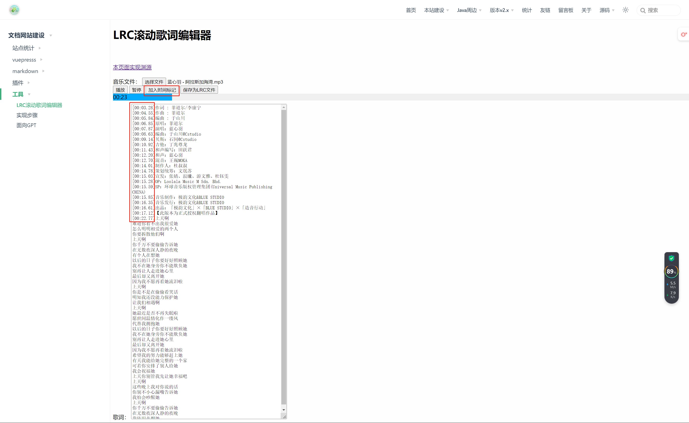
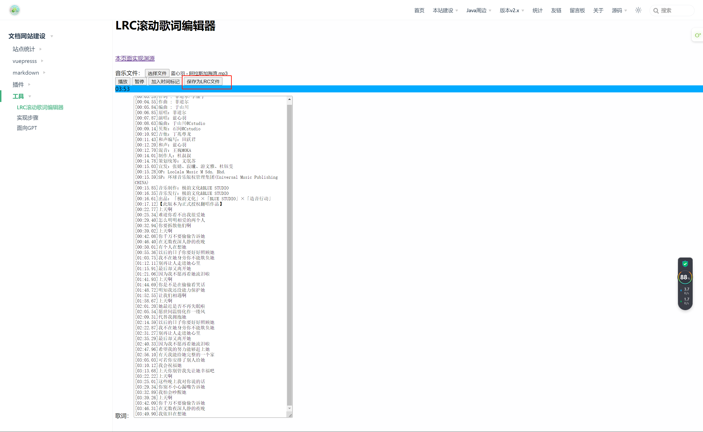

---

---

# 实现步骤

## 一开始
:::tip 一开始
在网上搜索相关功能

找到一个比较好的工具：[https://www.yuanchuangyinyue.com/3027.html](https://www.yuanchuangyinyue.com/3027.html)

于是想着复刻一个类似的工具

于是面向GPT编程开始了。。。
:::

## [面向GPT](./面向GPT.html) 编程

## 使用说明

### 1. 选择本地音频文件

### 2. 粘贴歌词
:::tip 提示
从网上搜索相关歌词复制到歌词框，或者自己知道音频内容输入歌词。每一行为一个时间标记点，点击加入时间标记后光标会自动移到下一行首位。
:::

### 3. 开始标记

点击播放按钮开始播放歌曲

点击加入时间标记按钮添加时间标记

注意一开始的光标位置，应该手动点击到第一行最左边

### 4. 保存为LRC文件

