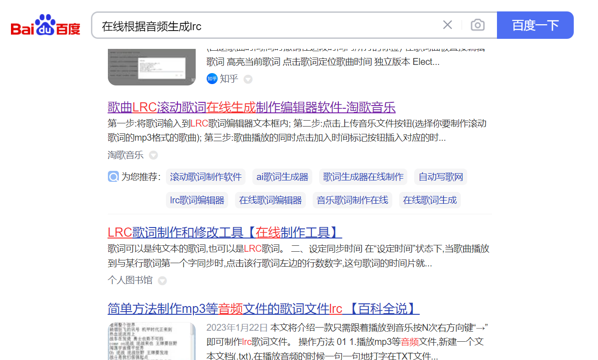
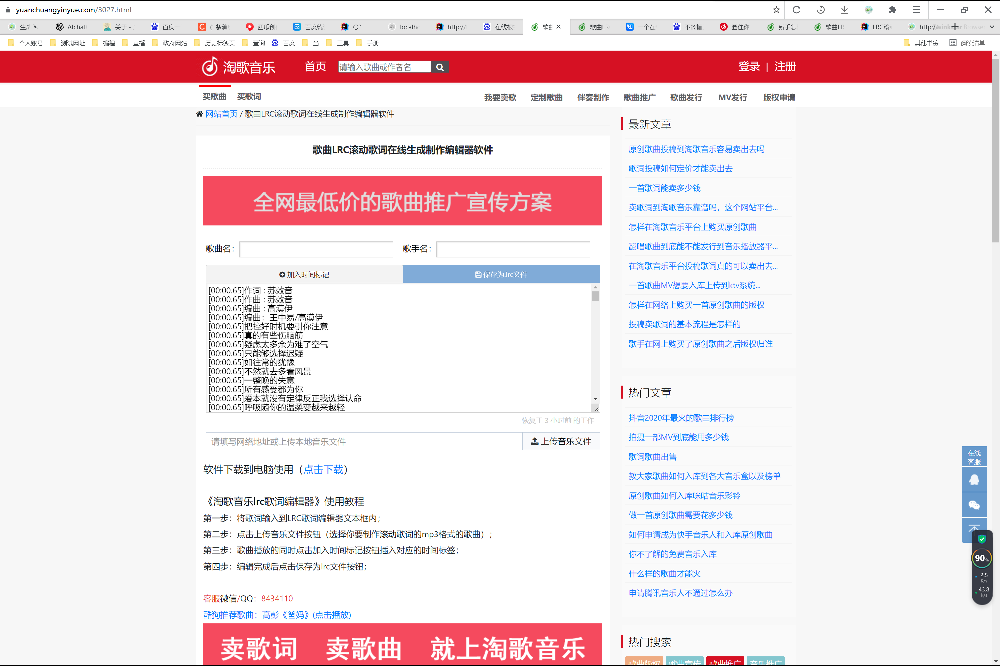

---

---

# 实现步骤

## 一开始
:::tip 一开始
在网上搜索相关功能

找到一个比较好的工具：[https://www.yuanchuangyinyue.com/3027.html](https://www.yuanchuangyinyue.com/3027.html)

于是想着复刻一个类似的工具

于是面向GPT编程开始了。。。
:::

[面向GPT](./面向GPT.html)

