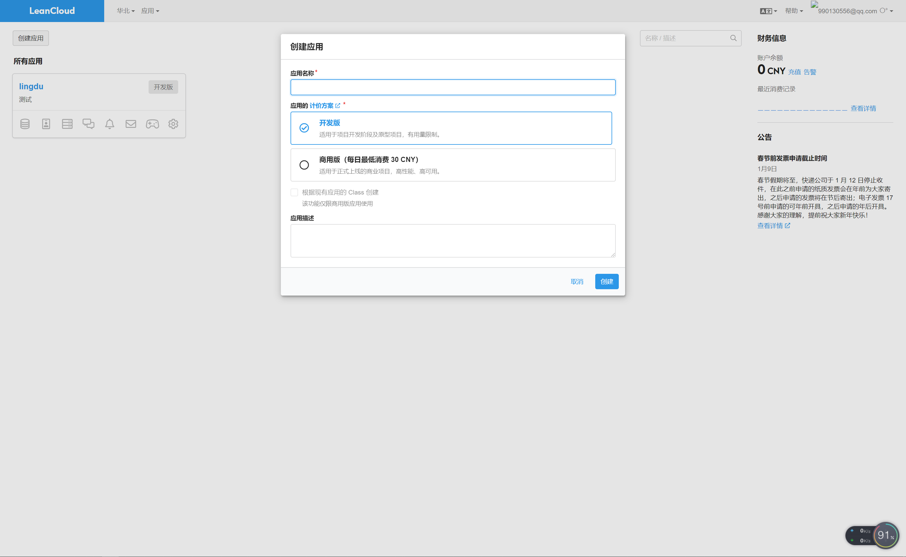
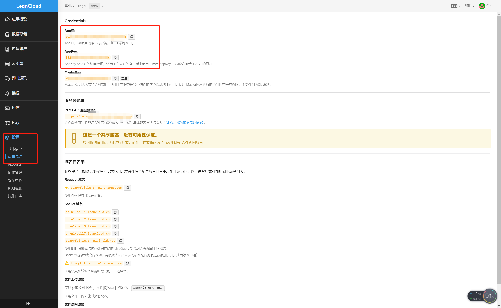

# 插件


## 留言板
### 下载安装
```shell
npm install --save vuepress-plugin-comment
npm install --save valine

or

yarn add vuepress-plugin-comment -D
yarn add valine -D
```
### 注册LeanCloud
进入官方网站[LeanCloud](https://www.leancloud.cn/)，注册你自己的账号并登录

创建应用



找到`AppID`和`AppKey`稍后会用到，该步骤很关键。



::: tip 提示
评论分为两种，单页面使用或者多页面使用
:::

- **多页面使用(不推荐)**

  多页面使用的理解就是：当你在Config.js中配置完成后，你的所有页面都自动被安排上了Valine功能，包括一些你不想要安排的页面也被安排上。

将 `vuepress-plugin-comment` 添加到`vuepress`项目的插件配置中：

```js
module.exports = {
    plugins: {
        'vuepress-plugin-comment': {
            choosen: 'valine',
            // options选项中的所有参数，会传给Valine的配置
            options: {
                el: '#valine-vuepress-comment',
                appId: 'Your own appId',
                appKey: 'Your own appKey'
            }
        }
    }
}

```

- **单页面使用(推荐)**

  单页面使用的理解就是：当你把基础配置的都配置完成后，你想在哪个页面指定配置评论功能，就可以在md文件中写`<valine></valine>`来调用评论功能

**单页面通过组件来实现功能**

.vuepress/config.js配置文件中加入

```js
module.exports = {
    plugins: {
        '@vuepress/register-components': {
            componentsDir: './components'
        }
    }
}
```

:::tip 提示
这是设置自定义组件的位置。然后在.vuepress/components目录中创建文件Valine.vue，这是用于自定义自己的 Valine 组件。
Valine.vue 的源码如下，这里我开启了阅读量统计。leancloud-visitors类所在的元素的 id 会用来识别页面所在位置。
:::

```vue
<template>
  <section style="border-top: 2px solid #eaecef;padding-top:1rem;margin-top:2rem;">
    <div>
      <!-- id 将作为查询条件 -->
      <span class="leancloud-visitors"
            data-flag-title="Your Article Title">
        <em class="post-meta-item-text">阅读量： </em>
        <i class="leancloud-visitors-count"></i>
      </span>
    </div>
    <h3>
      <a href="javascript:;"></a>
      评 论：
    </h3>
    <div id="vcomments"></div>
  </section>
</template>

<script>
export default {
  name: 'Valine',
  mounted: function () {
    // require window
    const Valine = require('valine');
    if (typeof window !== 'undefined') {
      document.getElementsByClassName('leancloud-visitors')[0].id
        = window.location.pathname
      this.window = window
      window.AV = require('leancloud-storage')
    }

    new Valine({
      el: '#vcomments',
      appId: 'XXXXXXXXXXXXX',// your appId
      appKey: 'XXXXXXXXXXXXX', // your appKey
      notify: false,
      verify: false,
      path: window.location.pathname,
      visitor: true,
      avatar: 'mm',
      placeholder: 'write here'
    });
  },
}
</script>

```
### 使用

然后在你所写的 md 文件中使用这个标签就行，比如在最下面一行键入

`<Valine></Valine>`

效果：

<Valine></Valine>

---


## 图片放大
:::warning 注意
仅适用于vuepress v1.x
:::
[官方文档](https://vuepress.vuejs.org/zh/plugin/official/plugin-medium-zoom.html)
### 下载安装依赖
```shell
npm install -D @vuepress/plugin-medium-zoom
```
### 配置
#### 简单使用:
```js
// .vuepresss/config.js
module.exports = {
    plugins: {
        '@vuepress/medium-zoom': {}
    }
}
```
#### 自定义选项:
```js
module.exports = {
  plugins: {
    '@vuepress/medium-zoom': {
      // selector: 'img.zoom-custom-imgs',
      // medium-zoom options here
      // See: https://github.com/francoischalifour/medium-zoom#options
      options: {
        margin: 16,                             // 外边距
        background: 'rgba(255,255,255,0.39)',   // 背景色
        scrollOffset: 100                       // 滑动关闭像素
      }
    }
  }
}
```
##### 选项
- **selector**
    - 类型: `string`
    - 默认值: `.theme-default-content :not(a) > img`  
      值得注意的是， `.theme-default-content` 是默认主题添加给 `<Content />` 组件的 class name。
- **options**
    - 类型: `object`
    - 默认值: `undefined`

options参数如下:

|属性|类型|默认值|描述|  
|:--:|:-:|:--:|:-:|  
|margin|number|0|放大图像外的空间|  
|background|string|#ff|叠加的背景|  
|scrollOffset|number|40|要滚动以关闭缩放的像素数|  
|container|string \|\| HTMLElementobject|null|视图端口以显示放大|  
|template|string \|\| HTMLTemplateElement|null|缩放时显示的模板元素|


---
## 记录当前浏览的位置信息
:::warning 注意
仅适用于vuepress v1.x
:::
### 介绍

该插件在页面关闭时，记录当前浏览的位置信息。用来在下一次访问时，展示一个前往该位置的弹窗。

默认的弹窗样式与 [@vuepress/plugin-pwa](https://github.com/vuejs/vuepress/tree/master/packages/%40vuepress/plugin-pwa) 一样。

---

### 安装

``` sh
yarn add vuepress-plugin-last-reading
## or
npm i vuepress-plugin-last-reading
```

### 使用

``` js
module.exports = {
  plugins: [
    'last-reading'
  ]
}
```

### 选项

#### popupConfig
- 类型: `Object`
- 必须: `false`

弹出组件中显示的默认提示文本内容。

``` js
module.exports = {
  plugins: [
    ['last-reading', {
      popupConfig: {
        message: '返回之前位置',
        buttonText: '确定'
      },
    }]
  ]
}
```

或者参考 [i18n](../../src/i18n.js) 配置多语言。

#### popupCountdown
- 类型: `Number`
- 默认值: `10000`
- 必须: `false`

配置弹窗显示的时间。

#### popupComponent
- 类型: `string`
- 必须: `false`

用于替换默认弹出组件的自定义组件，参考[自定义弹窗样式](#自定义弹窗样式)。

#### popupCustom
- 类型: `Function`
- 必须: `false`

自定义弹窗相关逻辑。

::: tip
如果配置该选项，请通过下面方式定义函数
:::

``` js
module.exports = {
  plugins: [
    ['last-reading', {
      popupCustom: function() {
        const now = new Date().getTime()
        if (now - this.lastReading.timestamp > 30 * 24 * 60 *60 * 1000) {
          this.clean()
        } else if (this.$route.path === this.lastReading.path) {
          this.goto()
        } else {
          this.show = true
          setTimeout(this.clean, 10000)
        }
      },
    }]
  ]
}
```

### 自定义弹窗样式

首先，您需要在 `.vuepress/components` 中创建一个全局组件 (例如 `MyPopup`)。 一个基于默认组件创建的简单组件如下：

``` vue
<template>
  <LastReadingPopup v-slot="{ show, goto, message, buttonText }">
    <div v-if="show" class="my-sw-update-popup">
      {{ message }}<br>
      <button @click="goto">{{ buttonText }}</button>
    </div>
  </LastReadingPopup>
</template>
<script>
import LastReadingPopup from 'vuepress-plugin-last-reading/src/LastReadingPopup.vue'
export default {
  components: { LastReadingPopup }
}
</script>
<style>
.my-sw-update-popup {
  text-align: right;
  position: fixed;
  bottom: 20px;
  right: 20px;
  background-color: #fff;
  font-size: 20px;
  padding: 10px;
  border: 5px solid #3eaf7c;
}
.my-sw-update-popup button {
  border: 1px solid #fefefe;
}
</style>
```

接着，更新你的插件配置：

``` js
module.exports = {
  plugins: [
    ['last-reading', {
      popupComponent: 'MyPopup'
    }]
  ]
}
```
---

## 阅读进度条
:::warning 注意
仅适用于vuepress v1.x
:::
[vuepress-plugin-reading-progress](https://github.com/tolking/vuepress-plugin-reading-progress)

## 面向 VuePress2 的常用组件

vuepress-plugin-components  

### 安装
<CodeGroup>
  <CodeGroupItem title="pnpm" active>

```pnpm
pnpm add -D vuepress-plugin-components
```

  </CodeGroupItem>
  <CodeGroupItem title="yarn">
  
```yarn
yarn add -D vuepress-plugin-components
```

  </CodeGroupItem>
  <CodeGroupItem title="npm">
  
```npm
npm i -D vuepress-plugin-components
```

  </CodeGroupItem>
</CodeGroup>

### 使用

<CodeGroup>
  <CodeGroupItem title="TS" active>

```ts
// .vuepress/config.ts
import { componentsPlugin } from "vuepress-plugin-components";

export default {
  plugins: [
    componentsPlugin({
      // 插件选项
    }),
  ],
};

```

  </CodeGroupItem>
  <CodeGroupItem title="JS">

```js
// .vuepress/config.js
import { componentsPlugin } from "vuepress-plugin-components";

export default {
  plugins: [
    componentsPlugin({
      // 插件选项
    }),
  ],
};

```

  </CodeGroupItem>
</CodeGroup>

### [官方文档](https://plugin-components.vuejs.press/zh/)

### 公告窗改装成音乐播放器
:::tip 描述
利用公告插件嵌入网易云音乐<br>

:::
#### 1.开启公告窗口
```ts
import { componentsPlugin } from "vuepress-plugin-components";

export default {
  plugins: [
    componentsPlugin({
      // 公告插件
      rootComponents: {
        notice: [
          {
            path: "/",
            title: '<div id="lingdu-tishi"><button id="btnMove" type="button" class="notice-footer-action primary">〇°</button></div>',
            // content: "Notice Content",// 内容 这里嵌入网易云播放器
            content: "<iframe frameborder=\"no\" border=\"0\" marginwidth=\"0\" marginheight=\"0\" width=100% height=450 src=\"//music.163.com/outchain/player?type=0&id=5163968960&auto=1&height=430\"></iframe>",
            // 关闭全屏显示
            fullscreen: false,
            // 需要确认才关闭否则延时关闭
            confirm: true,
          },
        ],
      },
    }),
  ],
};

```
#### 2.添加脚本使窗口最小化
在`.vuepress/public/js`下创建`gonggao.js`
:::: details gonggao.js代码
```js
/**
 * 延迟 4000 毫秒后执行 showMessage 函数 【这里用一个对象接收就会只执行一次，否则跳转页面会执行多次】
 */
const constResize=setTimeout(resize, 4000);

/**
 * 调整大小
 */
function resize() {
  let myDiv;
  let ok=false;
  let x = 100, y = 100, h; // 初始位置
  let timer;
  let status = 1;// 状态默认1为最大化，0为最小化

  myDiv = document.getElementsByClassName("notice-wrapper")[0];
  const initialLeft = parseInt(myDiv.getBoundingClientRect().left); // 获取 myDiv 元素的初始水平位置
  const initialTop = parseInt(myDiv.getBoundingClientRect().top); // 获取 myDiv 元素的初始垂直位置
  const initialH = parseInt(myDiv.getBoundingClientRect().height); // 获取 myDiv 元素的初始高
  x = initialLeft
  y = initialTop; // 初始位置
  h = initialH; // 初始高度

  const tishi = document.getElementById("lingdu-tishi");
  tishi.innerHTML +="<span style='color: #282c34'>👈点击按钮最小化</span>";

  const btnMove = document.getElementById("btnMove");

  // btnMove.onclick = delayedMove;
  /**
   * 监测点击按钮事件
   */
  btnMove.onclick = function () {
    // console.log("点击了。。。")
    if(!ok){
      return;
    }
    if (status === 1) {
      timer = setInterval(moveDiv, 0); // 点击按钮后，每隔 50 毫秒执行一次移动操作
      status = 0
    } else {
      timer = setInterval(moveDiv2, 0); // 点击按钮后，每隔 50 毫秒执行一次移动操作
      status = 1

    }
  };
  ok=true;

  /**
   * 最小化
   */
  function moveDiv() {
    x += 2; // 每次向右移动 10 个像素
    myDiv.style.left = x + "px"; // 设置水平位置

    y += 4; // 每次向下移动 5 个像素
    myDiv.style.top = y + "px"; // 设置垂直位置

    h += -4;
    myDiv.style.height = h + "px";
    // 调整透明度
    myDiv.style.opacity = 0.3;

    if (x - initialLeft >= 225) { // 如果达到执行次数上限，停止定时器
      clearInterval(timer);
    }
  }

  /**
   * 还原
   */
  function moveDiv2() {
    x += -2; // 每次向右移动 10 个像素
    myDiv.style.left = x + "px"; // 设置水平位置

    y += -4; // 每次向下移动 5 个像素
    myDiv.style.top = y + "px"; // 设置垂直位置

    h += 4;
    myDiv.style.height = h + "px";
    // 调整透明度
    myDiv.style.opacity = 1;

    if (x - initialLeft <= 0) { // 如果达到执行次数上限，停止定时器
      clearInterval(timer);
    }
  }

}

```
::::

#### 3. 使脚本生效
在config.ts中配置项追加`head`项
```ts
// .vuepress/config.ts

// 配置
import {head, navbarMy, sidebarMy} from './configs';
export default ({
  head,
})
```
我这里`head`是引用进来的  
`head.ts`中追加
```ts
import type { HeadConfig } from '@vuepress/core'

const name='/vuepress-lingdu-v2'

export const head: HeadConfig[] = [
  // 添加浏览器图标
  ['link',{rel: 'icon',type: 'image/png',sizes: '16x16',href: `/vuepress-lingdu-v2/img/logo.png`,},],
  ['link',{rel: 'icon',type: 'image/png',sizes: '32x32',href: `/vuepress-lingdu-v2/img/logo.png`,},],
  ['link', { rel: 'manifest', href: '/manifest.webmanifest' }],
  ['meta', { name: 'application-name', content: 'VuePress' }],
  ['meta', { name: 'apple-mobile-web-app-title', content: 'VuePress' }],
  ['meta', { name: 'apple-mobile-web-app-status-bar-style', content: 'black' }],
  ['link',{ rel: 'apple-touch-icon', href: `/images/icons/apple-touch-icon.png` },],
  ['link',{rel: 'mask-icon',href: '/images/icons/safari-pinned-tab.svg',color: '#3eaf7c',},],
  ['meta', { name: 'msapplication-TileColor', content: '#3eaf7c' }],
  ['meta', { name: 'theme-color', content: '#3eaf7c' }],

  ['script', { src: '/vuepress-lingdu-v2/js/gonggao.js' }]// 追加项 引入js
]

```
<h1>
<Badge text="演示" />
</h1>

<BiliBili bvid="BV1ym4y1i78E" />

